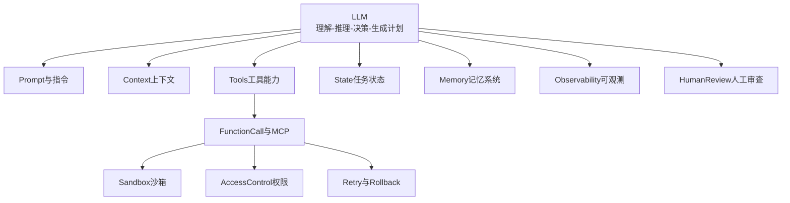
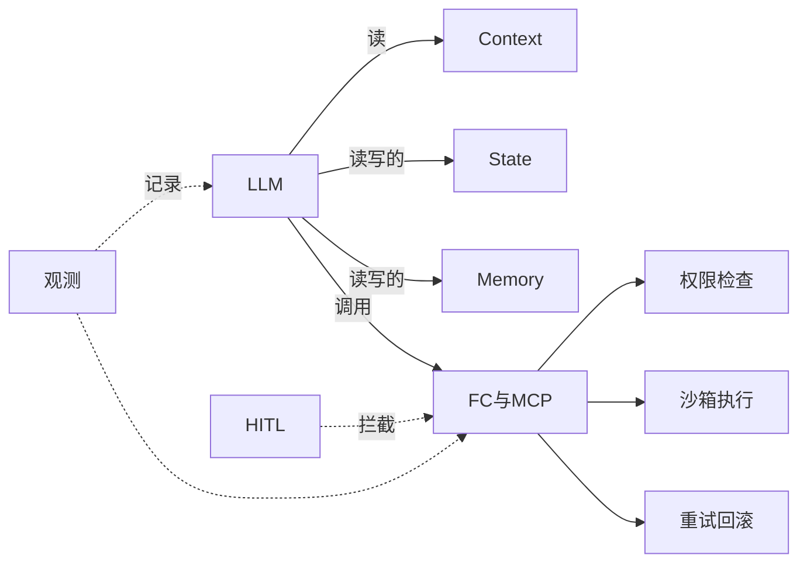

# Harness 十一模块总览

## 核心观点

Agent 不是只有模型，而是 **LLM 被一整套执行系统（Harness）包裹**。LLM 负责理解、推理、决策；Harness 负责执行、约束、恢复。

## 十一模块架构

## 模块速查

| 模块 | 解决什么问题 |
|------|--------------|
| Prompt 与指令 | 目标、规则、约束、输出格式 |
| Context 上下文 | 模型「需要知道的」资料与历史 |
| Tools 工具能力 | 查询、操作、API、脚本 |
| Function Call / MCP | 标准化调用、参数校验、结果回传 |
| State 任务状态 | 进度、计划、已完成步骤、中间结果 |
| Memory 记忆系统 | 长期偏好、项目背景、经验沉淀 |
| Sandbox 沙箱 | 隔离执行高风险命令与代码 |
| Access Control 权限 | 最小权限、资源范围、凭证管理 |
| Retry 与 Rollback | 失败重试、回滚到安全点 |
| Observability 可观测 | 日志、追踪、指标、告警 |
| Human Review | 高风险操作人工确认 |

## 8+4 与 11 模块对照

| 8 核心（速记） | 11 模块中的对应 |
|---------------|-----------------|
| 上下文管理 | Prompt + Context |
| 工具注册 | Tools |
| MCP 与 FC | Function Call / MCP |
| 权限边界 | Access Control |
| Sandbox | Sandbox |
| 状态管理 | State |
| Memory | Memory |
| Human Review | Human Review |
| （增强） | Observability、Retry/Rollback、评测 |

## 核心调用关系

## 设计原则

- LLM 居中，模块环绕，职责单一
- 调用链必经权限与观测
- 高风险路径必经 Sandbox 或 HITL

## 动手练习

1. 画出你熟悉的一个 Agent 产品，标注具备哪些模块
2. 对比 8 模块与 11 模块，说明 Prompt 为何从 Context 中独立
3. 列出 Observability 应记录的最小字段集（输入、工具、输出、耗时）

## 常见坑

- **Tools 与 MCP 混淆**：Tools 是能力目录，MCP 是接入协议
- **Memory 与 State 混淆**：State 是当前任务，Memory 是跨任务长期知识
- **只做 Observability 不做 HITL**：观测只能事后追责，不能事前拦截

## 本仓库延伸阅读

| 文档 | 说明 |
|------|------|
| [agent-harmess/关系.md](../../agent-harmess/关系.md) | 原始架构速记 |
| [hermes-learning-path/00-概述与架构总览.md](../../hermes-learning-path/00-概述与架构总览.md) | Hermes 架构实例 |
| [openclaw-learning-path/01-概述与架构/02-四层架构总览.md](../../openclaw-learning-path/01-概述与架构/02-四层架构总览.md) | OpenClaw 四层架构 |

## 小结

- 11 模块完整描述 Harness；8+4 是速记分组
- LLM 思考，Harness 执行与兜底
- 权限、沙箱、观测、HITL 是生产四件套
