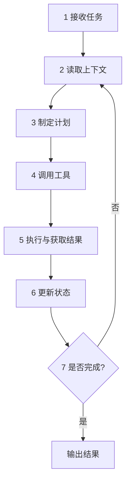
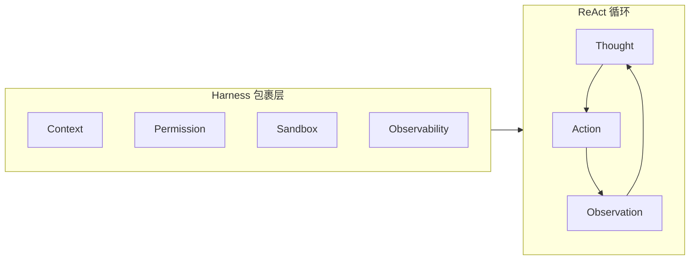

# Agent 执行循环

## 核心流程

用户目标 → 任务拆解（LLM）→ 调用工具（Harness）→ 观察结果 / 更新状态 → 循环直至完成。

## 各步 Harness 介入点

| 步骤 | LLM 做什么 | Harness 做什么 |
|------|------------|----------------|
| 接收任务 | 理解意图 | 任务边界校验、输入清洗 |
| 读取上下文 | — | Context/Memory 检索与裁剪 |
| 制定计划 | 生成下一步 | Prompt 规则约束 |
| 调用工具 | 选择工具与参数 | Schema 校验、权限检查 |
| 执行 | — | Sandbox 执行、Retry |
| 更新状态 | — | State 持久化、Checkpoint |
| 完成判断 | 评估是否达成 | 评测门禁、HITL 确认 |
| 输出 | 生成回复 | 观测记录、审计留痕 |

## ReAct 与 Harness 的关系

ReAct 是 LLM 层循环模式；Harness 在每轮 Action 前后注入约束与记录。

## 设计原则

- 每步可观测、关键步可回滚
- 循环次数与 Token 预算设上限
- 失败时分类：可重试 vs 需 HITL vs 终止

## 动手练习

1. 为一个「查天气并发邮件」任务，逐步填写 Harness 介入点
2. 画出循环 5 轮时的 State 应包含哪些字段
3. 说明 Observation 错误时，Retry 与重新 Plan 如何选择

## 常见坑

- **无限循环**：缺 max_iterations 与重复检测
- **Observation 污染 Context**：需清洗失败堆栈再喂给 LLM
- **跳步执行**：未更新 State 就进入下一轮

## 本仓库延伸阅读

| 文档 | 说明 |
|------|------|
| [agent-learning-path/03-Agent/01-Agent架构概述.md](../../agent-learning-path/03-Agent/01-Agent架构概述.md) | Agent 架构 |
| [hermes-learning-path/01-Agent核心循环.md](../../hermes-learning-path/01-Agent核心循环.md) | Hermes 主循环 |
| [openclaw-learning-path/02-Agent核心循环/01-ReAct循环机制.md](../../openclaw-learning-path/02-Agent核心循环/01-ReAct循环机制.md) | OpenClaw ReAct |

## 小结

- 7 步闭环：接收 → 上下文 → 计划 → 工具 → 执行 → 状态 → 完成判断
- Harness 在每步注入校验、隔离、持久化、观测
- ReAct 是 LLM 模式，Harness 是工程包裹层
