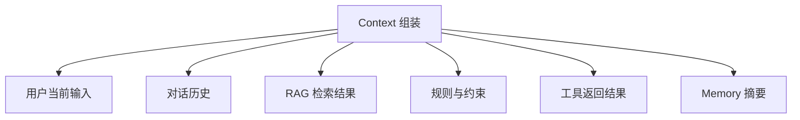

# 上下文管理

## 解决什么问题

把**对的资料、规则、历史**提供给模型，减少噪音和遗漏。

> **类比**：上下文管理是「给 LLM 配一副合适的眼镜」——不是看得越多越好，而是看得准。

## 上下文来源

## 裸 Agent vs Harness

| 维度 | 裸 Agent | Harness |
|------|----------|---------|
| 历史 | 全量塞入，易超长 | 压缩、摘要、分层 |
| 检索 | 无或随意 | RAG + 相关性过滤 |
| 工具结果 |  raw  dump | 清洗、截断、结构化 |
| 更新 | 静态 | 按轮次刷新 |

## 设计原则

- **相关性优于完整性**：只给当前步需要的
- **分层**：系统规则 > 任务上下文 > 历史摘要
- **可溯源**：每条上下文标注来源

## 动手练习

1. 设计一个 10 轮对话的压缩策略（何时摘要、保留什么）
2. 工具返回 10MB JSON 时，Harness 应如何处理再喂给 LLM？
3. 列举 3 种「上下文污染」场景及防护

## 常见坑

- **上下文窗口打满**：长任务必做压缩
- **检索噪声**：RAG 命中率低比没有更糟
- **工具结果未清洗**：错误堆栈误导 LLM 下一步

## 本仓库延伸阅读

| 文档 | 说明 |
|------|------|
| [hermes-learning-path/05-上下文压缩.md](../../hermes-learning-path/05-上下文压缩.md) | 自动摘要与修剪 |
| [openclaw-learning-path/06-上下文管理/01-上下文压缩策略.md](../../openclaw-learning-path/06-上下文管理/01-上下文压缩策略.md) | OpenClaw 压缩 |
| [agent-learning-path/05-RAG/](../../agent-learning-path/05-RAG/) | RAG 作外部上下文 |

## 小结

- 上下文管理 = 检索 + 裁剪 + 分层 + 刷新
- 目标是「给对的信息」，不是「给多的信息」
- 与 Memory 配合：Memory 长期，Context 当前任务
