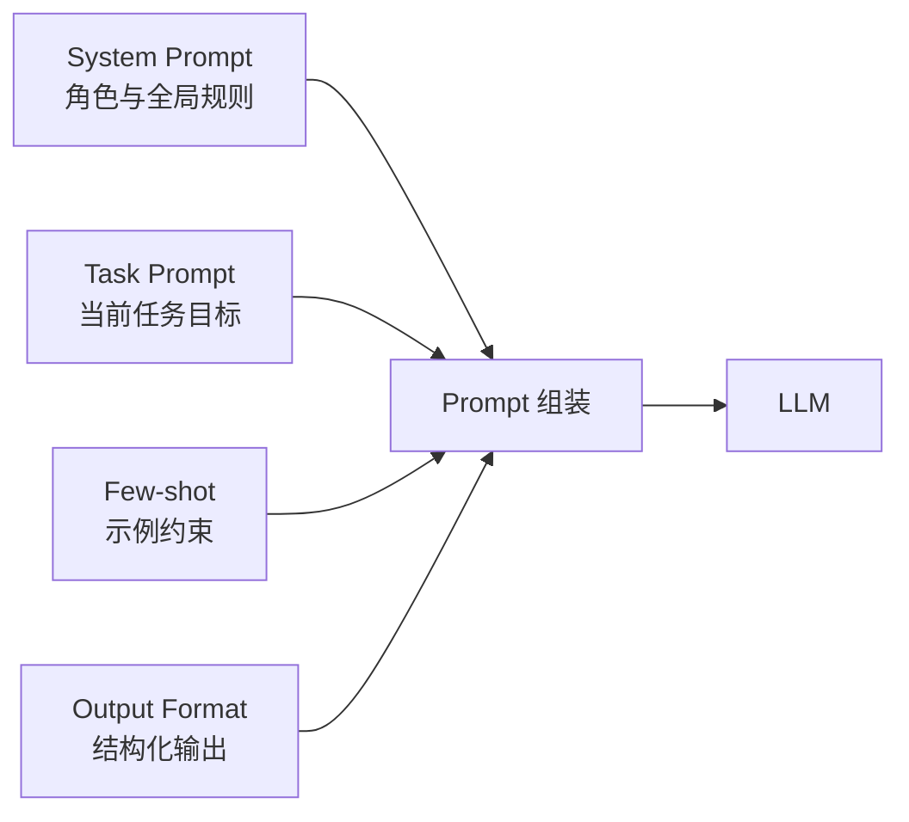

# Prompt 与规则约束

## 解决什么问题

给模型**目标、规则、约束、输出格式**，使行为可预期、可验证。

## Prompt 在 Harness 中的位置

## 规则类型

| 类型 | 示例 | 作用 |
|------|------|------|
| 角色 | 「你是代码审查助手」 | 边界与语气 |
| 禁止项 | 「不得执行 rm -rf」 | 安全红线 |
| 流程 | 「先 plan 再 act」 | 行为顺序 |
| 输出格式 | JSON Schema | 可解析、可校验 |

## 裸 Agent vs Harness

| 裸 Agent | Harness |
|----------|---------|
| 单段 Prompt，易漂移 | 分层 Prompt + 项目级规则文件 |
| 无输出校验 | Schema 校验 + 重试 |
| 规则靠模型自觉 | 规则 + 权限 + HITL 三重约束 |

## 设计原则

- 规则要**可执行**（能映射到权限或 HITL）
- 项目级规则持久化（如 CLAUDE.md）
- 输出格式优先结构化

## 动手练习

1. 为一个「只读代码分析」Agent 写 System Prompt 必含的三类规则
2. 设计 JSON 输出 Schema，说明校验失败时 Harness 如何处理
3. 对比 Prompt 规则与 Access Control 的边界

## 常见坑

- **Prompt 过长**：规则应分层，非常用进 Skills
- **规则冲突**：系统 vs 用户指令优先级需定义
- **只靠 Prompt 保安全**：必须配合权限与沙箱

## 本仓库延伸阅读

| 文档 | 说明 |
|------|------|
| [hermes-learning-path/04-System Prompt构建.md](../../hermes-learning-path/04-System%20Prompt构建.md) | Prompt 组装 |
| [claude-code-learning-path/01-项目记忆与配置/01-CLAUDE.md详解.md](../../claude-code-learning-path/01-项目记忆与配置/01-CLAUDE.md详解.md) | 项目级规则 |

## 小结

- Prompt = 目标 + 规则 + 格式，是 Harness 的「软约束」
- 须与权限、沙箱等「硬约束」配合
- 项目级规则文件是团队 Harness 的标配
