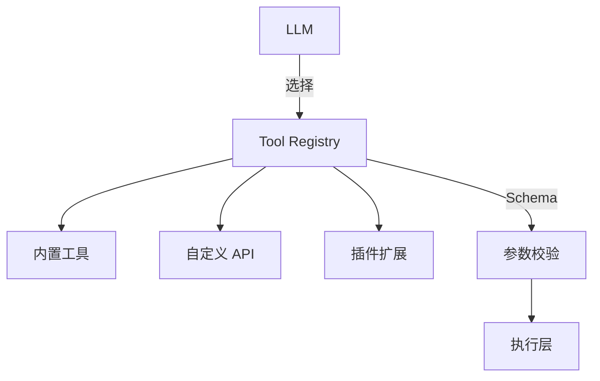

# 工具注册与扩展

## 解决什么问题

把外部能力**标准化注册**，供模型可扩展、可复用地调用。

> **类比**：工具注册是「能力菜单」——LLM 点菜，Harness 厨房按标准出餐。

## 工具注册架构

## 工具描述要素

| 字段 | 作用 |
|------|------|
| name | 唯一标识 |
| description | LLM 选型依据 |
| parameters | JSON Schema |
| returns | 输出结构说明 |
| permissions | 所需权限级别 |

## 裸 Agent vs Harness

| 裸 Agent | Harness |
|----------|---------|
| 临时拼函数 | 统一 Registry |
| 描述模糊 | 清晰 description + 示例 |
| 无版本管理 | 工具版本与废弃策略 |

## 设计原则

- **最小暴露**：只注册任务需要的工具
- **描述即文档**：LLM 靠 description 选型
- **幂等与副作用标注**：读 vs 写 vs 不可逆

## 动手练习

1. 为一个「文件搜索」工具写完整 Schema 与 description
2. 设计工具分级：只读 / 写入 / 高危
3. 说明为何工具过多会降低 Agent 稳定性

## 常见坑

- **工具描述过短**：LLM 选错工具
- **读写工具混注册**：权限难控
- **无 deprecation**：旧工具长期残留

## 本仓库延伸阅读

| 文档 | 说明 |
|------|------|
| [agent-learning-path/03-Agent/02-Tool-Calling深度实践.md](../../agent-learning-path/03-Agent/02-Tool-Calling深度实践.md) | Tool Calling |
| [hermes-learning-path/02-工具调用系统.md](../../hermes-learning-path/02-工具调用系统.md) | Hermes 工具 |
| [claude-code-learning-path/02-Tools工具系统/01-内置工具详解.md](../../claude-code-learning-path/02-Tools工具系统/01-内置工具详解.md) | Claude Code 工具 |

## 小结

- Tool Registry 统一能力入口
- Schema + description 决定调用成功率
- 最小暴露 + 分级是安全前提
