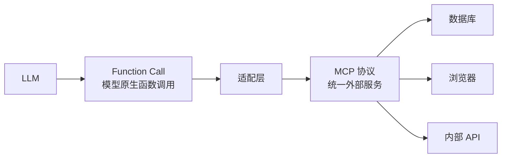
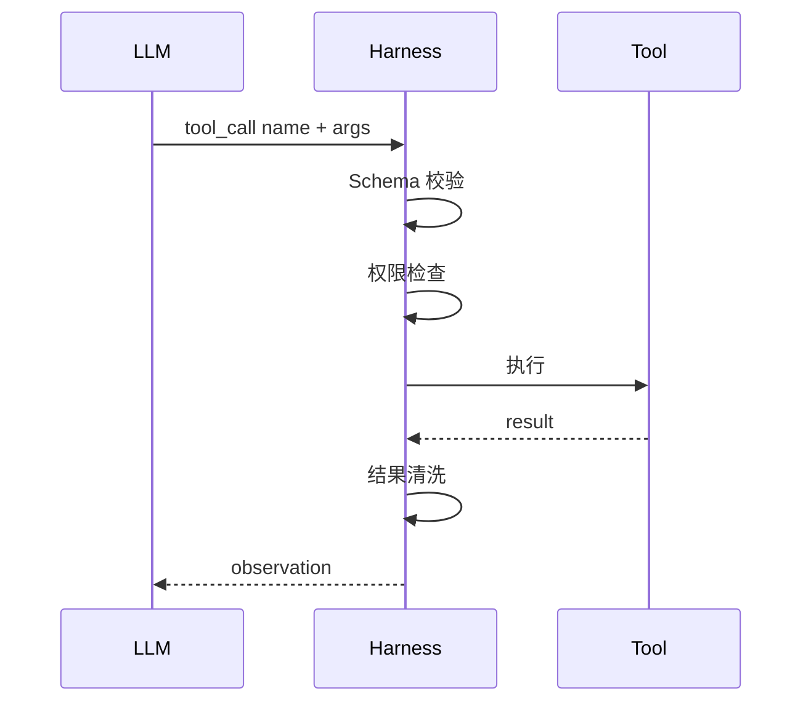

# MCP 与 Function Call

## 解决什么问题

规范工具调用的**输入输出格式**，使模型能稳定、可验证地调用能力。

## Function Call vs MCP

| | Function Call | MCP |
|---|---------------|-----|
| 层级 | 模型 API 层 | 跨进程/跨服务协议 |
| 校验 | JSON Schema | MCP Tool Schema |
| 生态 | 各厂商原生 | 可复用 MCP Server |

## 调用链路

## 裸 Agent vs Harness

| 裸 Agent | Harness |
|----------|---------|
| 模型猜参数 | Schema 校验 + 默认值 |
| 失败即报错 | 校验失败反馈 LLM 重试 |
| 无超时 | 超时 + 重试策略 |

## 设计原则

- 必填项、类型、枚举在 Schema 中严格定义
- MCP Server 独立部署，Harness 管连接与凭证
- 工具结果大小限制与截断

## 动手练习

1. 设计一个 MCP Tool 的 inputSchema（含必填、类型、示例）
2. 参数校验失败时，Harness 应返回什么给 LLM？
3. 比较 Function Call 直连与 MCP 的适用场景

## 常见坑

- **Schema 过宽**：LLM 仍填错
- **MCP 无超时**： hung 住整个 Agent
- **凭证写在 Prompt 里**：必须走 Harness 凭证管理

## 本仓库延伸阅读

| 文档 | 说明 |
|------|------|
| [claude-code-learning-path/05-MCP协议集成/](../../claude-code-learning-path/05-MCP协议集成/) | MCP 实战 |
| [hermes-learning-path/09-SDK与API开发接口.md](../../hermes-learning-path/09-SDK与API开发接口.md) | MCP/ACP |

## 小结

- Function Call 是模型层接口，MCP 是生态层协议
- Harness 负责校验、权限、超时、结果清洗
- Schema 严格度直接决定调用成功率
