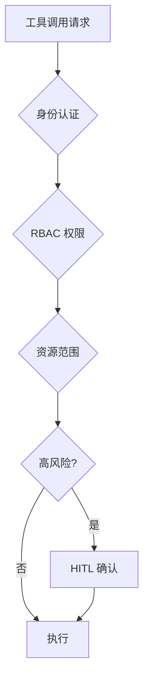

# 权限边界与访问控制

## 解决什么问题

控制模型**能做什么、不能做什么**，避免越权和高风险操作。

## 权限分级

| 级别 | 操作示例 | Harness 策略 |
|------|----------|--------------|
| 只读 | 读文件、查 API | 默认允许 |
| 写入 | 改配置、写 DB | 范围白名单 |
| 执行 | Shell、部署 | Sandbox + 审批 |
| 管理 | 删库、发版 | HITL 必须 |

## 裸 Agent vs Harness

| 裸 Agent | Harness |
|----------|---------|
| 全权限工具 | 最小权限 |
| 无资源范围 | 路径/租户/环境隔离 |
| 无审计 | 操作留痕 |

## 设计原则

- **最小权限**：默认 deny，显式 allow
- **凭证不进 Prompt**：Harness 注入短期 token
- **与环境绑定**：dev/staging/prod 分离

## 动手练习

1. 为 IDE Agent 设计三级权限矩阵（读/写/执行）
2. 列举 3 个「权限过大」导致的事故模式
3. 说明 RBAC 与 HITL 的分工边界

## 常见坑

- **开发环境权限带到生产**
- **Service Account 绑 cluster-admin**
- **工具权限与 UI 权限不一致**

## 本仓库延伸阅读

| 文档 | 说明 |
|------|------|
| [agent-learning-path/07-生产部署/03-安全与防护.md](../../agent-learning-path/07-生产部署/03-安全与防护.md) | Agent 安全 |
| [claude-code-learning-path/01-项目记忆与配置/03-权限与安全配置.md](../../claude-code-learning-path/01-项目记忆与配置/03-权限与安全配置.md) | Claude Code 权限 |
| [openclaw-learning-path/04-工具与技能系统/03-工具安全护栏.md](../../openclaw-learning-path/04-工具与技能系统/03-工具安全护栏.md) | 工具护栏 |

## 小结

- Access Control = 身份 + 权限 + 范围 + 高风险拦截
- 最小权限是 Harness 安全基线
- 与 Sandbox、HITL 组成纵深防御
