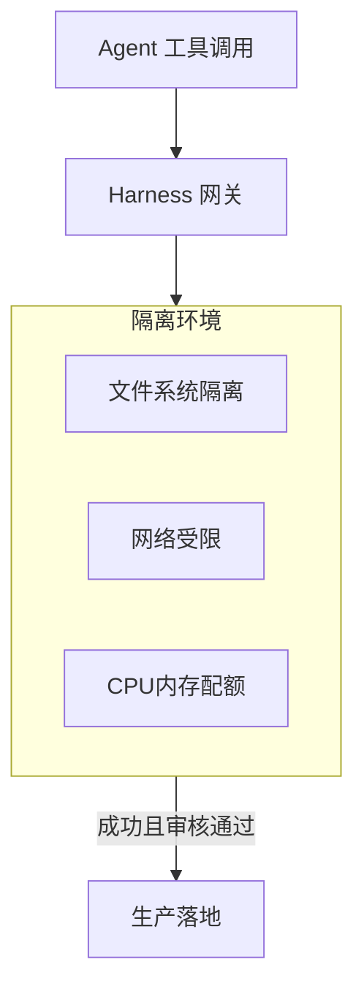

# Sandbox 沙箱环境

## 解决什么问题

将代码、命令、文件操作放在**隔离环境**执行，保护真实系统。

> **类比**：Sandbox 是「实验室」——实验在实验室做，确认无误再应用到现场。

## 沙箱架构

## 隔离维度

| 维度 | 典型限制 |
|------|----------|
| 文件系统 | 只读根、工作目录可写 |
| 网络 | 禁止或白名单 egress |
| 进程 | 无特权、cap-drop |
| 资源 | CPU/内存/时间上限 |

## 裸 Agent vs Harness

| 裸 Agent | Harness |
|----------|---------|
| 宿主机直跑 | 容器/VM 隔离 |
| 可删系统文件 | 路径白名单 |
| 无快照 | 执行前快照 |

## 设计原则

- **默认 Sandbox**：凡执行类工具必进沙箱
- **模拟后落地**：dry-run 或 staging 验证
- **沙箱与权限叠加**：隔离不等于授权

## 动手练习

1. 设计 coding Agent 的沙箱：可写目录、禁网、超时
2. 沙箱失效的 3 种场景（配置错误、逃逸、挂载越权）
3. 对比 Docker 沙箱与 WASM 沙箱 trade-off

## 常见坑

- **挂载宿主机敏感目录**
- **沙箱内仍能访问 metadata API**
- **只 Sandbox 不做 HITL**：写操作仍需人审

## 本仓库延伸阅读

| 文档 | 说明 |
|------|------|
| [hermes-learning-path/02-工具调用系统.md](../../hermes-learning-path/02-工具调用系统.md) | 多沙箱后端 |
| [openclaw-learning-path/09-安全与可观测/01-安全模型.md](../../openclaw-learning-path/09-安全与可观测/01-安全模型.md) | Docker 沙箱配置 |

## 小结

- Sandbox 隔离执行，是 Harness 保护生产的第一道硬屏障
- 文件/网络/进程/资源四维限制
- 与权限、HITL、快照配合使用
