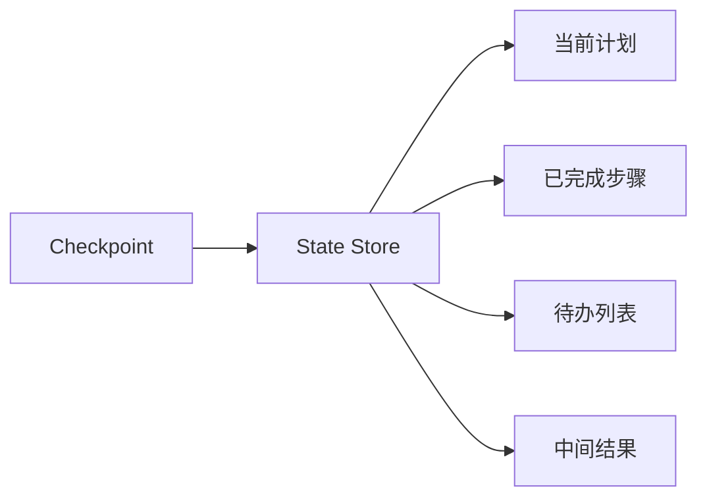

# 任务状态管理

## 解决什么问题

记录任务进度、计划、已完成步骤与中间结果，支持**长任务不中断**。

## State 核心字段

| 字段 | 用途 |
|------|------|
| task_id | 唯一标识 |
| status | running / blocked / done |
| current_step | 执行到哪一步 |
| artifacts | 中间产出 |
| error | 最近失败信息 |

## 裸 Agent vs Harness

| 裸 Agent | Harness |
|----------|---------|
| 内存态，进程挂就丢 | 持久化 DB/文件 |
| 无断点 | Checkpoint 续跑 |
| 重复劳动 | 幂等跳过已完成步 |

## 设计原则

- 每步结束时写 State，而非结束时才写
- Checkpoint 粒度：太细影响性能，太粗难恢复
- 与 Kanban/任务队列集成（长编排）

## 动手练习

1. 设计一个 5 步数据处理任务的 State JSON 结构
2. 第 3 步失败后，Harness 如何从 Checkpoint 恢复？
3. State 与 Memory 各存什么，边界如何划？

## 常见坑

- **State 过大**：中间结果存对象存储，State 存引用
- **无版本号**：并发更新覆盖
- **Checkpoint 不含工具副作用**：恢复后重复写

## 本仓库延伸阅读

| 文档 | 说明 |
|------|------|
| [agent-learning-path/02-图核心/04-状态管理与Checkpoint.md](../../agent-learning-path/02-图核心/04-状态管理与Checkpoint.md) | LangGraph Checkpoint |
| [hermes-learning-path/11-Kanban看板系统.md](../../hermes-learning-path/11-Kanban看板系统.md) | 持久化任务调度 |

## 小结

- State = 当前任务进度与中间态
- Checkpoint 实现断点续跑
- 长任务与多 Agent 编排的基础设施
