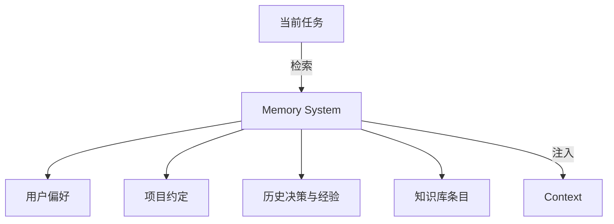

# Memory 记忆系统

## 解决什么问题

保存**长期知识、偏好、项目背景**，让 Agent 越用越懂你。

## Memory vs State vs Context

| | Memory | State | Context |
|---|--------|-------|---------|
| 时间跨度 | 跨会话长期 | 当前任务 | 当前轮次 |
| 内容 | 偏好、经验 | 进度、步骤 | 检索结果、历史 |
| 更新频率 | 低 | 高 | 每轮 |

## 裸 Agent vs Harness

| 裸 Agent | Harness |
|----------|---------|
| 无记忆，每次重讲 | 持久化 Memory |
| 全量历史 | 检索 + 摘要 |
| 无遗忘策略 | TTL、重要性打分 |

## 设计原则

- **写入门槛**：重要决策、显式偏好才入库
- **检索优于全量**：向量 + 关键词混合
- **隐私分级**：敏感记忆加密与隔离

## 动手练习

1. 列举应写入 Memory 的 3 类信息 vs 不应写入的 3 类
2. 设计「用户说记住 X」的 Harness 处理流程
3. Memory 污染（错误事实入库）如何检测与修正？

## 常见坑

- **把所有对话都存 Memory**：噪声爆炸
- **Memory 与 RAG 重复**：职责不清
- **跨用户 Memory 泄漏**：租户隔离

## 本仓库延伸阅读

| 文档 | 说明 |
|------|------|
| [hermes-learning-path/06-记忆与技能系统.md](../../hermes-learning-path/06-记忆与技能系统.md) | FTS5 + 技能 |
| [openclaw-learning-path/05-记忆系统/](../../openclaw-learning-path/05-记忆系统/) | 四层记忆栈 |

## 小结

- Memory 跨会话，State 当前任务，Context 当前轮
- 检索 + 摘要 + 写入门槛 = 可用记忆
- 与 RAG 互补：RAG 外部知识，Memory 交互沉淀
