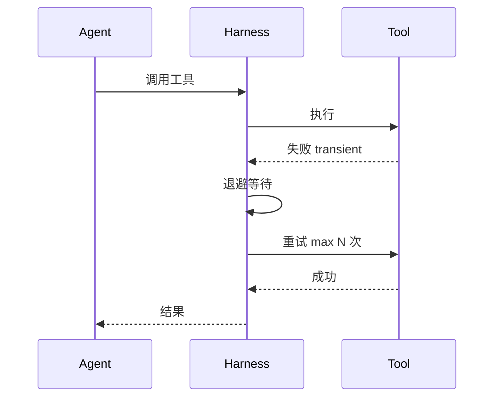
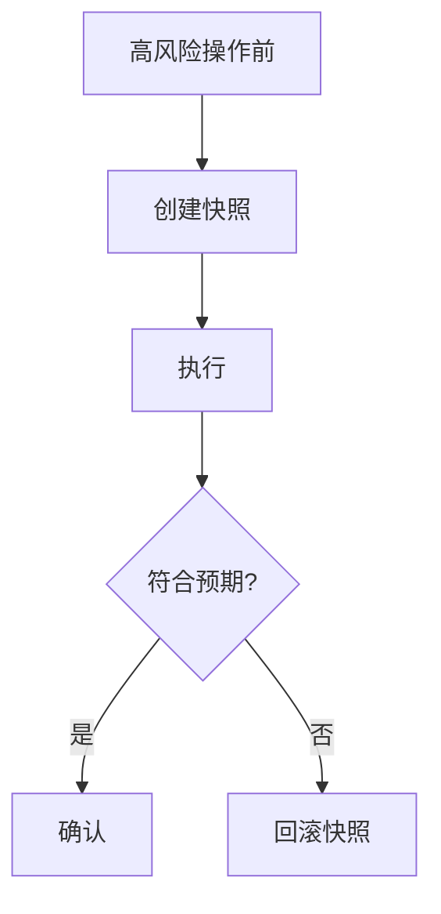

# 重试与回滚机制

## 解决什么问题

**Retry**：临时失败自动重试，提高成功率。**Rollback**：出错时撤销高风险操作，恢复安全状态。

## Retry 策略

| 策略 | 说明 |
|------|------|
| 固定间隔 | 简单，易 thundering herd |
| 指数退避 | 推荐，加 jitter |
| 失败分类 | 4xx 不重试，5xx/超时重试 |
| 幂等 | 写操作必幂等键 |

## Rollback 策略

| 机制 | 适用 |
|------|------|
| 文件快照 | 代码/配置修改 |
| 事务 | DB 操作 |
| 补偿事务 | 跨系统不可逆操作 |
| 版本回退 | 部署类 |

## 裸 Agent vs Harness

| 裸 Agent | Harness |
|----------|---------|
| 失败即停 | 分类重试 |
| 无幂等 | 幂等键 + 去重 |
| 不可逆 | 快照 + 回滚预案 |

## 设计原则

- 重试上限 + 总超时预算
- 写操作先快照再执行
- 回滚触发条件文档化

## 动手练习

1. 设计 API 调用的重试策略（次数、退避、可重试错误码）
2. 文件批量修改前，Harness 应如何做快照？
3. 幂等键在 Agent 重试中的必要性

## 常见坑

- **无限重试**：打爆下游
- **非幂等写重试**：重复扣款
- **无回滚演练**：预案不可用

## 本仓库延伸阅读

| 文档 | 说明 |
|------|------|
| [hermes-learning-path/11-Kanban看板系统.md](../../hermes-learning-path/11-Kanban看板系统.md) | Claim 回收与重试 |
| [k8s-learning-path/02-工作负载/01-Deployment与ReplicaSet.md](../../k8s-learning-path/02-工作负载/01-Deployment与ReplicaSet.md) | rollout 回滚类比 |

## 小结

- Retry 治 transient 失败，Rollback 治错误后果
- 指数退避 + 幂等 + 快照是三板斧
- 写操作必考虑回滚路径
