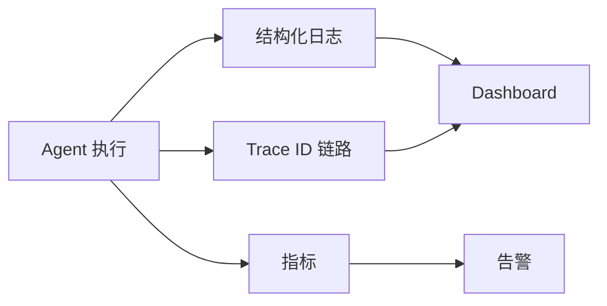

# 日志观测与链路追踪

## 解决什么问题

记录每一步决策、调用与结果，**方便排查和优化**。

## 可观测三支柱

| 支柱 | Agent 场景 | 关键字段 |
|------|------------|----------|
| Log | 每步决策 | trace_id, step, tool, latency |
| Trace | 跨工具调用 | span 父子关系 |
| Metric | SLO | 成功率、P95 延迟、成本 |

## 最小日志集

- 用户输入（脱敏）
- LLM 请求/响应 token 数
- 工具名、参数摘要、结果状态
- 错误栈与重试次数
- 最终输出与 HITL 记录

## 裸 Agent vs Harness

| 裸 Agent | Harness |
|----------|---------|
| print 调试 | 结构化 JSON |
| 无 trace | 全链路 trace_id |
| 事后翻代码 | Dashboard + 告警 |

## 设计原则

- **Trace ID 贯穿**会话与工具调用
- **敏感数据脱敏**后再入库
- **成本指标**与质量指标同等重要

## 动手练习

1. 设计一条工具调用的结构化日志 JSON
2. 列举 3 个应告警的 Agent 指标阈值
3. 如何用 Trace 定位「第 4 步工具超时」？

## 常见坑

- **日志过大**：参数全量入库
- **无关联 ID**：多轮对话无法串联
- **只 log 不 metric**：无法做 SLO

## 本仓库延伸阅读

| 文档 | 说明 |
|------|------|
| [agent-learning-path/10-生产部署/01-LangSmith可观测性.md](../../agent-learning-path/10-生产部署/01-LangSmith可观测性.md) | LangSmith |
| [openclaw-learning-path/09-安全与可观测/02-可观测性.md](../../openclaw-learning-path/09-安全与可观测/02-可观测性.md) | OTel + Dashboard |

## 小结

- Log + Trace + Metric 是可观测三支柱
- trace_id 与结构化日志是排障基础
- 成本、成功率、延迟是 Agent 核心 SLO
