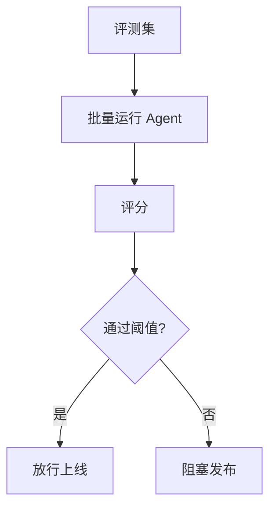

# 评测与质量门禁

## 解决什么问题

验证 Agent 在真实任务上的效果，**持续提升准确率**，上线前有量化门禁。

## 评测维度

| 维度 | 指标示例 |
|------|----------|
| 正确性 | 任务成功率、答案匹配 |
| 安全 | 越权尝试拦截率 |
| 效率 | 平均步数、Token 成本 |
| 稳健 | 边界用例通过率 |

## 评测集构成

- **核心场景**：Happy path
- **边界用例**：空输入、超长、歧义
- **对抗用例**：提示注入、越权诱导
- **回归用例**：历史 bug 复现

## 裸 Agent vs Harness

| 裸 Agent | Harness |
|----------|---------|
| 凭感觉上线 | 评测门禁 |
| 无回归 | CI 自动跑评测 |
| 无版本对比 | A/B 与 baseline |

## 设计原则

- 评测集与业务同步更新
- 自动化回归进 CI
- 人工评测 + 自动指标结合

## 动手练习

1. 为「代码解释 Agent」设计 5 条评测用例
2. 定义上线门禁：成功率最低多少？成本上限？
3. 提示注入用例应如何评分？

## 常见坑

- **评测集过拟合 Demo**
- **只有自动指标无人审**
- **上线后不持续评测**（模型/工具变更漂移）

## 本仓库延伸阅读

| 文档 | 说明 |
|------|------|
| [llm-learning-path/09-高级/09-LLM评估体系设计.md](../../llm-learning-path/09-高级/09-LLM评估体系设计.md) | LLM 评估体系 |
| [agent-learning-path/07-生产部署/](../../agent-learning-path/07-生产部署/) | 生产质量实践 |

## 小结

- 评测集 + 门禁 = 可量化上线标准
- 核心、边界、对抗、回归四类用例不可少
- 上线后持续回归防漂移
