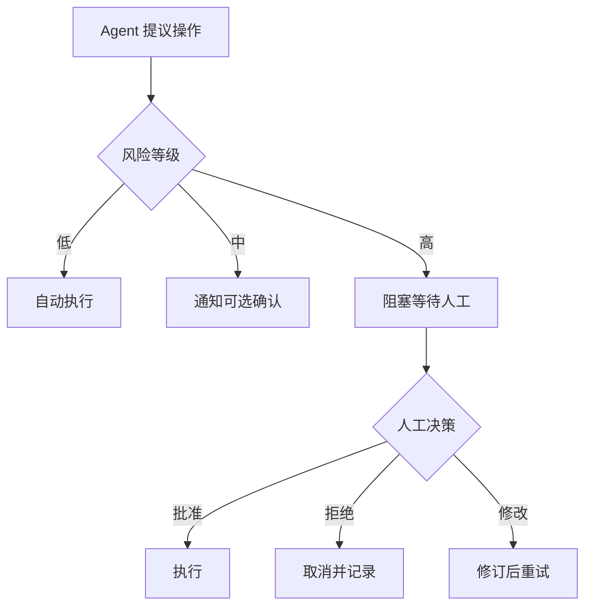

# Human Review 人工审查

## 解决什么问题

在**关键节点**让人确认，避免高风险操作和不可逆错误。

## 需 HITL 的操作清单（示例）

| 操作 | 风险 | HITL |
|------|------|------|
| 读公开文档 | 低 | 否 |
| 写测试分支 | 中 | 可选 |
| 删文件 / 改生产 | 高 | **必须** |
| 发外部邮件 | 高 | **必须** |
| 支付 / 转账 | 极高 | **必须 + 双人** |

## 裸 Agent vs Harness

| 裸 Agent | Harness |
|----------|---------|
| 自动执行到底 | 高风险暂停 |
| 无留痕 | 审批记录审计 |
| 误操作不可逆 | 拒绝/修改/撤销 |

## 设计原则

- **清单驱动**：哪些操作必须 HITL 写进配置
- **默认阻塞**：高风险默认 wait，不默认放行
- **审计留痕**：谁、何时、批/拒、理由

## 动手练习

1. 为你的 Agent 写一份 HITL 操作清单（至少 10 项）
2. 设计 HITL UI 需展示的最小信息集
3. 超时未审批时 Harness 应如何处理？

## 常见坑

- **HITL 太多**：运营疲劳，形同虚设
- **HITL 太少**：事故后补洞
- **无超时策略**：任务永久阻塞

## 本仓库延伸阅读

| 文档 | 说明 |
|------|------|
| [agent-learning-path/03-Agent/04-Human-in-the-Loop.md](../../agent-learning-path/03-Agent/04-Human-in-the-Loop.md) | LangGraph HITL |
| [openclaw-learning-path/10-与Hermes对比/02-能力矩阵对比.md](../../openclaw-learning-path/10-与Hermes对比/02-能力矩阵对比.md) | HITL 能力对比 |

## 小结

- HITL = 高风险操作的强制人工关卡
- 清单 + 阻塞 + 审计是三要素
- 与权限、Sandbox 互补，不能相互替代
