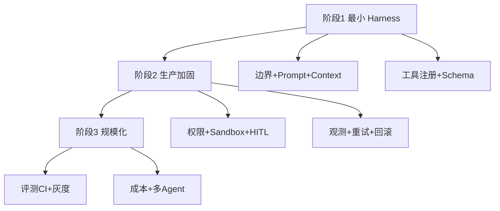
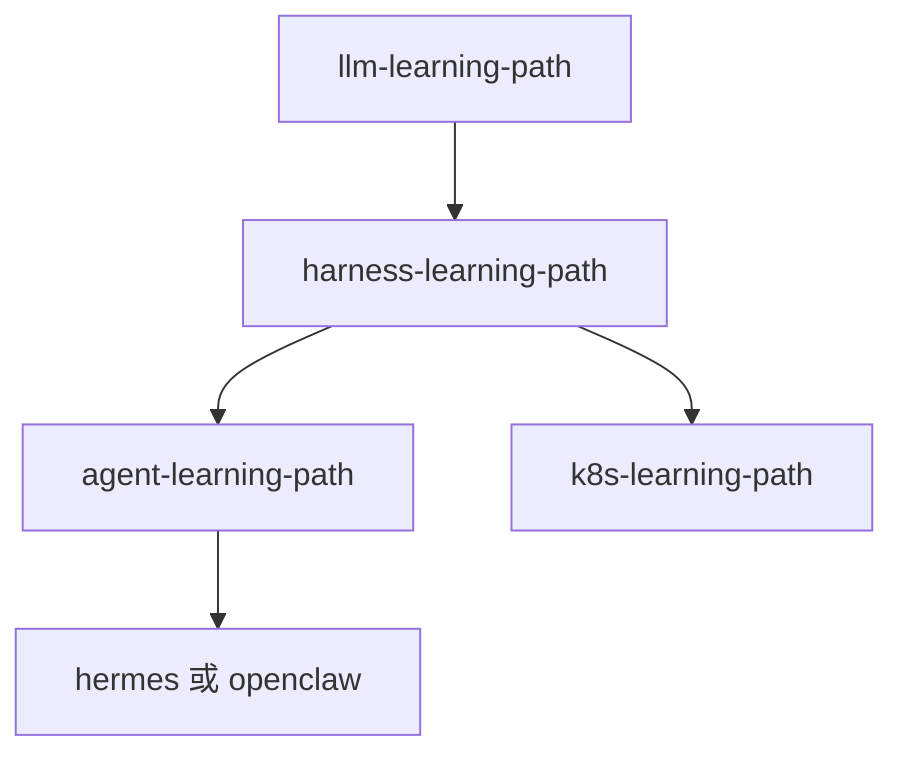

# 落地路径与迭代建议

## 落地三阶段

## 阶段 1：最小 Harness（可 Demo）

- 明确任务边界与 Prompt 规则
- Context 管理与基础工具注册
- Function Call / MCP Schema 校验

**目标**：单场景跑通，不碰生产。

## 阶段 2：生产加固（可内测）

- 权限最小化 + Sandbox
- State / Checkpoint
- 日志 + Trace + 基础告警
- HITL 高风险清单
- Retry + 快照回滚

**目标**：小流量内测，可排障可恢复。

## 阶段 3：规模化（可全量）

- 评测集 + CI 门禁
- 灰度发布与成本配额
- Memory 与多 Agent 编排（如需要）
- 运维文档与应急预案

**目标**：持续交付，指标驱动优化。

## 本仓库推荐学习顺序

| 方向 | 路径顺序 |
|------|----------|
| Agent 应用 | LLM → **Harness** → Agent → Hermes/OpenClaw |
| IDE 工具 | Harness → Claude Code（权限/MCP/Hooks） |
| 生产部署 | Harness 10 → Agent 07 → K8s |

## 迭代原则

1. **先定义任务边界和权限**
2. **从小场景试点**，逐步扩展工具
3. **全程可观测、可回滚、可审查**，才能上线
4. **每加一工具**，更新评测集与权限矩阵

## 动手练习

1. 为你当前项目标出处于阶段 1/2/3 的哪些模块
2. 写一份 4 周落地里程碑（每周交付物）
3. 列出「可暂缓」模块及业务风险接受签字

## 常见坑

- **跳过阶段 2 直接全量**
- **工具先于权限扩张**
- **无评测基线就优化 Prompt**

## 本仓库延伸阅读

| 文档 | 说明 |
|------|------|
| [agent-harmess/八大模块速通.md](../../agent-harmess/八大模块速通.md) | 落地建议原文 |
| [00-入口/03-本仓库路径对照索引.md](../00-入口/03-本仓库路径对照索引.md) | 全仓库对照 |
| [README.md](../README.md) | 路径总览 |

## 小结

- 最小 Harness → 生产加固 → 规模化，三阶段渐进
- 本仓库：LLM → Harness → Agent → 框架源码 → K8s
- 边界、权限、观测、审查、评测是迭代主轴
