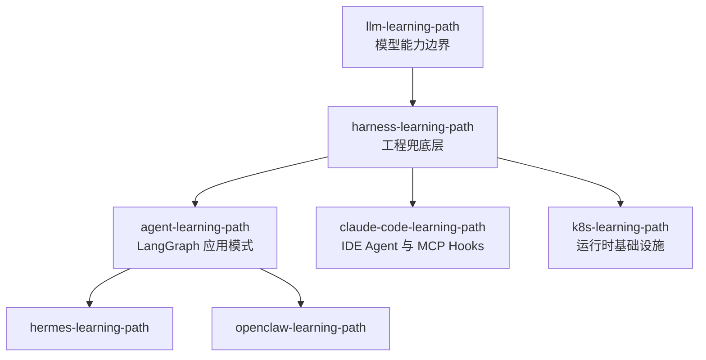

# Agent Harness 学习路径

Agent Harness 是包裹 LLM 的**工程执行与兜底系统**——决定 Agent 能否稳定、可控、可上线。本路径从「为什么需要 Harness」到十一模块架构、生产上线检查，系统掌握 Agent 工程化能力。

| 阶段 | 内容 | 预计学时 |
|------|------|----------|
| 00-入口 | 学习路线总览、参考阅读、本仓库对照索引 | 1h |
| 01-为什么需要Harness | 裸 Agent 风险、何时必须上 Harness | 3h |
| 02-架构全景 | 十一模块总览、Agent 执行循环 | 4h |
| 03-上下文与指令 | 上下文管理、Prompt 与规则约束 | 4h |
| 04-工具与协议 | 工具注册、MCP 与 Function Call | 4h |
| 05-安全执行 | 权限边界、Sandbox 沙箱 | 4h |
| 06-状态与记忆 | 任务状态、Memory 记忆系统 | 4h |
| 07-可靠性与可观测 | 重试回滚、日志观测、评测门禁 | 6h |
| 08-人在回路 | Human Review 人工审查 | 2h |
| 10-生产落地 | 上线检查清单、落地路径 | 4h |

**总计约 32 学时**

## 术语对照：8+4 vs 11 模块

| 8 核心模块（速记） | 11 模块（完整架构） |
|-------------------|---------------------|
| 上下文管理 | Prompt 与指令 + Context 上下文 |
| 工具注册 | Tools 工具能力 |
| MCP 与 Function Call | Function Call / MCP |
| 权限边界 | Access Control 权限控制 |
| Sandbox | Sandbox 沙箱执行环境 |
| 状态管理 | State 任务状态 |
| Memory | Memory 记忆系统 |
| Human Review | Human Review 人工审查 |
| — | Retry 与 Rollback、Observability、评测（四大增强） |

## 核心等式

> 模型负责「想什么」，Harness 负责「怎么做、做得对、可控、可恢复」。

## 在本仓库中的位置

- **推荐顺序**（Agent 方向）：LLM 基础 → **本路径** → Agent 框架 → Hermes / OpenClaw → K8s 部署
- **速记参考**：[`agent-harmess/`](../agent-harmess/) 四篇导图提取稿
- **对照索引**：[00-入口/03-本仓库路径对照索引.md](00-入口/03-本仓库路径对照索引.md)

## 学习建议

1. **先建立全局观**：01 为什么 + 02 架构，再按模块深入
2. **对照本仓库**：每章「延伸阅读」链到 Agent/Hermes/OpenClaw 等具体实现
3. **以上线检查收束**：阶段 10 的 15 项清单是工程验收标准
