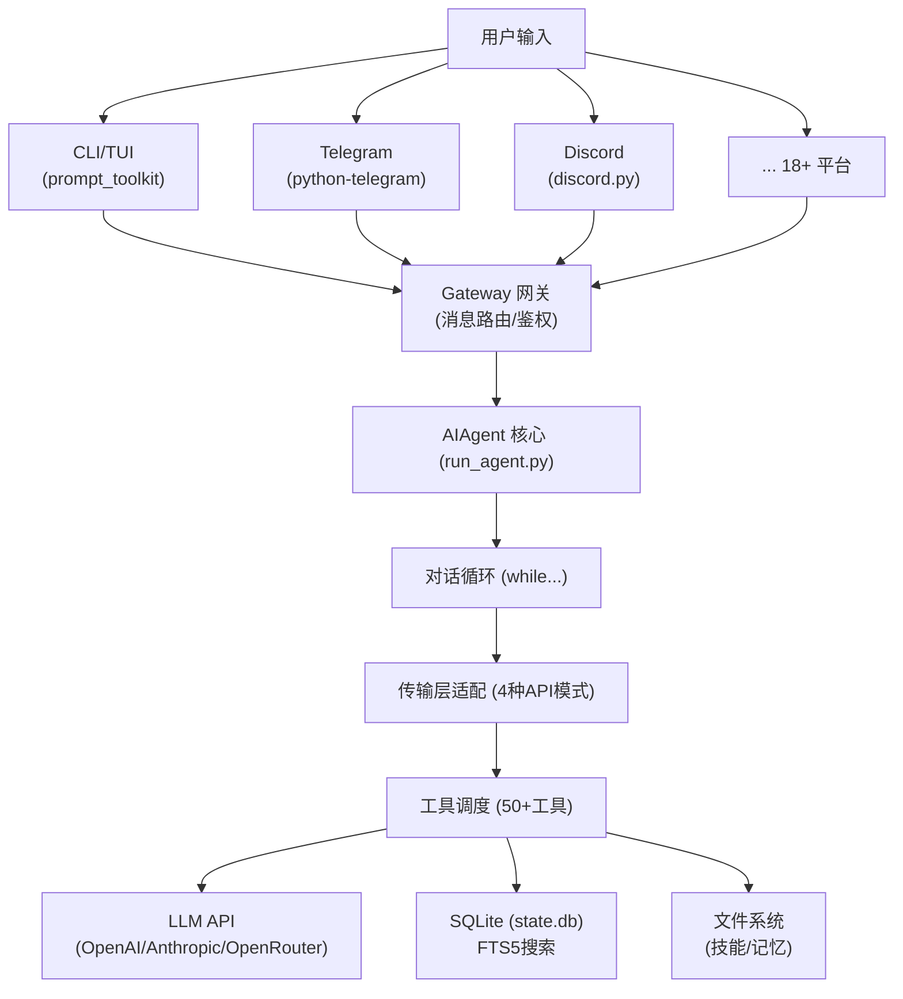
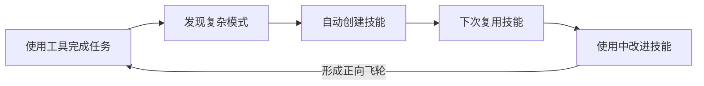

# 00 - 概述与架构总览

## Hermes Agent 是什么？

Hermes Agent 是 [Nous Research](https://nousresearch.com) 构建的一个**自进化 AI 代理**。它不是简单的"聊天机器人"——它内置了完整的学习闭环:

- 🧠 **从经验中学习**: 完成复杂任务后自动创建"技能"，下次遇到类似任务直接复用
- 🔧 **技能自我改进**: 使用技能过程中发现的问题会自动修补
- 📝 **主动记忆管理**: 自己决定什么该记住、什么该遗忘，跨会话持久化知识
- 🔍 **会话搜索**: 通过 FTS5 全文搜索 + LLM 摘要实现跨会话回溯
- 🌐 **多平台接入**: 同一个 Agent 核心，通过 Telegram、Discord、Slack、WhatsApp 等 18+ 平台访问

## 技术栈一览

```
┌─────────────────────────────────────────────────────────────────┐
│                        技术栈全景图                               │
├──────────────┬──────────────────────────────────────────────────┤
│   层级        │   使用的技术                                      │
├──────────────┼──────────────────────────────────────────────────┤
│   语言        │   Python 3.11+                                   │
│   AI SDK      │   openai>=2.21, anthropic>=0.39                  │
│   CLI/TUI     │   prompt_toolkit, rich, fire                     │
│   数据库       │   SQLite (WAL模式) + FTS5 全文搜索               │
│   配置管理     │   YAML (ruamel.yaml)                             │
│   消息平台     │   python-telegram-bot, discord.py, slack-bolt    │
│   浏览器自动化  │   agent-browser (CDP协议), Playwright(可选的)    │
│   沙箱执行     │   Docker, Modal, Daytona, SSH, Singularity       │
│   调度器       │   croniter (cron 表达式解析)                      │
│   语音         │   faster-whisper (STT), edge-tts (TTS免费)       │
│   打包         │   setuptools + uv                                │
│   可观测性     │   logging (结构化), JSONL 轨迹记录               │
└──────────────┴──────────────────────────────────────────────────┘
```

## 项目结构总览

整个项目代码约 **30万行**（不含测试），核心组织如下:

```
hermes-agent/
├── run_agent.py          ← 🔥 Agent核心 (15075行) — 主对话循环
├── cli.py                ← CLI交互界面 (588KB)
├── hermes_state.py       ← SQLite会话持久化 (123KB)
├── model_tools.py        ← 工具调度层
├── toolsets.py           ← 工具集定义
├── agent/                ← Agent内部模块 (54个文件, ~36000行)
│   ├── transports/       ← 传输层 (适配不同LLM API)
│   ├── prompt_builder.py ← System Prompt 构建引擎
│   ├── memory_manager.py ← 记忆管理器
│   ├── context_compressor.py ← 上下文压缩器
│   ├── tool_guardrails.py    ← 工具安全护栏
│   ├── error_classifier.py   ← 错误分类与故障转移
│   ├── curator.py        ← 技能维护管家
│   ├── trajectory.py     ← 轨迹记录
│   └── ...
├── tools/                ← 50+ 工具实现
├── skills/               ← 内置技能库 (27个分类)
├── gateway/              ← 消息网关 (18+ 平台适配)
├── hermes_cli/           ← CLI子命令系统
├── plugins/              ← 插件系统
├── cron/                 ← 定时任务调度
└── tests/                ← 测试
```

## 宏观架构图

下面这张图展示了 Hermes Agent 运行时的整体数据流:



## 核心设计哲学

### 1. "管道式"消息处理

Agent 不直接操作原始 LLM API。所有请求都经过一条**统一管道**:

```
用户消息 → 记忆注入 → System Prompt 组装 → 传输层转换 → API调用 → 响应归一化 → 工具执行 → 结果注入 → 循环
```

每个环节都是独立的模块，可以单独替换或扩展。

### 2. 多传输层适配

同一个 Agent 代码可以对接 **4 种不同的 API 协议**:

| API 模式 | 用途 | 代表模型 |
|----------|------|----------|
| `chat_completions` | OpenAI 兼容 API | GPT-5, Gemini, Kimi, DeepSeek, Qwen, 等 16+ 提供商 |
| `anthropic_messages` | Anthropic Messages API | Claude Opus/Sonnet/Haiku |
| `codex_responses` | OpenAI Responses API | Codex, GPT-5 (Responses模式) |
| `bedrock_converse` | AWS Bedrock Converse | Claude (AWS托管) |

### 3. 故障自愈

Agent 不会因为一次 API 调用失败就崩溃。它有 4 层容错:

1. **凭证池轮换**: 同提供商的多个 API Key 自动切换
2. **提供商故障转移**: 主提供商挂了自动切备用
3. **上下文溢出自修复**: 检测到超出上下文窗口时自动压缩
4. **指数退避重试**: 带抖动的退避策略避免雪崩

### 4. 自进化闭环



---

## 下一步

接下来我们从 [01-Agent核心循环](01-Agent核心循环.md) 开始，深入理解 Agent 是怎么"思考"和"行动"的。
