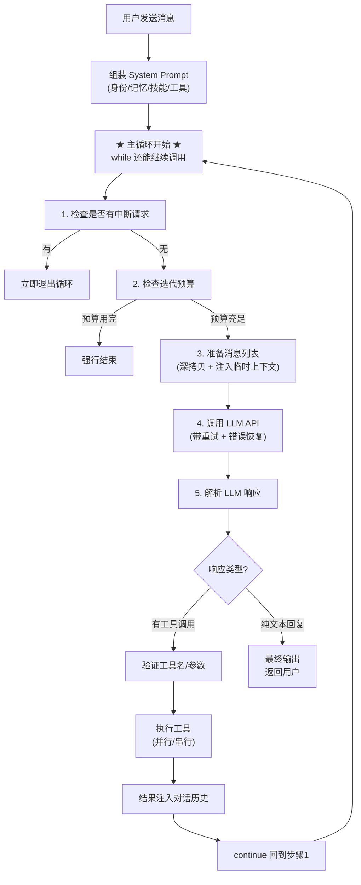
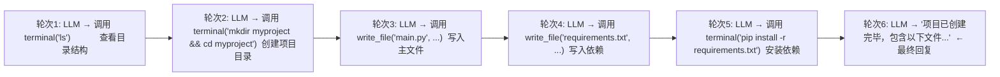

# 01 - Agent 核心循环

## 这一章讲什么？

这是理解 Hermes Agent 最关键的一章。我们把 Agent 的"大脑"拆开来看——它怎么接收输入、怎么调用 LLM、怎么执行工具、怎么循环往复直到完成任务。

核心代码在 [run_agent.py](../code/hermes-agent/run_agent.py) 的 `AIAgent` 类（第 1028 行开始，约 15000 行）。

## AIAgent 是什么？

`AIAgent` 是一个"管家"类。它不自己写回复，也不自己执行 shell 命令。它做的事情是**编排**: 把用户消息发给 LLM，LLM 说要调什么工具就帮忙调，把工具结果塞回对话历史，再发给 LLM，直到 LLM 说"我完成了，这是最终答案"。

可以这样理解:

```
AIAgent = 对话管理器 + LLM客户端 + 工具执行器 + 错误处理器
```

## 核心循环流程图

这是 Agent 最核心的运行逻辑:



## 逐步拆解

### 第1步: 初始化 (__init__, 约1350行)

Agent 初始化做的事非常多，但可以归为几类:

```python
class AIAgent:
    def __init__(self, ...):
        # 1. 基本身份
        self.model = "claude-opus-4-20250514"
        self.provider = "anthropic"
        self.platform = "cli"  # 或 "telegram", "discord"...

        # 2. 循环控制
        self.max_iterations = 90        # 最多调90次LLM
        self.iteration_budget = ...     # 迭代预算（父子Agent共享）

        # 3. LLM客户端 (懒加载)
        self.client = None              # OpenAI兼容客户端
        self._anthropic_client = None   # Anthropic原生客户端
        self.api_mode = ...             # 自动检测用哪种API协议

        # 4. 工具系统
        self.tools = [...]              # 所有可用工具的JSON Schema
        self.valid_tool_names = {...}   # 快速查找合法工具名

        # 5. 记忆系统
        self._memory_store = ...        # MEMORY.md + USER.md
        self._memory_manager = ...      # 外部记忆提供者插件

        # 6. 上下文管理
        self.context_compressor = ...   # 上下文太长时自动压缩
        self._cached_system_prompt = "" # System Prompt缓存

        # 7. 会话持久化
        self._session_db = ...          # SQLite会话存储

        # 8. 回调系统 (给TUI/网关用的钩子)
        self.stream_delta_callback = ...  # 流式文本回调
        self.tool_progress_callback = ... # 工具进度回调
        self.thinking_callback = ...      # 思考指示器回调
        # ... 20+ 种回调

        # 9. 安全机制
        self._tool_guardrails = ...       # 工具护栏
        self._credential_pool = ...       # 凭证池

        # 10. 容错机制
        self._fallback_chain = [...]      # 备用提供商链
        self._rate_limit_state = ...      # 速率限制追踪
```

### 第2步: run_conversation() — 对话入口

```python
async def run_conversation(self, system_message, messages, ...):
    # 1. 准备工作: 激活fallback, hydrate todo列表, 注入记忆
    # 2. 进入主循环 → 不断调用LLM直到获得最终答案
    # 3. 收尾工作: 保存会话, 保存轨迹, 触发记忆同步
    # 4. 返回结构化结果
```

这个方法本身不长，核心逻辑全在 while 循环里。

### 第3步: 主循环详解 (while 循环体)

```python
while (api_call_count < self.max_iterations
       and self.iteration_budget.remaining > 0
       or self._budget_grace_call):  # 预算用完后还有一次"告别调用"

    # --- 3a. 中断检查 ---
    if self._interrupt_requested:
        break  # 用户按了Ctrl+C或在Telegram发了/stop

    # --- 3b. 迭代预算 ---
    self.iteration_budget.consume()  # 扣一个token，不够了标记耗尽

    # --- 3c. 触发步骤回调 ---
    # 网关用这个回调实现 agent:step 事件（对外广播）
    self.step_callback(...)

    # --- 3d. 注入 /steer 文本 ---
    # 用户可以在Agent运行时发送指导信息
    steer_text = self._drain_pending_steer()
    if steer_text:
        # 追加到上一条工具结果后面
        last_msg["content"] += f"\n[User guidance: {steer_text}]"

    # --- 3e. 准备消息列表 ---
    api_messages = copy.deepcopy(messages)  # 深拷贝，避免修改原列表
    # 剥离内部字段（call_id等），规范化空白，过滤非法Unicode

    # --- 3f. 组装完整消息 (System + User + History) ---
    if system_prompt:
        api_messages.insert(0, {"role": "system", "content": system_prompt})
    if self.prefill_messages:
        api_messages.extend(self.prefill_messages)  # few-shot示例

    # 给Anthropic API打缓存标记（让Claude复用prompt缓存）
    apply_anthropic_cache_control(api_messages, ...)

    # --- 3g. 调用LLM API (带重试循环) ---
    for retry_count in range(max_retries):
        try:
            response = await self._do_api_call(api_messages, ...)
            break  # 成功，跳出重试循环
        except Exception as e:
            reason = classify_api_error(e)  # 分类错误
            # 根据错误类型执行恢复策略:
            #   - 429 限流 → 换凭证/退避重试
            #   - 上下文溢出 → 压缩历史
            #   - 401 认证过期 → 刷新token
            #   - 503 过载 → 切换备用提供商
            if not recoverable:
                raise  # 无法恢复，向上传播

    # --- 3h. 解析响应 ---
    # transport.normalize_response() 把各种API格式统一成:
    # { content: str, tool_calls: [...], finish_reason: str,
    #   reasoning: str, usage: {...} }
    assistant_msg = self._get_transport().normalize_response(response)

    # --- 3i. 处理工具调用 ---
    if assistant_msg.tool_calls:
        # 验证: 工具名有效吗? JSON参数合法吗?
        # 自动修复: 近似的工具名、格式错误尝试修正
        self._repair_tool_call(...)

        # 护栏检查: 是不是在死循环调同一个失败工具?
        guardrail_result = self._tool_guardrails.check(...)

        # 执行: 并发(ThreadPoolExecutor)或串行
        tool_results = await self._execute_tool_calls(
            assistant_msg.tool_calls, messages, ...
        )

        # 把结果注入消息历史
        for result in tool_results:
            messages.append({
                "role": "tool",
                "tool_call_id": result.id,
                "content": result.content
            })

        continue  # ← 回到循环开头，LLM看到工具结果后继续

    # --- 3j. 无工具调用 → 这就是最终答案 ---
    else:
        # 但要检查是不是空回复（模型卡壳了）
        if not assistant_msg.content.strip():
            # 尝试多种恢复策略:
            #   1. 注入 "Please continue" 再试
            #   2. 切换到备用模型
            #   3. 最多重试3次空回复
            ...

        # 正常回复 → 跳出循环
        break
```

### 第4步: 收尾工作

```python
# 循环结束后:
# 1. 处理预算耗尽 → 如果还有内容没输出，做最后一次摘要调用
# 2. 保存系统提示到会话日志
# 3. 写入JSONL轨迹文件 (如果开启)
# 4. 异步触发记忆同步 (不阻塞用户等待)
# 5. 触发插件 on_session_end 钩子
# 6. 返回结构化结果 {text, usage, model, ...}
```

## 关键设计决策

### 为什么用深拷贝而不是直接修改消息列表？

Agent 循环中会反复用到 `messages`。如果工具调用失败需要回滚，或者 `/undo` 要撤销上一步，有原始列表可以直接回退。深拷贝约 2ms，换来的是安全的错误恢复。

### 迭代预算怎么算？

```
每次LLM调用         = 扣1个预算点
execute_code 工具    = 返还0.5个预算点 (轻量工具)
预算用完             = 还有1次"告别调用" (让模型做个总结)
子Agent启动          = 继承父Agent的预算
默认总预算           = 90次调用 + 1次告别
```

### 中断是怎么实现的？

```python
# 线程A (主循环): 每轮循环开头检查
if self._interrupt_requested:
    break

# 线程B (用户输入): 按Ctrl+C时
agent.interrupt("User pressed Ctrl+C")
# → 设置 _interrupt_requested = True
# → 终止正在运行的工具子进程
# → 递归中断所有子Agent
```

## 一个真实调用场景

假设用户说 "帮我在当前目录创建一个 Python web 项目":



每一轮都是一次完整的"调用LLM → 解析 → 执行工具 → 反馈结果"循环。

---

## 下一步

理解了 Agent 怎么循环之后，下一章 [02-工具调用系统](02-工具调用系统.md) 深入看工具是怎么定义、注册、调度和执行的。
