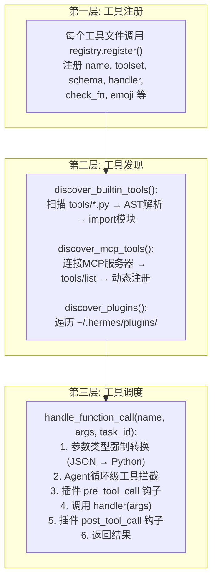
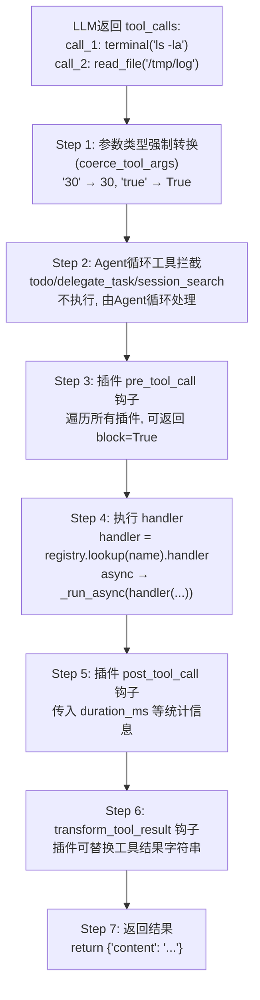
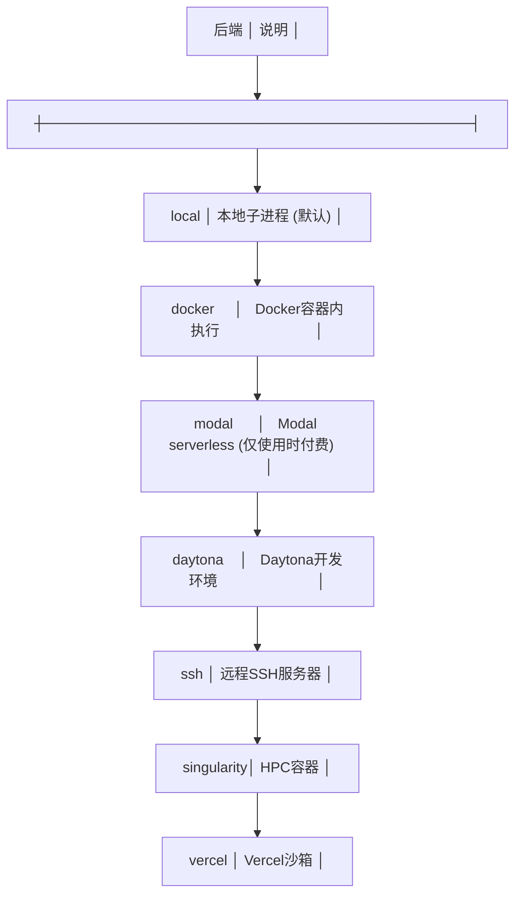
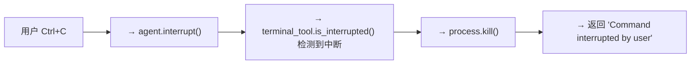

# 02 - 工具调用系统

## 这一章讲什么？

Agent 的能力来自工具。Hermes Agent 有 50+ 内置工具，还支持通过 MCP 协议和插件系统无限扩展。这一章详解工具从"注册"到"执行"的完整生命周期。

核心文件:
- [model_tools.py](../code/hermes-agent/model_tools.py) — 工具调度中枢
- [tools/registry.py](../code/hermes-agent/tools/registry.py) — 工具注册表
- [tools/terminal_tool.py](../code/hermes-agent/tools/terminal_tool.py) — 终端工具 (最复杂的工具)
- [toolsets.py](../code/hermes-agent/toolsets.py) — 工具集管理

## 工具系统的三层架构



## 工具注册详解

### ToolEntry 数据结构

每个注册的工具被包装成一个 `ToolEntry`:

```python
@dataclass
class ToolEntry:
    name: str                # "terminal"
    toolset: str             # "terminal"
    schema: dict             # 完整的 OpenAI function 定义
    handler: Callable        # 实际的 Python 函数
    check_fn: Callable       # 返回 True 表示工具可用
    is_async: bool           # handler 是否是 async 的
    emoji: str               # ">_"
    description: str         # 人类可读描述
    requires_env: list[str]  # 需要的环境变量 (用于显示配置提示)
```

### 自动发现机制（AST扫描）

有趣的是，Hermes 不用 `import *` 或硬编码列表来发现工具。它用 **AST 解析**:

```python
def discover_builtin_tools():
    tools_dir = Path(__file__).parent / "tools"
    for py_file in tools_dir.glob("*.py"):
        # 读取文件源码，用 ast.parse() 解析
        tree = ast.parse(py_file.read_text())
        # 查找顶层 registry.register() 或 registry.register_async() 调用
        for node in ast.walk(tree):
            if (isinstance(node, ast.Call)
                and isinstance(node.func, ast.Attribute)
                and node.func.attr in ("register", "register_async")):
                # 找到了! import 这个模块
                importlib.import_module(f"tools.{py_file.stem}")
                break
```

为什么用 AST 而不是直接 import? 因为有些工具文件 import 时会触发副作用（比如连接外部服务），AST 扫描是零成本的。

## 工具 Schema 生成

每个工具需要给 LLM 提供一个 JSON Schema 描述。这是 LLM 知道"有哪些工具、怎么用"的唯一途径。

```python
# terminal 工具的 schema (简化版)
{
    "type": "function",
    "function": {
        "name": "terminal",
        "description": "在终端中执行shell命令",
        "parameters": {
            "type": "object",
            "properties": {
                "command": {
                    "type": "string",
                    "description": "要执行的shell命令"
                },
                "background": {
                    "type": "boolean",
                    "description": "是否后台运行",
                    "default": False
                },
                "timeout": {
                    "type": "integer",
                    "description": "超时时间(秒)"
                },
                "workdir": {
                    "type": "string",
                    "description": "工作目录"
                }
            },
            "required": ["command"]
        }
    }
}
```

### 动态 Schema

有些工具的 Schema 不是固定的，而是根据运行时状态动态生成的:

- `execute_code`: 根据当前可用的沙箱工具列表构建 Schema
- `discord`: 根据 bot 的 intents 权限动态增减参数
- `browser_navigate`: 当 web 相关工具不可用时，从描述中移除 web 工具的交叉引用

### Schema 缓存

`get_tool_definitions()` 的结果被缓存（memoize），key 是 `(启用的工具集, 禁用的工具集, 注册表版本, 配置mtime)`。这意味着切换模型/平台时不需要重建 Schema。

## 工具调度全流程



### 参数类型强制转换

这是一个小但关键的机制。开源模型（尤其是 7B/13B 量级）经常把参数类型搞错:

```
LLM 输出: {"timeout": "30"}     ← 字符串，但 Schema 要求 integer
LLM 输出: {"force": "true"}     ← 字符串，但 Schema 要求 boolean
LLM 输出: {"paths": "file.txt"} ← 字符串，但 Schema 要求 array
```

`coerce_tool_args()` 自动修正这些:

```python
def coerce_tool_args(args: dict, schema: dict) -> dict:
    for param_name, param_schema in schema["properties"].items():
        if param_name not in args:
            continue
        expected_type = param_schema.get("type")
        value = args[param_name]

        if expected_type == "integer" and isinstance(value, str):
            args[param_name] = int(value)      # "30" → 30
        elif expected_type == "boolean" and isinstance(value, str):
            args[param_name] = value.lower() == "true"  # "true" → True
        elif expected_type == "array" and isinstance(value, str):
            args[param_name] = json.loads(value)  # "[1,2]" → [1,2]
        # ...
```

## 工具并发执行

如果 LLM 一次性返回了多个工具调用（比如同时调 `read_file` 和 `web_search`），Agent 默认**并发执行**它们:

```python
def _execute_tool_calls_concurrent(self, tool_calls, ...):
    with ThreadPoolExecutor(max_workers=N) as executor:
        futures = {}
        for tc in tool_calls:
            # 提交到线程池
            future = executor.submit(self._run_tool_worker, tc, ...)
            futures[future] = tc

        # 等待所有完成
        results = []
        for future in as_completed(futures):
            results.append(future.result())

    # 按原始顺序排列结果（保持消息对齐）
    return sorted(results, key=lambda r: r.order_index)
```

但有些工具**必须串行执行**（比如前一个工具的结果是后一个工具的输入时）。可以通过配置 `tool_execution_mode: sequential` 强制串行。

## 工具集 (Toolset) 系统

工具不是散装的，而是按功能分组的"工具集"(Toolset)。这解决了几个问题:

1. **按场景激活**: Telegram 机器人不需要浏览器工具，代码项目不需要 Discord 工具
2. **权限控制**: 给不同用户/平台分配不同工具集
3. **减少 Schema 体积**: 只发给 LLM 需要的工具，节省 token

```python
# toolsets.py 中的定义
TOOLSETS = {
    "terminal": {
        "description": "终端命令执行",
        "tools": ["terminal"],
    },
    "browser": {
        "description": "网页浏览和交互",
        "tools": ["browser_navigate", "browser_snapshot", "browser_click",
                   "browser_type", "browser_scroll", "browser_back"],
    },
    "web": {
        "description": "网络搜索和数据提取",
        "tools": ["web_search", "web_extract"],
    },
    "developer": {
        "description": "完整开发工具集",
        "includes": ["terminal", "file_ops", "web", "code_execution"],
        # ↑ 组合了多个工具集
    },
}
```

### 工具集的分发机制

在 batch 数据生成场景中，`toolset_distributions.py` 按概率随机启用工具集:

```python
# "browser_tasks" 分布: 97%概率启用browser, 12%概率启用vision, ...
def sample_toolsets_from_distribution(name):
    for toolset_name, probability in DISTRIBUTIONS[name].items():
        if random.random() < probability:
            enabled.add(toolset_name)
```

## 终端工具深度剖析

`terminal_tool` 是 Hermes Agent 中最重要也最复杂的工具。它支持 **6 种后端**:



### 终端工具的安全机制

```python
def terminal_tool(command, background=False, timeout=None,
                  task_id=None, force=False, workdir=None):

    # 1. 危险命令检测
    if not force and is_dangerous_command(command):
        # rm -rf /, dd if=, mkfs, >/dev/sda 等
        # 返回审批请求
        return {"approval_required": True, "danger": reason}

    # 2. 选择后端
    env = get_active_env()  # 从 TERMINAL_ENV 环境变量读取

    # 3. 选择工作目录 (隔离)
    if env == "docker":
        workdir = f"/workspace/{task_id}"
    elif env == "modal":
        workdir = f"/root/workspace/{task_id}"

    # 4. 执行命令
    if background:
        # 后台模式: spawn + 返回pid
        pid = spawn_process(command, workdir, env)
        return {"pid": pid, "status": "running"}
    else:
        # 前台模式: 阻塞等待结果
        output = run_command(command, workdir, timeout, env)
        return {"output": output, "exit_code": exit_code}
```

### 中断传播

用户按 Ctrl+C 时:



## 工具结果处理

工具执行完后，结果经过几层处理才注入对话历史:

```python
# 1. 原始结果
result = {"output": "file1.txt\nfile2.txt\ndir1/", "exit_code": 0}

# 2. 持久化检查 (maybe_persist_tool_result)
if len(result.content) > PERSIST_THRESHOLD:
    # 大结果写入临时文件，消息中只放路径引用
    persist_path = write_temp(result.content)
    result.content = f"[Tool output saved to {persist_path}]"

# 3. 子目录提示注入 (SubdirectoryHintTracker)
# 如果命令中出现了路径，自动检查那个目录下有没有 AGENTS.md
if "/home/user/project" in command:
    hint = discover_context_files("/home/user/project")
    result.content += f"\n{hint}"

# 4. 多模态内容解包
# 如果结果包含图片/文件引用，展开成消息parts

# 5. 注入对话历史
messages.append({
    "role": "tool",
    "tool_call_id": tc.id,
    "name": tc.name,
    "content": result.content
})
```

---

## 下一步

理解了工具系统之后，下一章 [03-多传输层适配](03-多传输层适配.md) 看 Agent 怎么用同一套代码对接 4 种不同的 LLM API 协议。
