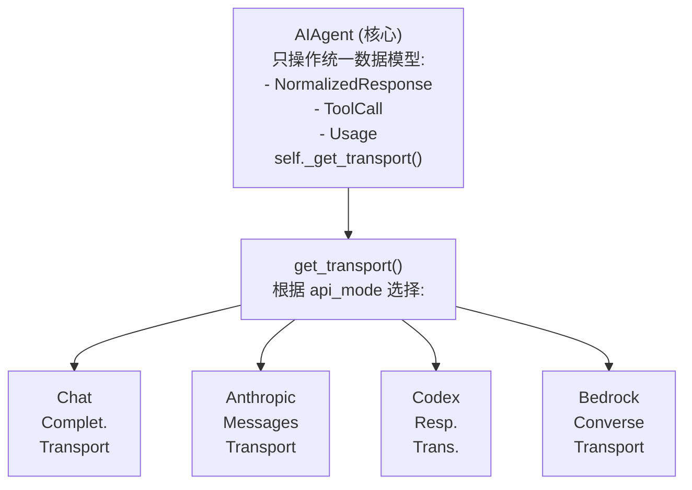
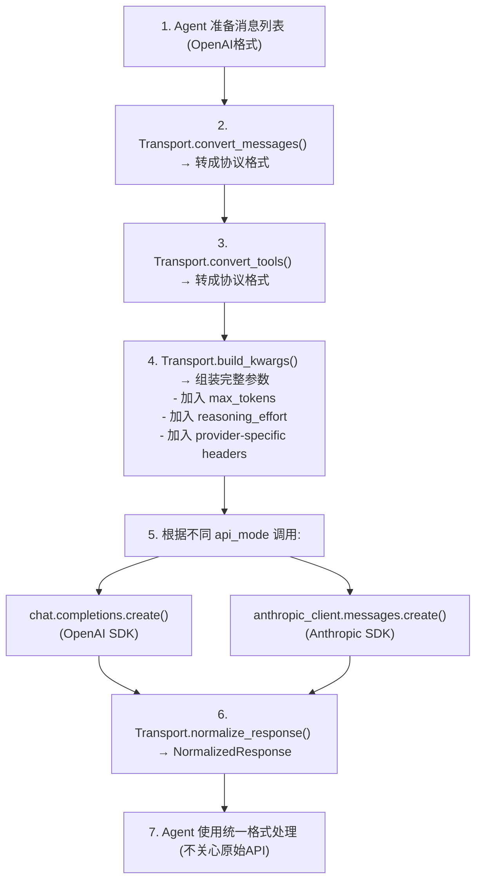

# 03 - 多传输层适配

## 这一章讲什么？

Hermes Agent 能对接几乎所有主流 LLM 提供商（OpenAI GPT、Anthropic Claude、Google Gemini、AWS Bedrock、Kimi、DeepSeek、Qwen...），靠的是一套精巧的**传输层适配**架构。同一套 Agent 代码，换个 API 模式就能换模型，不用改一行业务逻辑。

核心代码在 [agent/transports/](../code/hermes-agent/agent/transports/) 目录下。

## 问题: 每个 LLM API 都不一样

不同的 LLM 提供商使用不同的 API 协议:

```
OpenAI Chat Completions:
  POST /v1/chat/completions
  {"model": "gpt-5", "messages": [
    {"role": "user", "content": "Hello"}
  ]}
  响应: {"choices": [{"message": {"content": "Hi!", "tool_calls": [...]}}]}

Anthropic Messages:
  POST /v1/messages
  {"model": "claude-opus-4-20250514", "messages": [
    {"role": "user", "content": [{"type": "text", "text": "Hello"}]}
  ]}
  响应: {"content": [{"type": "text", "text": "Hi!"}, {"type": "tool_use", ...}]}

OpenAI Responses API (Codex):
  POST /v1/responses
  {"model": "codex", "input": [
    {"role": "user", "content": "Hello"}
  ]}
  响应: {"output": [{"type": "message", "content": [...]}, {"type": "function_call", ...}]}

AWS Bedrock Converse:
  POST /model/anthropic.claude-3-opus/converse
  {"messages": [...], "inferenceConfig": {...}}
  响应: {"output": {"message": {"content": [...], "toolUse": [...]}}}
```

如果不做适配，核心代码里就会充满 `if anthropic: ... elif openai: ... elif bedrock: ...`，根本没法维护。

## 解决方案: 策略模式 + 统一数据模型

Hermes 用了一个经典的**策略模式**:



### 统一数据模型 (transports/types.py)

所有传输层都"说"同一种语言:

```python
@dataclass
class ToolCall:
    """统一的工具调用表示"""
    id: str                    # 调用ID
    name: str                  # 工具名
    arguments: str             # JSON参数字符串
    provider_data: dict        # 提供商标识数据(用于重放)

@dataclass
class Usage:
    """统一的Token用量"""
    prompt_tokens: int
    completion_tokens: int
    total_tokens: int
    cached_tokens: int = 0

@dataclass
class NormalizedResponse:
    """统一的LLM响应"""
    content: Optional[str]           # 文本内容
    tool_calls: Optional[List[ToolCall]]  # 工具调用列表
    finish_reason: Optional[str]     # "stop", "tool_calls", "length"
    reasoning: Optional[str]         # 推理过程 (o1/Claude thinking)
    usage: Optional[Usage]           # Token用量
    provider_data: dict              # 提供商标识数据
```

### 传输层接口 (transports/base.py)

```python
class ProviderTransport(ABC):
    @abstractmethod
    def convert_messages(self, messages: list) -> list:
        """把OpenAI格式消息转成协议所需格式"""
        ...

    @abstractmethod
    def convert_tools(self, tools: list) -> list:
        """把OpenAI格式工具Schema转成协议所需格式"""
        ...

    @abstractmethod
    def build_kwargs(self, messages, tools, ...) -> dict:
        """构建API调用所需的全部参数"""
        ...

    @abstractmethod
    def normalize_response(self, response) -> NormalizedResponse:
        """把协议原生响应转成统一格式"""
        ...

    def validate_response(self, response) -> bool:
        """检查响应是否合法 (空回复? 格式错误?)"""
        ...

    def extract_cache_stats(self, response) -> dict:
        """提取缓存命中信息"""
        ...
```

## 四种传输层详解

### 1. ChatCompletionsTransport (默认，最常用)

这是 OpenHermes 的"主路径"。对接所有 OpenAI 兼容 API（约 16+ 提供商）。

```python
class ChatCompletionsTransport(ProviderTransport):
    def convert_messages(self, messages):
        # 基本是透传，但要清理 Codex 泄露的字段
        # (比如 Anthropic → chat_completions 切换时残留的 codex_reasoning_items)
        clean = []
        for msg in messages:
            clean_msg = {k: v for k, v in msg.items()
                        if k not in ("codex_reasoning_items", "call_id", "response_item_id")}
            clean.append(clean_msg)
        return clean

    def build_kwargs(self, messages, tools, model, ...):
        kwargs = {
            "model": model,
            "messages": messages,
            "tools": tools,
            "max_tokens": max_tokens,
        }
        # 处理各种特殊逻辑:
        # - GPT-5/Codex: 把 "system" 角色换成 "developer"
        # - Kimi/Moonshot: 清理不兼容的 tool schema 字段
        # - Gemini: 添加 thought_signature
        # - LM Studio: 解析 reasoning effort
        return kwargs

    def normalize_response(self, response):
        choice = response.choices[0]
        msg = choice.message

        tool_calls = []
        if msg.tool_calls:
            for tc in msg.tool_calls:
                tool_calls.append(ToolCall(
                    id=tc.id,
                    name=tc.function.name,
                    arguments=tc.function.arguments,
                ))

        return NormalizedResponse(
            content=msg.content,
            tool_calls=tool_calls or None,
            finish_reason=choice.finish_reason,
            usage=Usage(...),
        )
```

**适配的提供商特性**:
- Moonshot/Kimi: 工具参数中不能有 `pattern` 和 `format` 关键字，需要清理
- DeepSeek: 需要特殊的 reasoning_content 桥接
- Gemini: 需要在 tool_call 中保留 `thought_signature` 用于重放
- GPT-5/Codex: `system` role 必须替换为 `developer` role
- Alibaba: identity 必须放在第一条 user message 中（API bug 绕过）

### 2. AnthropicTransport

适配 Anthropic Messages API。最复杂的是内容格式转换。

```python
class AnthropicTransport(ProviderTransport):
    def convert_messages(self, messages):
        # OpenAI: [{"role": "user", "content": "hello"}]
        # Anthropic: [{"role": "user", "content": [{"type": "text", "text": "hello"}]}]
        # 多了一个 content 层级，每段文本/图片/工具调用都是独立的 content block
        return anthropic_adapter.convert(messages)

    def normalize_response(self, response):
        content_blocks = response.content  # [{type: "text", text: "..."}, {type: "tool_use", ...}]

        text_parts = []
        tool_calls = []
        reasoning_parts = []

        for block in content_blocks:
            if block.type == "text":
                text_parts.append(block.text)
            elif block.type == "tool_use":
                tool_calls.append(ToolCall(
                    id=block.id,
                    name=block.name,
                    arguments=json.dumps(block.input),
                ))
            elif block.type == "thinking":
                reasoning_parts.append(block.thinking)

        return NormalizedResponse(
            content="\n".join(text_parts) if text_parts else None,
            tool_calls=tool_calls or None,
            reasoning="\n".join(reasoning_parts) if reasoning_parts else None,
            finish_reason=map_stop_reason(response.stop_reason),
            ...
        )
```

**prompt caching 支持**: AnthropicTransport 是唯一支持 Prompt Caching 的传输层。`apply_anthropic_cache_control()` 在消息上标记 `cache_control: {"type": "ephemeral"}`:

```python
# 缓存策略: system_and_3 (system prompt + 最后3条非system消息)
messages[0]["content"][-1]["cache_control"] = {"type": "ephemeral"}  # system
for i in range(max(0, len(messages)-3), len(messages)):
    if messages[i]["role"] != "system":
        messages[i]["content"][-1]["cache_control"] = {"type": "ephemeral"}
```

### 3. ResponsesApiTransport

适配 OpenAI Responses API（Codex系列）。这个 API 的格式和前两个完全不同。

```python
class ResponsesApiTransport(ProviderTransport):
    def build_kwargs(self, messages, tools, ...):
        # Chat API 用 "messages", Responses API 用 "input"
        # Chat API 用 "tools", Responses API 用 "tools" (但格式略有不同)
        kwargs = {
            "model": model,
            "input": self.convert_messages(messages),
            "tools": self.convert_tools(tools),
            "instructions": extract_system(messages),  # system prompt 单独提取
        }
        return kwargs

    def normalize_response(self, response):
        # 解析 output 列表中的各种 item 类型
        for item in response.output:
            if item.type == "message":
                for content_item in item.content:
                    if content_item.type == "output_text":
                        text += content_item.text
            elif item.type == "function_call":
                tool_calls.append(ToolCall(
                    id=item.call_id,
                    name=item.name,
                    arguments=item.arguments,
                ))
```

### 4. BedrockTransport

适配 AWS Bedrock Converse API。这个 API 在调用方式上和其他三个完全不同:

```python
class BedrockTransport(ProviderTransport):
    def normalize_response(self, response):
        # Bedrock 的响应可能是两种形态:
        # 1. 原始 boto3 返回的 dict
        # 2. 已经被 bedrock_adapter 转成 SimpleNamespace

        if isinstance(response, dict):
            output = response.get("output", {})
            msg = output.get("message", {})
            content = msg.get("content", [])
        else:
            content = response.output.message.content

        # 解析 content list...
        # Bedrock 特有的 finish_reason: "guardrail_intervened", "content_filtered"
```

## 传输层切换流程

Agent 是怎么决定用哪个传输层的？

```python
# run_agent.py AIAgent.__init__
def _resolve_api_mode(self):
    if self.provider == "anthropic" and self.base_url is None:
        return "anthropic_messages"
    elif self._model_requires_responses_api(self.model):
        return "codex_responses"
    elif self.provider == "bedrock":
        return "bedrock_converse"
    else:
        return "chat_completions"  # 默认

# 使用时:
transport = self._get_transport()  # → 返回对应 Transport 实例
api_kwargs = transport.build_kwargs(messages, tools, ...)
response = self.client.chat.completions.create(**api_kwargs)
normalized = transport.normalize_response(response)
```

## 整个 API 调用的完整链路



## 设计亮点

### 1. 新增提供商只需加一个 Transport

不需要改 Agent 核心代码，只需要:
1. 创建新的 Transport 子类
2. 实现 convert_messages / build_kwargs / normalize_response
3. 在 `_resolve_api_mode()` 中加一条判断

### 2. 提供商 Profile 系统

对于 OpenAI 兼容但不完全标准的 API（如 Kimi、DeepSeek），`build_kwargs()` 通过 `ProviderProfile` 系统做细粒度控制:

```python
# 每个提供商可以有独立配置:
{
    "kimi": {
        "sanitize_tool_schemas": True,   # 清理 pattern/format 字段
        "developer_role": False,         # 不用 developer role
        "max_tokens_field": "max_tokens",
    },
    "deepseek": {
        "reasoning_content_bridge": True, # 需要桥接 reasoning_content
    },
}
```

### 3. Bedrock 独立流式路径

AWS Bedrock 的流式 API 完全不同，所以 AnthropicTransport 走 Anthropic SDK 的 `client.messages.stream()`，而 BedrockTransport 走 `stream_converse_with_callbacks()`——但对外暴露的回调接口完全一致。

---

## 下一步

理解了传输层如何屏蔽 API 差异，下一章 [04-System Prompt构建](04-System%20Prompt构建.md) 看 Agent 是怎么"认识自己"的——System Prompt 的14层组装过程。
