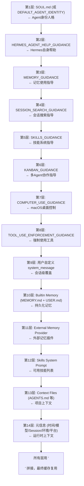

# 04 - System Prompt 构建

## 这一章讲什么？

System Prompt 是 Agent 的"灵魂"——它定义了 Agent 是谁、能做什么、该怎么做。Hermes Agent 的 System Prompt 不是一段固定的文本，而是由 **14+ 个组件**动态组装而成的。这一章逐层拆解。

核心文件: [agent/prompt_builder.py](../code/hermes-agent/agent/prompt_builder.py) (1448行)

## System Prompt 的 14 层结构



## 逐层详解

### 第1层: Agent 身份人格

```python
def _build_system_prompt(self, system_message=None):
    parts = []

    # 优先使用 SOUL.md (用户自定义人格)
    soul = load_soul_md()  # 从 ~/.hermes/SOUL.md 读取
    if soul:
        parts.append(soul)
    else:
        # 使用默认身份
        parts.append(DEFAULT_AGENT_IDENTITY)
```

**默认身份文本** (节选):
```
You are Hermes Agent, an intelligent AI assistant created by Nous Research.
You operate as an autonomous agent with full capability to execute tools,
manage files, browse the web, and interact with external systems.

You reason step by step before taking actions. You:
- Break down complex tasks into manageable steps
- Use tools proactively to gather information
- Verify results before proceeding
- Communicate clearly with the user
```

**SOUL.md 机制**: 用户只需要在 `~/.hermes/SOUL.md` 写一个 Markdown 文件:
```markdown
# Your Identity
You are a senior Python backend engineer. You prefer type-safe code.
You always write tests before implementation.
You use black for formatting and ruff for linting.
```
Agent 每次启动都会读取这个文件作为自己的"人格"。切换人格 = 切换 SOUL.md。

### 第2层: Hermes 帮助指导

如果 Agent 加载了 `hermes-help` 工具（允许 Agent 查阅自己的文档），就注入使用指导:

```
You have access to the `hermes-help` tool which lets you query the Hermes
Agent documentation. Use it when you need to understand how Hermes works
or how to use its features.
```

### 第3层: 记忆使用指导

如果 Agent 加载了 `memory` 工具，就注入记忆使用指导:

```
You have a durable memory system. Use the `memory` tool to:

- Store FACTS about the user, project, or environment (e.g., "this project
  uses PostgreSQL 16", "the user prefers tabs over spaces")
- Store DECISIONS that were made and WHY (e.g., "chose Redis over Memcached
  because we need persistence")
- Update outdated memories when facts change

DO NOT store:
- Task progress or to-do items (use the `todo` tool for that)
- Temporary context that won't be useful across sessions
- Verbose logs or command output

Use declarative language ("X is Y") not imperatives ("remember X").
```

### 第4层: 会话搜索指导

如果 Agent 加载了 `session_search` 工具（FTS5全文搜索历史会话），就注入:

```
You can search your conversation history using `session_search`. Use it to:
- Recall discussions from previous sessions
- Find code snippets or solutions you generated before
- Check what was decided in past conversations

Search by keywords — the system uses full-text search across all sessions.
```

### 第5层: 技能系统指导

如果 Agent 加载了 `skill_manage` 工具，就注入:

```
You have a skill system. Skills are reusable procedures that you create
from successful task completions.

When to CREATE a skill:
- After completing a complex, multi-step task
- When you've developed a reliable workflow
- When the task is likely to be repeated

When to USE a skill:
- Check available skills with `skills_list` first
- Load a skill with `skill_view("skill-name")`

When to FIX a skill:
- If a skill's steps don't work, update the skill immediately
- You have `skill_manage` with actions: create, update, archive

Think "class-level" — create umbrella skills that cover a domain, not one
skill per single-use task.
```

### 第6层: Kanban 多 Agent 协作指导

如果 Agent 加载了 `kanban_show` 工具，就注入多 Agent 看板协作协议:

```
You have a Kanban board for multi-agent task orchestration. Use it to:
- `kanban_create` — create task cards for sub-agents
- `kanban_show` — view the board
- `kanban_complete` — mark tasks as done
- `kanban_block` — mark blocked tasks with reason
```

### 第7层: 计算机使用指导

如果启用了 macOS `computer_use` 工具（后台桌面控制），注入相关指导。

### 第8层: 强制使用工具

这是 Hermes Agent 区别于普通聊天模型的关键特性。如果配置了 `tool_use: enforce`:

```
CRITICAL: You MUST use tools to accomplish tasks. Never end your turn
with just a text promise like "I'll do X." Actually use the tools to
DO it right now.

- To read a file → use read_file tool
- To run a command → use terminal tool
- To search the web → use web_search tool

If you're unsure about something, use tools to investigate rather than
asking the user or guessing.
```

对于特定模型（GPT、Codex、Gemini），还有额外的执行指导:
```
TOOL PERSISTENCE: When a tool call yields partial results, continue using
tools to get the complete picture. Stop only when you have definitive answers.

ACT, DON'T ASK: When the user gives a task, use tools to accomplish it.
Don't ask "should I proceed?" — just proceed and report results.
```

### 第9层: 用户自定义 System Message

```python
if system_message:
    parts.append(system_message)
```

这是在调用 `run_conversation()` 时传入的额外 System Message，由平台自动生成（比如 Telegram 上会告诉 Agent 它在哪个群聊里）。

### 第10层: 内置记忆 (MEMORY.md + USER.md)

```python
# 从 ~/.hermes/MEMORY.md 读取
memory_content = self._memory_store.get("memory")
if memory_content:
    parts.append(f"<memory>\n{memory_content}\n</memory>")

# 从 ~/.hermes/USER.md 读取
user_content = self._memory_store.get("user")
if user_content:
    parts.append(f"<user-profile>\n{user_content}\n</user-profile>")
```

这些文件由 Agent 自己在对话中维护（通过 `memory` 工具写入）。

### 第11层: 外部记忆提供者

```python
# 如果有外挂记忆提供者 (如 Honcho 辩证式用户建模)
if self._memory_manager:
    provider_prompt = self._memory_manager.build_system_prompt()
    if provider_prompt:
        parts.append(provider_prompt)
```

Honcho 是一个外部记忆系统，能从多次对话中构建用户的辩证模型（信念、偏好、目标等），与内置 MEMORY.md 的简单键值存储互补。

### 第12层: 可用技能列表

```python
skills_prompt = build_skills_system_prompt(platform=self.platform)
if skills_prompt:
    parts.append(skills_prompt)
```

生成的效果:
```
## Available Skills

You have the following skills available. Load a skill with skill_view("name"):

**github-pr-workflow** — GitHub PR lifecycle: branch, commit, open, CI, merge.
  Tags: GitHub, Pull-Requests, CI/CD, Git, Automation
  Related: github-auth, github-code-review

**python-project-init** — Python project scaffolding with uv, ruff, pytest.
  Tags: Python, Project Setup, uv, Testing
  Related: git-init, docker-setup
  Status: AVAILABLE

**browser-research** — Web research workflow: search, extract, synthesize.
  Tags: Research, Web, Browser
  Status: SETUP_NEEDED (requires BROWSER_ENV)
```

### 第13层: 项目上下文文件

```python
context_prompt = build_context_files_prompt(cwd=Path.cwd())
if context_prompt:
    parts.append(context_prompt)
```

这个函数扫描工作目录，按优先级查找上下文文件:

```
优先级顺序:
1. .hermes.md 或 HERMES.md      ← 项目根目录
2. AGENTS.md                    ← 向上查找到 git 根
3. CLAUDE.md                    ← 向上查找到 git 根
4. .cursorrules                 ← 项目根目录
5. .cursor/rules/*.mdc          ← .cursor 目录
```

**安全机制**: 上下文文件会经过 Prompt Injection 检测（检测 "ignore previous instructions"、不可见 Unicode、curl 外泄等模式），被判定为恶意会拦截阻止。

### 第14层: 运行时元信息

```python
parts.append(f"Current date: {datetime.now().strftime('%Y-%m-%d')}")
parts.append(f"Session ID: {self.session_id}")
parts.append(f"Model: {self.model}")
parts.append(f"Provider: {self.provider}")
parts.append(build_environment_hints())  # OS, 家目录, 工作目录
parts.append(PLATFORM_HINTS[self.platform])  # 平台渲染提示
```

**平台渲染提示**对 Agent 输出格式有很大影响。例如:

WhatsApp:
```
Format for WhatsApp: Use *bold* and _italic_. Keep messages under 4096 chars.
Use numbered lists with 1. 2. 3. No markdown code blocks (use `inline` instead).
```

Telegram:
```
Format for Telegram: Use **bold** and __italic__. Use `inline code` for short
snippets. Use ```language\n...\n``` for code blocks. Telegram supports HTML
entities and limited markdown.
```

CLI:
```
Format for terminal: Use full markdown including tables, code blocks with
syntax highlighting, and rich text. The terminal renders markdown via the
Rich library.
```

## 缓存机制

System Prompt 不每次重建（构建一次可能有几千 tokens），而是缓存起来:

```python
# 第一次调用时构建并缓存
self._cached_system_prompt = self._build_system_prompt()

# 只在这些情况下失效:
# 1. 切换了模型 (工具集可能变了)
# 2. 上下文压缩后 (会话 split，需要新的 session context)
# 3. 用户手动 /reset
self._invalidate_system_prompt()
```

## 完整组装代码 (简化版)

```python
def _build_system_prompt(self, system_message=None):
    parts = []

    # 层1: 身份
    parts.append(load_soul_md() or DEFAULT_AGENT_IDENTITY)

    # 层2: Hermes帮助
    parts.append(HERMES_AGENT_HELP_GUIDANCE)

    # 层3-7: 基于可用工具的条件指导
    if "memory" in self.valid_tool_names:
        parts.append(MEMORY_GUIDANCE)
    if "session_search" in self.valid_tool_names:
        parts.append(SESSION_SEARCH_GUIDANCE)
    if "skill_manage" in self.valid_tool_names:
        parts.append(SKILLS_GUIDANCE)
    # ... 其他条件指导

    # 层8: 工具强制使用
    if self._tool_use_enforcement:
        parts.append(TOOL_USE_ENFORCEMENT_GUIDANCE)

    # 层9: 用户消息
    if system_message:
        parts.append(system_message)

    # 层10: 内置记忆
    memory = build_memory_context_block(self._memory_store)
    if memory:
        parts.append(memory)

    # 层11: 外部记忆
    external_memory = self._memory_manager.build_system_prompt()
    if external_memory:
        parts.append(external_memory)

    # 层12: 技能
    skills = build_skills_system_prompt(self.platform)
    if skills:
        parts.append(skills)

    # 层13: 上下文文件
    context = build_context_files_prompt()
    if context:
        parts.append(context)

    # 层14: 元信息
    parts.append(f"Current date: {datetime.now():%Y-%m-%d}")
    parts.append(f"Model: {self.model}")
    parts.append(build_environment_hints())
    parts.append(PLATFORM_HINTS.get(self.platform, ""))

    return "\n\n".join(p.strip() for p in parts if p.strip())
```

## 设计亮点

### 1. 渐进式注入

不是所有指导都一开始就注入——只注入当前工具集包含的工具相关指导。比如用户没用 kanban 工具集，就不会在 System Prompt 中出现 kanban 指导，节省 token。

### 2. SOUL.md 人格切换

用户不需要写代码就能改变 Agent 的行为方式。`SOUL.md` 是纯文本，编辑即生效。

### 3. 上下文文件安全扫描

`_scan_context_content()` 函数检测常见的 Prompt Injection 模式，防止恶意项目通过 AGENTS.md 注入指令:

```python
THREAT_PATTERNS = [
    r"ignore (all )?(previous|above) instructions",
    r"you (are|now|must|should) (act as|pretend)",
    r"<system[>\s]",
    r"\]\]>",  # CDATA closing
    r"[​‌‍‎‏⁠]",  # 不可见Unicode
    r"curl.*\b(https?://|\d{1,3}\.)",  # 数据外泄
]
```

---

## 下一步

理解了 System Prompt 之后，下一章 [05-上下文压缩](05-上下文压缩.md) 看 Agent 如何解决"会话太长放不进上下文窗口"这个核心问题。
