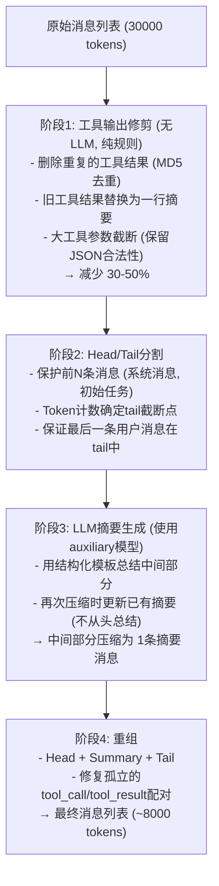
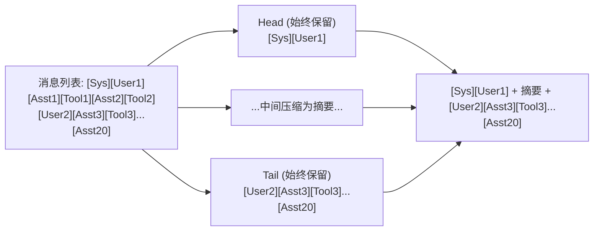
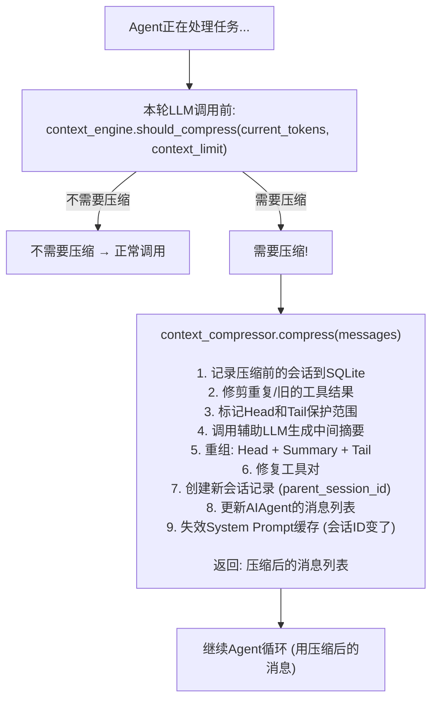

# 05 - 上下文压缩

## 这一章讲什么？

Agent 在执行复杂任务时，对话历史会飞速增长——调用几十次工具，每次工具输出可能几百上千行。当上下文长度超出模型的上下文窗口，Agent 就会"失忆"甚至崩溃。这一章详解 Hermes Agent 的上下文压缩系统。

核心文件:
- [agent/context_compressor.py](../code/hermes-agent/agent/context_compressor.py) (1556行)
- [agent/context_engine.py](../code/hermes-agent/agent/context_engine.py) (206行) — 可插拔压缩引擎接口

## 问题: 对话历史为什么会爆炸？

一个典型的编程任务:

```
轮次1: terminal("cat main.py")              → 300行输出
轮次2: terminal("find . -name '*.py'")     → 50行输出
轮次3: web_search("Python async patterns")  → 10条搜索结果摘要
轮次4: read_file("config.py")               → 200行
轮次5: terminal("grep -r 'TODO' .")         → 80行
轮次6: web_extract("https://docs.python.org/...") → 500行
...
```

20轮之后，对话历史轻松超过 30000 tokens。而某些模型上下文窗口只有 8000 或 32000。

## 压缩策略概览

Hermes 的上下文压缩不是简单的"截断最旧的消息"，而是一个**四阶段管线**:



## 阶段1: 工具输出修剪 (无LLM)

这是最"便宜"的优化——不调LLM，纯规则。

### Pass 1: 重复结果去重

```python
def _prune_old_tool_results(self, messages, ...):
    seen_hashes = {}
    for i, msg in enumerate(messages):
        if msg["role"] == "tool":
            content_hash = hashlib.md5(msg["content"].encode()).hexdigest()
            if content_hash in seen_hashes:
                # 重复了! 删除这个结果 (保留更新的那个)
                messages[i] = None  # 标记删除
            else:
                seen_hashes[content_hash] = i
```

### Pass 2: 旧工具结果压缩为一行

不是所有工具结果都需要保留完整内容。对于早期的工具结果:

```
Before (800 chars):
  {"output": "file1.py\nfile2.py\nfile3.py\n... (200 files) ...\n",
   "exit_code": 0, "duration_ms": 1500}

After (80 chars):
  [terminal] ran ls -la → exit 0, 47 lines output
```

```python
def _summarize_old_tool_result(self, msg, tool_name, tool_args):
    # 提取关键信息: 工具名, 主要参数, 退出码, 输出行数
    exit_code = extract_exit_code(msg["content"])
    line_count = msg["content"].count("\n")
    primary_arg = tool_args.get(list(tool_args.keys())[0], "")

    return f"[{tool_name}] ran {primary_arg[:80]} → exit {exit_code}, {line_count} lines output"
```

### Pass 3: 大参数截断

LLM 有时会产生巨大的工具调用参数（比如 write_file 带了 5000 行代码）:

```python
if len(json_args) > 500:
    # 保留JSON结构，但截断长字符串值
    for key, value in args.items():
        if isinstance(value, str) and len(value) > 200:
            args[key] = value[:200] + "... [truncated]"
```

**多模态/图片处理**: 旧工具结果中的图片/文件引用被替换为占位符 `[image omitted]` / `[file content omitted]`，因为图片 base64 尤其占空间。

## 阶段2: Head/Tail 分割

### 什么是 Head 和 Tail？



**Head (始终保护)**: 前 `protect_first_n` 条消息（默认3），通常包含 System Prompt 和初始任务描述。

**Tail (始终保护)**: 最近的消息，由 Token 预算决定保留多少。

### Tail 截断算法

```python
def _find_tail_cut_by_tokens(self, messages, target_tokens):
    accumulated = 0
    # 从后往前数token
    for i in range(len(messages) - 1, -1, -1):
        msg_tokens = estimate_tokens_rough(messages[i])
        if accumulated + msg_tokens > target_tokens * 1.5:  # 软上限
            # 但如果连最小要求 (3条) 都不够, 继续加
            if len(messages) - i < 3:
                continue
            return i + 1  # 从这个位置开始是tail
        accumulated += msg_tokens
    return 0  # 消息本来就不长
```

### 最后一条用户消息锚定

如果 `_find_tail_cut_by_tokens` 的截断点把最后一条用户消息切到了中间区域（被摘要掉的部分），需要向前调整截断点:

```python
def _ensure_last_user_message_in_tail(self, messages, cut_point):
    # 找最后一条 user role 消息
    for i in range(len(messages) - 1, -1, -1):
        if messages[i]["role"] == "user":
            last_user_idx = i
            break
    # 如果它在中间区域 → 把cut_point移到它前面
    if last_user_idx < cut_point:
        return last_user_idx
    return cut_point
```

## 阶段3: LLM 摘要生成

这是压缩的"智能"部分。

### 摘要模板

LLM 被要求用结构化模板总结中间部分的对话:

```markdown
## Conversation Summary

### Active Task
[当前正在执行的任务]

### Goal
[最终目标]

### Completed Actions
- 第1步: 做了什么, 结果如何
- 第2步: 做了什么, 结果如何

### Active State
- 当前所在目录, 打开的文件, 运行中的进程等

### In Progress
- 正在做的事情

### Blocked
- 遇到的阻塞

### Key Decisions
- 做出的重要决定及原因

### Resolved Questions
- 已经解决的问题

### Pending User Asks
- 用户还没回答的问题

### Relevant Files
- 涉及的重要文件

### Remaining Work
- 还需要做的事

### Critical Context
- 关键上下文信息 (密码, token, 特殊配置等)
```

### 迭代摘要

如果同一会话被压缩多次，第二次压缩不会从原始对话重新摘要，而是在**上一次的摘要基础上更新**:

```python
def _generate_summary(self, middle_messages, previous_summary=None):
    if previous_summary:
        prompt = f"""Update this conversation summary with new information:

        PREVIOUS SUMMARY:
        {previous_summary}

        NEW CONVERSATION SEGMENT TO INCORPORATE:
        {format_messages(middle_messages)}

        Update the summary fields to reflect the combined conversation.
        Keep the same format.
        """
    else:
        prompt = f"""Summarize this conversation segment:

        {format_messages(middle_messages)}

        Use this format:
        {SUMMARY_TEMPLATE}
        """
```

### 摘要使用的模型

摘要不一定要用主模型。可以通过 `auxiliary.compression` 配置指定专用模型:

```yaml
auxiliary:
  compression:
    provider: openrouter
    model: anthropic/claude-haiku-4-20250514  # 便宜快速的模型
```

### 摘要失败的回退

如果 LLM 摘要调用失败（网络问题、模型不可用等），插入静态回退标记:

```python
try:
    summary = call_llm(prompt, model=compression_model)
except Exception:
    summary = f"{SUMMARY_PREFIX}[compression failed — conversation continues]"
```

## 阶段4: 重组与修复

### 消息重组

```python
def compress(self, messages, ...):
    # 阶段1: 修剪
    pruned = self._prune_old_tool_results(messages)

    # 阶段2: 分割
    head = pruned[:protect_first_n]
    cut_point = self._find_tail_cut_by_tokens(pruned, target_tokens)
    tail = pruned[cut_point:]
    middle = pruned[protect_first_n:cut_point]

    # 阶段3: 摘要
    summary = self._generate_summary(middle, previous_summary=self._last_summary)
    summary_msg = {"role": "user", "content": f"<conversation-summary>\n{summary}\n</conversation-summary>"}

    # 阶段4: 重组
    compressed = head + [summary_msg] + tail

    # 修复孤立的 tool_call / tool_result
    compressed = self._sanitize_tool_pairs(compressed)

    return compressed
```

### 工具对修复

压缩后可能出现"tool_call 在中间被删了但 tool_result 还在 tail 里"的情况。修复函数遍历消息，确保每个 tool_result 都有对应的 tool_call:

```python
def _sanitize_tool_pairs(self, messages):
    tool_call_ids = set()
    for msg in messages:
        if msg.get("tool_calls"):
            for tc in msg["tool_calls"]:
                tool_call_ids.add(tc["id"])

    clean = []
    for msg in messages:
        if msg["role"] == "tool":
            if msg.get("tool_call_id") in tool_call_ids:
                clean.append(msg)  # 有对应tool_call, 保留
            # else: 孤儿tool_result, 丢弃
        else:
            clean.append(msg)
    return clean
```

## 触发时机

上下文压缩不会"自动"发生——需要触发条件:

| 触发方式 | 说明 |
|---------|------|
| **主动预检** (preflight) | 每轮LLM调用前，`ContextEngine.should_compress()` 检查是否接近上下文窗口 |
| **被动响应** (reactive) | LLM返回 context_overflow 错误时，压缩后重试 |
| **用户手动** | 用户在CLI执行 `/compress` 命令 |
| **自动 413** | API返回 413 Payload Too Large 错误时 |

### 防震荡机制

如果连续两轮的压缩都只节省了不到 10% 的 tokens，暂停压缩一段时间:

```python
def should_compress(self, current_tokens, context_limit):
    # 还没到阈值 → 不压缩
    if current_tokens < context_limit * self.threshold:
        return False

    # 最近两次压缩效果不好 → 跳过
    if (self._last_two_savings
        and all(s < 0.1 for s in self._last_two_savings[-2:])):
        return False

    return True
```

## 压缩引发的会话分裂

压缩不只是减少 token——它还会在 SQLite 中**创建新的会话记录**:

```
原始会话: session_abc (parent_session_id = None)
压缩后:   session_def (parent_session_id = session_abc)
```

这形成了一个**会话链**，便于追踪和回溯。

## 完整压缩流程



---

## 下一步

理解了上下文压缩，下一章 [06-记忆与技能系统](06-记忆与技能系统.md) 看 Agent 如何在跨会话中保持"记忆"和"能力"。
