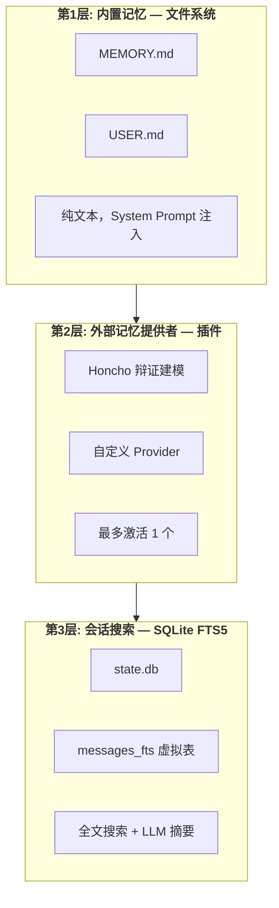
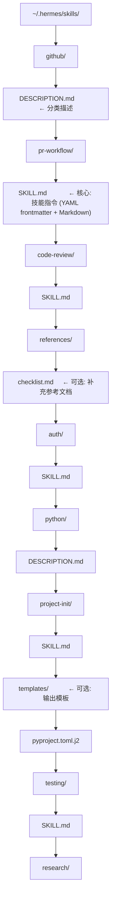
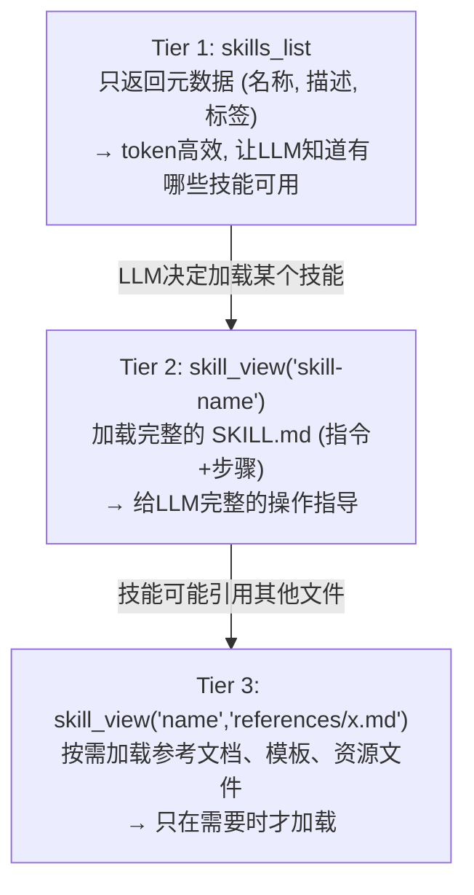
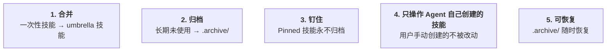
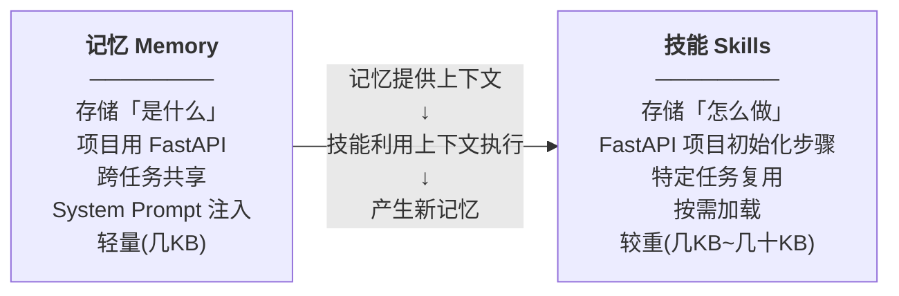

# 06 - 记忆与技能系统

## 这一章讲什么？

普通的 AI 聊天机器人每次对话都是"全新"的——它不记得上次聊了什么，也不会从经验中学习。Hermes Agent 不同: 它有 **持久记忆**（记住你是谁、你的偏好、项目信息）和 **技能系统**（从成功任务中提取可复用的工作流）。这一章详解这两个系统如何协同工作。

核心文件:
- [agent/memory_manager.py](../code/hermes-agent/agent/memory_manager.py) (555行) — 记忆管理器
- [agent/memory_provider.py](../code/hermes-agent/agent/memory_provider.py) (279行) — 记忆提供者抽象
- [tools/memory_tool.py](../code/hermes-agent/tools/memory_tool.py) — Agent 使用的 memory 工具
- [agent/skill_utils.py](../code/hermes-agent/agent/skill_utils.py) (511行) — 技能元数据工具
- [agent/skill_commands.py](../code/hermes-agent/agent/skill_commands.py) (501行) — 技能命令绑定
- [agent/skill_preprocessing.py](../code/hermes-agent/agent/skill_preprocessing.py) (131行) — 技能内容预处理
- [tools/skills_tool.py](../code/hermes-agent/tools/skills_tool.py) — Agent 使用的技能工具
- [agent/curator.py](../code/hermes-agent/agent/curator.py) (1767行) — 技能维护管家

## 第一部分: 记忆系统

### 记忆的三层架构



### 内置记忆: MEMORY.md + USER.md

这是最基础的记忆层。由 Agent 通过 `memory` 工具自动维护。

**Agent 怎么决定记住什么？**

System Prompt 中的 `MEMORY_GUIDANCE` 指导 Agent:

```
存储这些信息:
✓ 用户的事实信息 ("用户是后端工程师", "项目使用PostgreSQL 16")
✓ 偏好 ("用户喜欢tab缩进", "优先用 pytest 而非 unittest")
✓ 决策及原因 ("选择Redis而非Memcached因为需要持久化")
✓ 环境信息 ("部署在AWS us-east-1", "Python版本 3.12")

不要存储这些:
✗ 任务进度 (用 todo 工具)
✗ 临时上下文 (不会跨会话有用)
✗ 冗长的命令输出
✗ "记住X"这样的祈使句 — 用陈述句 "X is Y"
```

**Agent 如何执行记忆操作？**

```python
# Agent 调用 memory 工具 (模型生成的工具调用)
memory(action="add", scope="memory", content="项目使用 FastAPI + SQLAlchemy")

# memory_tool.py 处理:
def memory_tool(action, scope, content, title=None):
    if action == "add":
        # 追加到 MEMORY.md
        append_to_file(f"{hermes_home}/MEMORY.md", content)
    elif action == "update":
        # 查找并更新已有条目
        ...
    elif action == "remove":
        # 删除条目
        ...
    elif action == "read":
        # 读取当前记忆
        return read_file(f"{hermes_home}/MEMORY.md")
```

### 记忆管理器 (MemoryManager)

`MemoryManager` 是记忆系统的"总管"。它协调内置记忆和外部记忆提供者:

```python
class MemoryManager:
    def __init__(self, hermes_home):
        self._providers = {}  # name → MemoryProvider

    def add_provider(self, provider: MemoryProvider):
        # 严格限制: 最多一个外部提供者
        if len(self._providers) > 1:
            raise TooManyMemoryProviders(...)
        self._providers[provider.name] = provider

    def build_system_prompt(self) -> str:
        """收集所有提供者的 System Prompt 块"""
        blocks = []
        for provider in self._providers.values():
            block = provider.system_prompt_block()
            if block:
                blocks.append(block)
        return "\n\n".join(blocks)

    def prefetch_all(self, session_id, user_message):
        """异步预取记忆 (下一轮使用)"""
        for provider in self._providers.values():
            provider.queue_prefetch(session_id, user_message)
            # 不阻塞! 放到后台线程执行

    def sync_all(self, session_id, messages):
        """同步本轮对话到所有记忆提供者"""
        for provider in self._providers.values():
            provider.sync_turn(session_id, messages)

    def handle_tool_call(self, function_name, function_args):
        """路由工具调用到正确的记忆提供者"""
        for provider in self._providers.values():
            if function_name in provider.get_tool_schemas():
                return provider.handle_tool_call(function_name, function_args)
        return None  # 没找到对应的提供者
```

### 外部记忆提供者接口

```python
class MemoryProvider(ABC):
    name: str                          # 提供者名称
    is_available() -> bool             # 依赖是否满足
    initialize(**kwargs)               # 初始化

    system_prompt_block() -> str       # 注入到System Prompt的文本
    prefetch(session_id, user_msg)     # 预取相关记忆 (同步)
    queue_prefetch(session_id, msg)    # 排队预取 (异步, 不阻塞)
    sync_turn(session_id, messages)    # 同步本轮对话

    get_tool_schemas() -> list[dict]   # 该提供者注册的额外工具
    handle_tool_call(name, args)       # 处理工具调用

    # 可选的生命周期钩子
    on_turn_start(...)                 # 每轮开始
    on_session_end(...)                # 会话结束
    on_pre_compress(...)               # 压缩前
    on_memory_write(...)               # 记忆写入后
    on_delegation(...)                 # 子Agent创建时
```

### 会话搜索 (FTS5 全文搜索)

这是 SQLite 层面的跨会话搜索。Agent 通过 `session_search` 工具调用:

```python
# Agent 调用 session_search 工具
session_search(query="上次我们讨论的微服务架构方案是什么?")

# hermes_state.py SessionDB.search_messages():
def search_messages(self, query: str, limit=20):
    # FTS5 全文搜索
    cursor = self.conn.execute("""
        SELECT m.session_id, m.role, m.content, m.timestamp,
               s.source, s.started_at
        FROM messages_fts fts
        JOIN messages m ON fts.rowid = m.rowid
        JOIN sessions s ON m.session_id = s.id
        WHERE messages_fts MATCH ?
        ORDER BY rank
        LIMIT ?
    """, (query, limit))

    # 对搜索结果做 LLM 摘要
    return summarize_search_results(cursor.fetchall())
```

## 第二部分: 技能系统

### 技能的核心理念

技能 = **可复用的操作流程**。比如 "给 GitHub PR 做 Code Review" 这个任务，Agent 第一次做时经历了 15 轮工具调用——搜索代码、读 diff、运行测试、检查风格。完成后，Agent 自动把这些步骤提炼为一个技能。下次用户说 "review 一下这个 PR"，Agent 直接加载技能，按已有流程执行。

### 技能的文件结构



### SKILL.md 格式

```markdown
---
name: python-project-init
description: "Python project scaffolding with uv, ruff, pytest."
version: 1.2.0
author: Hermes Agent
license: MIT
platforms: [linux, macos, windows]
metadata:
  hermes:
    tags: [Python, Project Setup, uv, Testing]
    related_skills: [git-init, docker-setup]
    config:
      TEST_FRAMEWORK:
        description: "Default testing framework"
        type: string
        default: "pytest"
        choices: ["pytest", "unittest"]
---

# Python Project Initialization

## Steps

1. Create project directory structure:
   ```
   project/
   ├── src/project/
   ├── tests/
   └── pyproject.toml
   ```

2. Initialize with uv:
   ```bash
   uv init --name project
   ```

3. Add development dependencies:
   ```bash
   uv add --dev pytest ruff mypy
   ```

4. Configure ruff in pyproject.toml with standard rules.

5. Create a basic test file and verify it runs.
```

### 技能的引用方式

Hermes 遵循 **agentskills.io** 开放标准，使用三级渐进式披露:



### 技能预处理

加载 SKILL.md 后会做两件事:

**1. 模板变量替换** (`skill_preprocessing.py`):
```markdown
技能中的变量:
  工作目录: ${HERMES_SKILL_DIR}
  会话ID: ${HERMES_SESSION_ID}

替换后:
  工作目录: /home/user/.hermes/skills/python/project-init
  会话ID: sess_abc123def456
```

**2. 内联 Shell 展开** (默认关闭，需要在 config.yaml 中启用):
```markdown
当前日期: `!`date +%Y-%m-%d``

展开后:
当前日期: 2026-05-10
```

### 技能的三级激活方式

| 方式 | 触发 | 使用场景 |
|------|------|---------|
| 斜杠命令 | 用户输入 `/skill-name` | 手动触发 |
| 工具调用 | Agent 调用 `skill_view("name")` | Agent 自动判断需要这个技能 |
| 会话预加载 | `--skills skill1,skill2` CLI 参数 | 会话开始时就加载 |

### 斜杠命令注册

```python
# agent/skill_commands.py
def scan_skill_commands(platform="cli"):
    """扫描所有技能目录, 构建 /command → skill 映射"""
    commands = {}
    for skill_dir in get_all_skill_dirs():
        skill_info = parse_skill_metadata(skill_dir / "SKILL.md")
        if not skill_matches_platform(skill_info, platform):
            continue  # 不适合当前平台
        name = skill_info.get("name")
        commands[f"/{name}"] = SkillCommand(
            skill_name=name,
            skill_dir=skill_dir,
            description=skill_info.get("description"),
        )
    return commands
```

### 技能管家 (Curator)

`Curator` 是一个后台维护程序，负责技能的"修剪花园":



Curator 的运行时机:
- Agent 空闲时触发
- 距上次运行超过 `curator.interval_hours`（默认6小时）
- 用户可通过 `/curator` 手动触发

Curator 使用一个独立的子 Agent 运行 `CURATOR_REVIEW_PROMPT`，分析所有技能的使用频率、创建时间、关联关系，自动决定合并/归档操作。

### 技能中心 (Skills Hub)

Hermes 还有一个 [agentskills.io](https://agentskills.io) 技能市场，可以从社区下载/分享技能:

```bash
hermes skills install github-pr-workflow   # 从技能中心安装
hermes skills publish my-skill             # 发布自己的技能
```

## 记忆与技能的关系



### 记忆触达 (Memory Nudge)

Agent 不是每次对话都提醒自己去看记忆。记忆触达是一个定时机制:

```python
# 每 N 轮对话后 (默认15轮), 在 System Prompt 中注入提醒:
if turns_since_last_memory >= memory_nudge_interval:
    system_prompt += "\n[System note: This is a good time to review "
    system_prompt += "your memory and skills to ensure relevance. "
    system_prompt += "Are there outdated facts to update? "
    system_prompt += "New skills to consolidate?]"
```

这个机制让 Agent 主动维护记忆的新鲜度。

---

## 下一步

理解了记忆和技能系统，下一章 [07-网关与多平台接入](07-网关与多平台接入.md) 看 Agent 如何通过 18+ 个消息平台对外提供服务。
