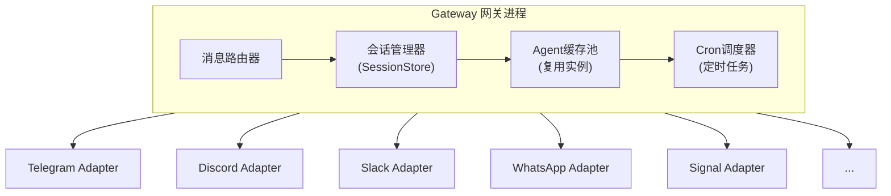
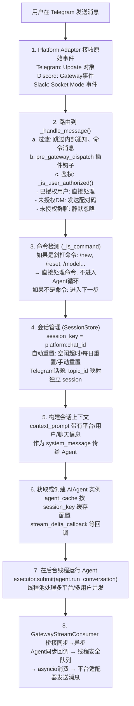
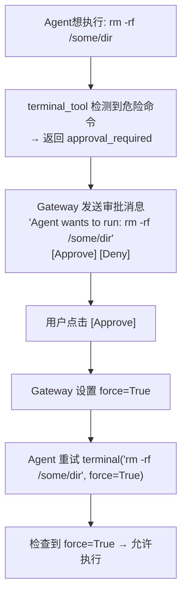
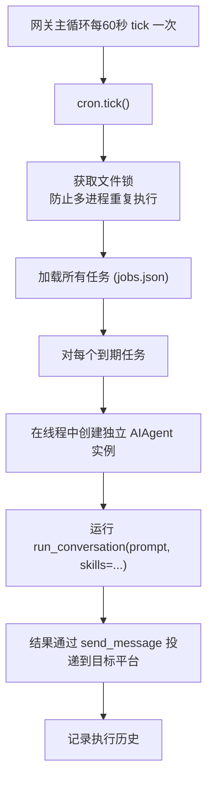

# 07 - 网关与多平台接入

## 这一章讲什么？

Hermes Agent 不仅在 CLI 中运行——同一个 Agent 核心可以从 Telegram、Discord、Slack、WhatsApp、Signal、飞书、钉钉、企业微信等 18+ 个消息平台访问。这一章详解**网关架构**和**消息分发流程**。

核心文件在 [gateway/](../code/hermes-agent/gateway/) 目录下。

## 为什么需要网关？

如果每个平台都独立启动一个 Agent 进程，会出现这些问题:
- 多平台间的会话无法共享
- 资源浪费（每个平台一个 LLM 客户端连接）
- 消息无法跨平台投递
- 定时任务不知道该发到哪里

网关的设计**统一了这些问题**:



## 支持的平台一览

| 平台 | 适配器文件 | 规模 | 特点 |
|------|-----------|------|------|
| Telegram | `telegram.py` | 185KB | Bot API, Webhook, 语音转写, 话题分组 |
| Discord | `discord.py` | 222KB | Gateway, 语音频道, Slash Commands |
| Slack | `slack.py` | 126KB | Socket Mode, 交互式消息 |
| Feishu/Lark | `feishu.py` | 208KB | 文档读写, 多维表格, 审批 |
| WhatsApp | `whatsapp.py` | 51KB | 媒体消息, 按钮交互 |
| Signal | `signal.py` | 61KB | E2E加密, 附件 |
| Matrix | `matrix.py` | 109KB | 联邦协议, E2E加密 |
| Mattermost | `mattermost.py` | 33KB | WebSocket, 线程 |
| DingTalk | `dingtalk.py` | 59KB | 流式消息, 机器人 |
| WeCom | `wecom.py` | 65KB | 企业微信, 语音 |
| WeChat (Weixin) | `weixin.py` | 83KB | 社区桥接 |
| QQBot | `qqbot/adapter.py` | 117KB | QQ官方Bot API |
| Yuanbao | `yuanbao.py` | 186KB | 腾讯元宝, 群管理 |
| BlueBubbles | `bluebubbles.py` | 35KB | iMessage桥接 |
| Email | `email.py` | 29KB | IMAP/SMTP, 多账户 |
| SMS | `sms.py` | 14KB | Twilio, 短信/电话 |
| Webhook | `webhook.py` | 32KB | HTTP回调, 自定义集成 |
| API Server | `api_server.py` | 151KB | RESTful API, WebSocket |
| Home Assistant | `homeassistant.py` | 16KB | IoT集成 |

## 平台注册机制

和工具注册类似，平台也使用注册表模式:

```python
# gateway/platform_registry.py

class PlatformRegistry:
    """平台注册表 (单例)"""
    _entries: dict[str, PlatformEntry] = {}

    def register(self, entry: PlatformEntry):
        self._entries[entry.name] = entry

    def get(self, name: str) -> PlatformEntry:
        return self._entries.get(name)

# 插件也可以注册平台:
# plugins/myplatform.py
platform_registry.register(PlatformEntry(
    name="myplatform",
    label="My Platform",
    emoji="🔌",
    adapter_factory=lambda config: MyPlatformAdapter(config),
    check_fn=lambda: importlib.util.find_spec("myplatform_sdk") is not None,
    max_message_length=4096,
    platform_hint="Format messages using plain text.",
))
```

## 消息到达 Agent 的完整流程



### 为什么需要 GatewayStreamConsumer？

Agent 运行在**同步线程**中（因为 `run_conversation` 是同步函数），但所有消息平台 SDK 都是**异步**的。GatewayStreamConsumer 承担了桥接的角色:

```python
class GatewayStreamConsumer:
    def __init__(self, adapter, platform_msg_context):
        self._queue = queue.Queue()  # 线程安全队列
        self._adapter = adapter
        self._buffer = ""
        self._last_edit_time = 0

    def on_delta(self, text: str):
        """Agent的同步回调 (在Agent的线程中执行)"""
        self._queue.put(text)  # 直接放进队列, 不阻塞

    async def run(self):
        """异步消费者 (在asyncio事件循环中执行)"""
        while True:
            # 从队列取数据, 有超时
            try:
                text = self._queue.get(timeout=0.3)
                self._buffer += text
            except queue.Empty:
                pass

            # 防抖: 每0.5秒最多更新一次消息
            now = time.monotonic()
            if now - self._last_edit_time > 0.5 and self._buffer:
                await self._adapter.edit_message(
                    chat_id=self._chat_id,
                    message_id=self._message_id,
                    text=self._buffer,
                )
                self._last_edit_time = now
```

这种设计让 Agent 流式输出时，Telegram/Discord 上的消息看起来是"一个字一个字打出来"的。

## 消息级别的交互

### 澄清 (Clarify)

当 Agent 需要向用户确认某个操作时（如 rm -rf），在 CLI 上可以弹出交互式提示。但在 Telegram/Discord 上怎么办？

网关实现了 `clarify_callback`，将澄清请求转为平台消息:

```python
# Agent调用 clarify 工具
clarify(question="确认删除 /var/log 下所有文件? 这是不可逆操作。",
        options=["确认删除", "取消"])

# Gateway 捕获 → 发送带按钮的消息:
# "确认删除 /var/log 下所有文件? 这是不可逆操作。"
# [确认删除] [取消]
# 用户点击按钮 → 回复被传回 Agent
```

### 审批 (Approval)

危险命令的审批流程:



### 中断 (Interrupt)

用户在 Telegram 发送 `/stop` 或在 Agent 处理过程中发送新消息:

```python
# Gateway 处理 /stop
def handle_stop_command(session_key):
    agent = agent_cache.get(session_key)
    if agent:
        agent.interrupt("User requested stop")
        # → 设置 _interrupt_requested = True
        # → 终止正在运行的工具子进程
        # → 递归中断所有子Agent
```

## Cron 定时调度

网关内嵌了一个 Cron 调度器，可以在指定时间自动触发 Agent:

```yaml
# ~/.hermes/cron/jobs.json
[
  {
    "id": "daily-report",
    "name": "每日项目总结",
    "schedule": "0 18 * * 1-5",
    "prompt": "分析今天GitHub仓库的提交记录，生成一份项目进度总结",
    "skills": ["github-analysis"],
    "enabled_toolsets": ["terminal", "web", "github"],
    "deliver": "telegram:123456789",
    "origin": {"created_by": "user", "platform": "cli"}
  }
]
```

### Cron 执行流程



### Cron 输出投递

```python
# 如果 Agent 回复以 [SILENT] 开头 → 不投递, 只存本地
if result.startswith("[SILENT]"):
    # 静默模式, 结果保存到 logs/ 目录
    save_silent_result(job_id, result)
else:
    # 投递到目标平台
    send_message_tool._send_via_adapter(
        target=job.deliver,  # "telegram:chat_id" 或 "discord:channel_id"
        content=result,
    )
```

### Cron Job 的安全检查

Cron 任务会自动加载技能。为了避免加载的技能中包含恶意指令（Prompt Injection），完整组装后的 Prompt（包括技能内容）会被扫描:

```python
def scan_prompt_for_injection(prompt: str) -> bool:
    for pattern in INJECTION_PATTERNS:
        if re.search(pattern, prompt, re.IGNORECASE):
            return True  # 检测到注入
    return False
```

## 语音与媒体

网关还处理语音消息:

- **Telegram**: 接收语音消息 → 下载音频 → faster-whisper 转写 → 文本传给 Agent
- **输出**: Agent 回复文本 → edge-tts 合成语音 → 发送音频文件

```python
# 语音转写流程
async def handle_voice_message(voice_file):
    # 1. 下载音频文件
    audio_path = await download_telegram_voice(voice_file)

    # 2. 用 faster-whisper 转写
    segments, _ = whisper_model.transcribe(audio_path)
    text = " ".join(seg.text for seg in segments)

    # 3. 文本传给 Agent (和普通文本消息一样处理)
    await handle_text_message(text, voice_context=True)
```

## 网关配置

```yaml
# cli-config.yaml 中的网关配置
gateway:
  telegram:
    enabled: true
    token: "${TELEGRAM_BOT_TOKEN}"
    allowed_users: ["123456789"]  # 白名单
    pairing_enabled: true

  discord:
    enabled: true
    token: "${DISCORD_BOT_TOKEN}"
    allowed_guilds: ["987654321"]

  cron:
    deliver_default: "telegram"  # 定时任务默认投递到Telegram
```

---

## 下一步

最后一章 [08-高级特性](08-高级特性.md) 详解子Agent委派、错误分类与故障转移、凭证池、工具护栏和流式处理。
