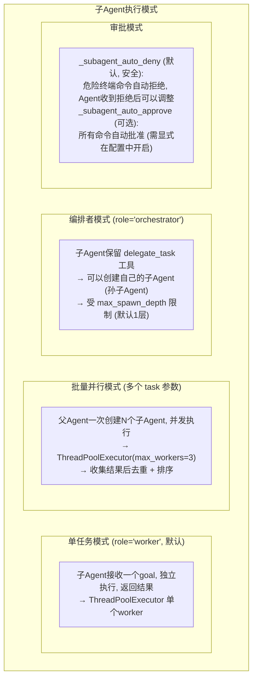
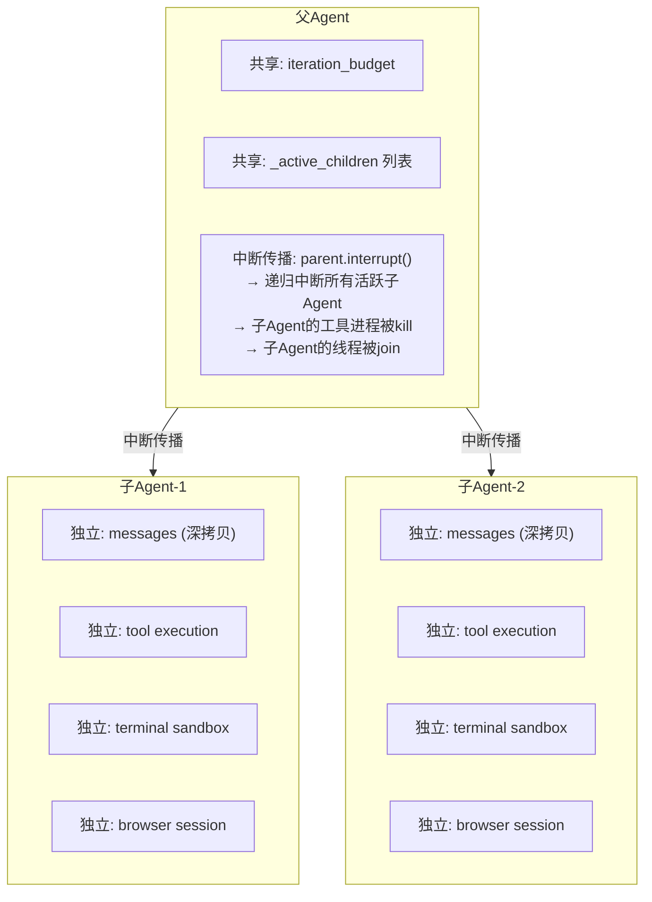
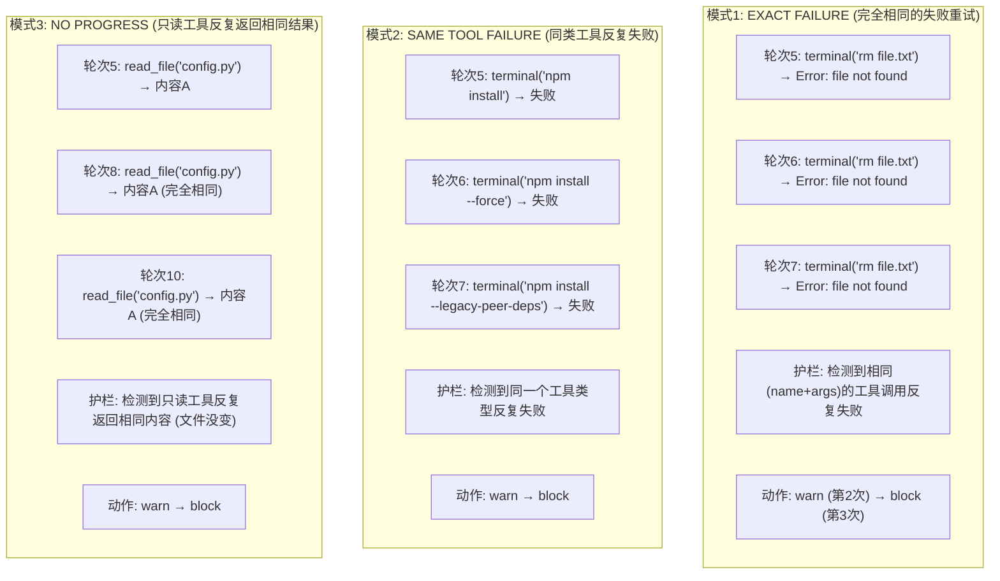
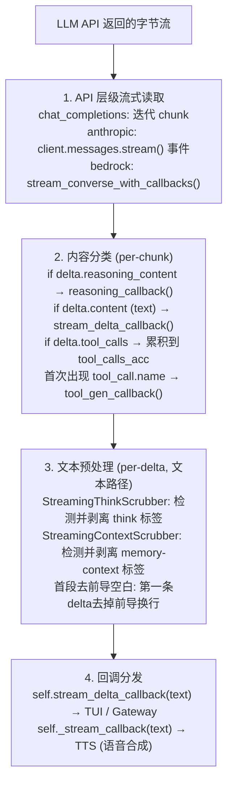
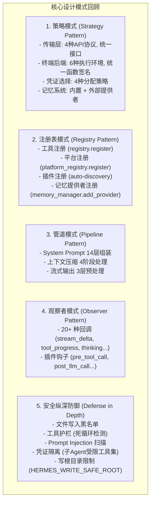

# 08 - 高级特性

## 这一章讲什么？

最后一章覆盖 Hermes Agent 的五个高级特性:
1. **子 Agent 委派**: 创建隔离的子 Agent 并行处理任务
2. **错误分类与故障转移**: 智能恢复机制
3. **凭证池**: 多 API Key 自动轮换
4. **工具安全护栏**: 防止死循环和危险操作
5. **流式处理**: 实时输出的实现

## 1. 子 Agent 委派 (Subagent Delegation)

### 为什么需要子 Agent？

主 Agent 在执行复杂任务时可以"分派"子任务给独立的子 Agent:

```
用户: "帮我同时调研 Python 的三种 Web 框架: FastAPI, Litestar, Sanic"

主Agent的分析:
  "这需要三个独立的调研任务，可以并行"
  → 创建3个子Agent，各自调研一个框架
  → 等待所有子Agent完成
  → 汇总结果

主Agent调用 delegate_task (3次, 并行):
  ├── 子Agent 1: "调研FastAPI的最新特性、性能、社区活跃度"
  ├── 子Agent 2: "调研Litestar的最新特性、性能、社区活跃度"
  └── 子Agent 3: "调研Sanic的最新特性、性能、社区活跃度"

每个子Agent独立运行完整的对话循环 (搜索web → 提取 → 分析)
  → 返回结构化结果给主Agent
  → 主Agent汇总: "根据调研，FastAPI在...方面最优..."
```

### 子 Agent 的创建

核心代码在 [tools/delegate_tool.py](../code/hermes-agent/tools/delegate_tool.py) (2767行):

```python
def _build_child_agent(self, goal, context, workspace_hints):
    """从父Agent克隆一个子Agent"""

    # 1. 继承父Agent的配置
    child = AIAgent(
        model=self.model,          # 使用相同模型
        provider=self.provider,
        api_key=self.api_key,
        base_url=self.base_url,
        # ...
    )

    # 2. 但工具集受到限制 (安全沙箱)
    child.enabled_toolsets = restricted_toolsets

    # 子Agent不能:
    # - delegate_task (防止无限递归)
    # - clarify (子Agent不和用户交互)
    # - memory (记忆由父Agent统一管理)
    # - send_message (消息由父Agent统一发送)
    # - execute_code (可配置)

    # 3. 独立的迭代预算 (默认50次调用)
    child.iteration_budget = IterationBudget(max_iterations=50)

    # 4. 记录到父Agent的活跃子Agent列表
    self._active_children.append(child)

    # 5. 标记委派深度
    child._delegate_depth = self._delegate_depth + 1

    return child
```

### 子 Agent 的执行模式



### 子 Agent 的隔离保证



### 子 Agent 进度回调

父Agent 通过回调感知子Agent的进度:

```python
def _build_child_progress_callback(self):
    """构建子Agent的任务进度回调"""
    def on_progress(event_type, data):
        if event_type == "thinking":
            # 子Agent正在思考 → 父Agent的TUI可以显示 "子Agent1: thinking..."
            parent.fire_thinking_callback(f"Subagent: {data}")
        elif event_type == "tool.started":
            # 子Agent开始执行工具
            parent.fire_tool_progress_callback(data)
        elif event_type == "subagent.completed":
            # 子Agent完成
            parent.fire_completion_callback(data)
    return on_progress
```

## 2. 错误分类与故障转移

### 错误分类器

核心文件: [agent/error_classifier.py](../code/hermes-agent/agent/error_classifier.py) (1058行)

Agent 不会遇到错误就崩溃。`classify_api_error()` 将 API 错误分为 20 种类型:

```python
class FailoverReason(Enum):
    # 认证问题
    auth = "auth"                        # 401 可恢复
    auth_permanent = "auth_permanent"    # 401 不可恢复

    # 配额/计费
    billing = "billing"                  # 402 配额耗尽
    rate_limit = "rate_limit"            # 429 速率限制

    # 容量问题
    context_overflow = "context_overflow"       # 上下文太长
    payload_too_large = "payload_too_large"      # 请求体太大 (413)
    image_too_large = "image_too_large"          # 图片太大

    # 服务问题
    overloaded = "overloaded"            # 503/529 服务过载
    server_error = "server_error"        # 5xx 服务器错误
    timeout = "timeout"                  # 请求超时

    # 格式问题
    format_error = "format_error"        # 请求格式错误
    thinking_signature = "thinking_signature"     # Anthropic thinking签名无效
    llama_cpp_grammar_pattern = "llama_cpp_grammar"  # llama.cpp语法拒绝

    # 模型问题
    model_not_found = "model_not_found"  # 模型不存在
    long_context_tier = "long_context_tier"       # 需要长上下文订阅

    # 策略
    provider_policy_blocked = "provider_policy_blocked"
    ...
```

### 分类管道 (优先级顺序)

```python
def classify_api_error(error) -> ClassifiedError:
    # 1. 提供商特定模式
    if is_anthropic_thinking_sig_error(error):
        return ClassifiedError(FailoverReason.thinking_signature, ...)
    if is_anthropic_long_context_tier_gate(error):
        return ClassifiedError(FailoverReason.long_context_tier, ...)
    if is_llama_cpp_grammar_error(error):
        return ClassifiedError(FailoverReason.llama_cpp_grammar_pattern, ...)

    # 2. HTTP状态码
    status = extract_status_code(error)
    if status == 401:
        return classify_auth_error(error)  # 可恢复 vs 永久
    elif status == 402:
        return classify_billing_error(error)  # 真配额耗尽 vs 瞬时使用上限
    elif status == 404:
        return classify_not_found(error)  # 模型不存在 vs 策略阻止
    elif status == 413:
        return ClassifiedError(FailoverReason.payload_too_large, ...)
    elif status == 429:
        return ClassifiedError(FailoverReason.rate_limit, ...)
    elif status == 400:
        return classify_bad_request(error)  # 上下文溢出 vs 图片太大 vs 格式错误

    # 3. 错误消息模式匹配
    message = str(error).lower()
    if any(p in message for p in BILLING_PATTERNS):
        ...
    if any(p in message for p in RATE_LIMIT_PATTERNS):
        ...
    if any(p in message for p in CONTEXT_OVERFLOW_PATTERNS):
        ...

    # 4. SSL/传输错误
    if is_tls_transient_error(error):
        ...

    # 5. 服务器断开 + 大会话 → 可能是上下文溢出
    ...

    # 6. 通用传输错误
    ...

    # 7. 未知错误 (退避重试)
    return ClassifiedError(FailoverReason.unknown, retryable=True)
```

### 恢复策略映射

每种错误类型都有预定义的恢复策略:

```python
# 错误 → 恢复动作 映射表
RECOVERY_MAP = {
    FailoverReason.rate_limit: [
        RecoveryAction.ROTATE_CREDENTIAL,    # 1. 换API Key
        RecoveryAction.BACKOFF_RETRY,        # 2. 退避重试
        RecoveryAction.FALLBACK_PROVIDER,     # 3. 切备用提供商
    ],
    FailoverReason.context_overflow: [
        RecoveryAction.COMPRESS_CONTEXT,     # 1. 压缩上下文
        RecoveryAction.REDUCE_CONTEXT_LENGTH, # 2. 减小估计窗口
        RecoveryAction.BACKOFF_RETRY,
    ],
    FailoverReason.thinking_signature: [
        RecoveryAction.STRIP_THINKING,       # 1. 移除 thinking 内容
        RecoveryAction.BACKOFF_RETRY,
    ],
    FailoverReason.overloaded: [
        RecoveryAction.BACKOFF_RETRY,        # 1. 退避重试 (更长的等待)
        RecoveryAction.FALLBACK_PROVIDER,     # 2. 切备用
    ],
    FailoverReason.auth_permanent: [
        RecoveryAction.ABORT,                # 无法恢复
    ],
}
```

### 重试回退算法

```python
# agent/retry_utils.py
def jittered_backoff(attempt: int, base_delay=1.0, max_delay=60.0) -> float:
    """
    退避策略: min(base * 2^(attempt-1), max) + jitter

    attempt 1: ~2s   (1 * 2^0 + jitter)
    attempt 2: ~3s   (1 * 2^1 + jitter)
    attempt 3: ~5s   (1 * 2^2 + jitter)
    attempt 4: ~9s   (1 * 2^3 + jitter)
    attempt 5: ~17s  (capped + jitter)
    """
    delay = min(base_delay * (2 ** (attempt - 1)), max_delay)
    # 抖动种子 = time_ns XOR 单调解引用计数器
    # 防止多个Agent同时重试造成雪崩
    jitter = random.Random(time.monotonic_ns() ^ _jitter_counter).uniform(0, delay * 0.5)
    return delay + jitter
```

### 故障转移链

```python
# 提供商故障转移
self._fallback_chain = [
    {"provider": "anthropic", "model": "claude-opus-4"},
    {"provider": "openrouter", "model": "anthropic/claude-sonnet-4"},
    {"provider": "openrouter", "model": "openai/gpt-5"},
]

# 当主提供商用尽所有恢复策略后:
def _try_activate_fallback(self):
    if self._fallback_index < len(self._fallback_chain):
        next_provider = self._fallback_chain[self._fallback_index]
        self.switch_model(next_provider["model"], next_provider["provider"])
        self._fallback_index += 1
        return True
    return False  # 所有备用都试过了
```

## 3. 凭证池 (Credential Pool)

核心文件: [agent/credential_pool.py](../code/hermes-agent/agent/credential_pool.py) (1603行)

### 为什么需要凭证池？

很多用户对同一个 AI 提供商有多个 API Key（个人开发key、公司key、免费额度key）。凭证池自动管理这些 Key:

```json
// ~/.hermes/credential_pool.json
[
  {
    "provider": "openrouter",
    "auth_type": "api_key",
    "access_token": "sk-or-v1-abc123...",
    "status": "ok",
    "priority": 1,
    "usage": {"requests": 1523, "tokens": 4500000}
  },
  {
    "provider": "openrouter",
    "auth_type": "api_key",
    "access_token": "sk-or-v1-def456...",
    "status": "exhausted",       // 这个key的配额用完了
    "priority": 2,
    "exhausted_at": "2026-05-10T12:00:00Z",
    "cooldown_until": "2026-05-10T13:00:00Z"  // 1小时后重试
  }
]
```

### 凭证选择策略

```python
class CredentialPool:
    strategies = {
        "fill_first": "优先用第一个ok的, 用完换下一个",
        "round_robin": "轮询所有ok的key",
        "random": "随机选一个ok的key",
        "least_used": "选用量最少的key",
    }

    def pick_credential(self, provider: str) -> Optional[PooledCredential]:
        # 过滤: 同一个provider, status=="ok", 不在冷却期
        candidates = [c for c in self.pool
                      if c.provider == provider
                      and c.status == "ok"
                      and not c.in_cooldown()]

        if not candidates:
            # 检查是否有冷却期刚过的
            cooldown_over = [c for c in self.pool
                            if c.provider == provider
                            and c.status == "exhausted"
                            and not c.in_cooldown()]
            for c in cooldown_over:
                c.status = "ok"  # 重新激活
            candidates = cooldown_over

        if not candidates:
            return None

        # 按策略选择
        if self.strategy == "least_used":
            return min(candidates, key=lambda c: c.usage["tokens"])
        elif self.strategy == "round_robin":
            return candidates[self._rr_counter % len(candidates)]
        else:  # fill_first
            return sorted(candidates, key=lambda c: c.priority)[0]
```

### 冷却机制

```
API Key 耗尽后的冷却:
  401 认证错误 → 5分钟冷却
  429 限流错误 → 1小时冷却
  402 配额耗尽 → 24小时冷却

冷却期间:
  → 自动切换下一个可用的 Key
  → 冷却结束后自动重新激活
```

## 4. 工具安全护栏 (Tool Guardrails)

核心文件: [agent/tool_guardrails.py](../code/hermes-agent/agent/tool_guardrails.py) (455行)

### 防止三个死循环模式



### 实现原理

```python
class ToolCallGuardrailController:
    def __init__(self, config: ToolCallGuardrailConfig):
        self._tool_call_history: list[ToolCallSignature] = []
        self._result_cache: dict[str, str] = {}  # tool_call_id → result_hash

    def check(self, tool_call) -> ToolGuardrailDecision:
        sig = ToolCallSignature(
            name=tool_call.name,
            args_hash=canonical_hash(tool_call.arguments),
        )

        # 检测1: 精确重复失败
        exact_failures = self._count_exact_failures(sig)
        if exact_failures >= config.exact_failure_hard_stop:
            return ToolGuardrailDecision.halt(
                f"Same tool call {sig.name} with identical arguments "
                f"has failed {exact_failures} times."
            )

        # 检测2: 同类工具失败
        same_tool_failures = self._count_same_tool_failures(sig.name)
        if same_tool_failures >= config.same_tool_failure_hard_stop:
            return ToolGuardrailDecision.halt(
                f"Tool {sig.name} has failed {same_tool_failures} times "
                "with different arguments."
            )

        # 检测3: 只读工具无进展
        if sig.name in IDEMPOTENT_TOOL_NAMES:
            # 检查是否和上次返回完全相同的结果
            ...

        return ToolGuardrailDecision.allow()
```

### 配置

```yaml
# config.yaml
tool_loop_guardrails:
  exact_failure_warn: 2       # 相同参数失败2次 → 警告
  exact_failure_hard_stop: 3  # 相同参数失败3次 → 强制停止
  same_tool_failure_warn: 4
  same_tool_failure_hard_stop: 6
  no_progress_idempotent_warn: 3
  no_progress_idempotent_hard_stop: 5
```

### 文件安全

护栏还检查文件写入:

```python
# agent/file_safety.py 定义的写入黑名单
WRITE_DENIED_PATHS = [
    "/etc/passwd", "/etc/shadow", "/etc/sudoers",
    "~/.ssh/authorized_keys", "~/.bashrc", "~/.zshrc",
    "~/.aws/credentials", "~/.gnupg/", "~/.kube/config",
    "~/.netrc",
]

# 同时也受 HERMES_WRITE_SAFE_ROOT 限制
# 设置后, Agent 只能在该目录内写文件
```

## 5. 流式处理

### 流式管道

Agent 的流式输出经过多层处理才到达用户:



### Thinking Scrubber 状态机

```python
class StreamingThinkScrubber:
    """
    状态机，处理流式输入中的 <think> 标签。
    因为标签可能在 chunk 的中间被截断。

    状态:
      OUTSIDE         → 正常输出给用户
      INSIDE_OPENING  → 正在读 <think  (还没到>)
      INSIDE          → 在 <think> 内部, 丢弃内容
      INSIDE_CLOSING  → 正在读 </think  (还没到>)
    """
    OUTSIDE = 0
    INSIDE_OPENING = 1
    INSIDE = 2
    INSIDE_CLOSING = 3

    def feed(self, text: str) -> str:
        result = []
        for ch in text:
            self._buffer += ch
            if self.state == self.OUTSIDE:
                if self._buffer.endswith("<think"):
                    self.state = self.INSIDE_OPENING
                    # 截掉 <think 之前累积的部分作为输出
                    result.append(self._buffer[:-6])
                    self._buffer = "<think"
                # ...
            elif self.state == self.INSIDE_OPENING:
                if ch == ">":
                    self.state = self.INSIDE
                    self._buffer = ""
            elif self.state == self.INSIDE:
                if self._buffer.endswith("</think"):
                    self.state = self.INSIDE_CLOSING
            elif self.state == self.INSIDE_CLOSING:
                if ch == ">":
                    self.state = self.OUTSIDE
                    self._buffer = ""

        # 在 OUTSIDE 状态时, 安全输出 (不在 OPENING/CLOSING 中输出)
        if self.state == self.OUTSIDE:
            safe = self._buffer
            # 检查缓冲区结尾是否可能是标签开始
            for tag_start in ["<", "<t", "<th", "<thi", "<thin", "<think"]:
                if safe.endswith(tag_start):
                    safe = safe[:-len(tag_start)]
                    break
            result.append(safe)

        return "".join(result)
```

## 总结: 核心设计模式回顾

贯穿整个 Hermes Agent 的设计模式:



---

## 学习路径完成

恭喜! 你已经完整了解了 Hermes Agent 的实现原理。建议按以下顺序深入源码:

1. 先看 [run_agent.py](../code/hermes-agent/run_agent.py) 的 `AIAgent` 类和主循环
2. 再看 [agent/transports/](../code/hermes-agent/agent/transports/) 理解 API 适配
3. 然后看 [tools/terminal_tool.py](../code/hermes-agent/tools/terminal_tool.py) 理解最复杂的工具
4. 接着看 [gateway/run.py](../code/hermes-agent/gateway/run.py) 理解消息分发
5. 最后看 [agent/curator.py](../code/hermes-agent/agent/curator.py) 理解自进化闭环

Happy hacking!
