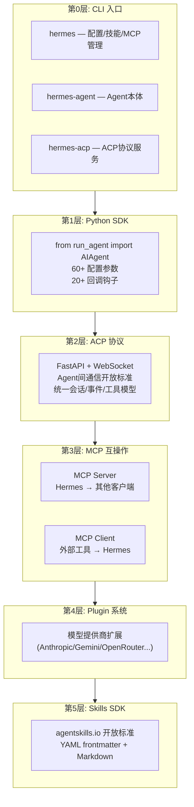
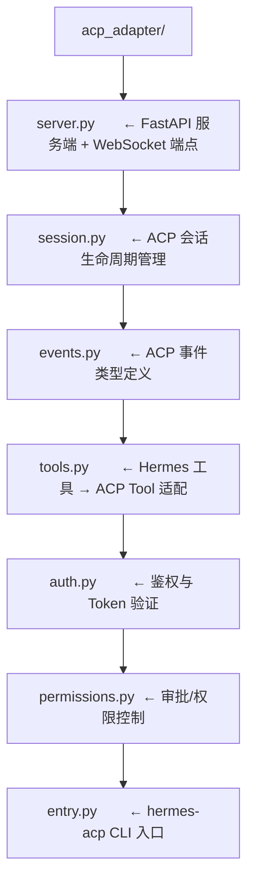
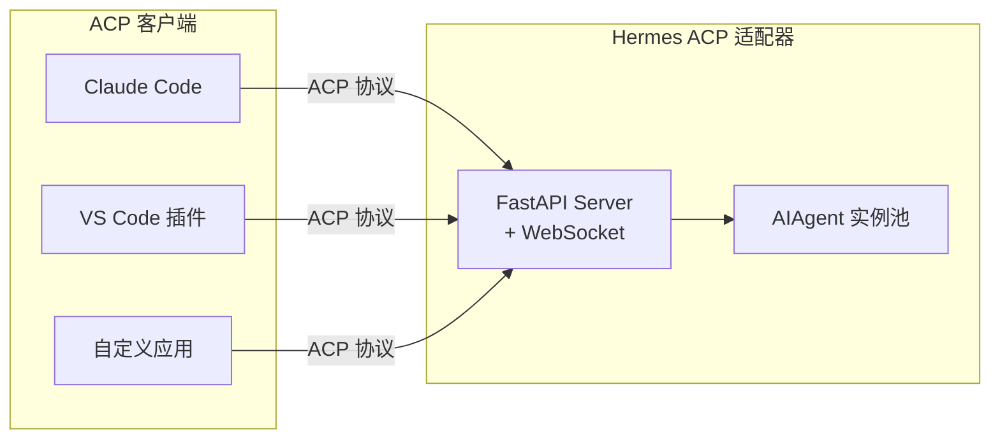
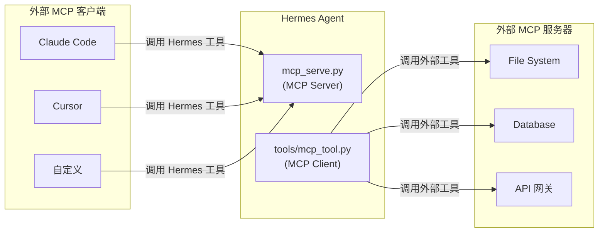
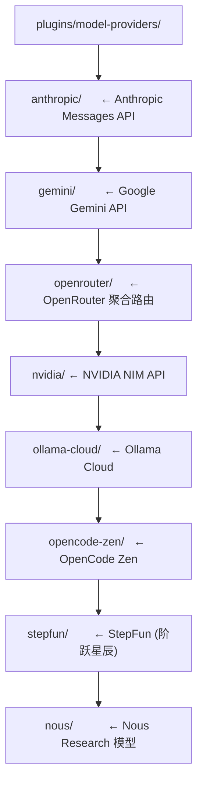
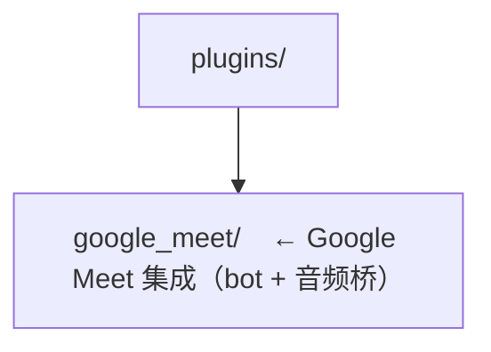

# 09 - SDK 与 API 开发接口

## 这一章讲什么？

Hermes Agent 不是黑盒。它提供了**从底层 Python API 到高层标准协议**的多层开发接口，你可以直接导入 Agent 类做程序化调用，也可以通过 ACP/MCP 等开放标准让其他应用与 Hermes 互通，还可以用插件系统扩展新的模型提供商。

核心文件:
- [run_agent.py](../code/hermes-agent/run_agent.py) (15075行) — `AIAgent` 类是完整的 Python SDK
- [acp_adapter/](../code/hermes-agent/acp_adapter/) — ACP 协议适配器（FastAPI + WebSocket）
- [mcp_serve.py](../code/hermes-agent/mcp_serve.py) — MCP 服务端（把 Hermes 暴露为 MCP 工具）
- [tools/mcp_tool.py](../code/hermes-agent/tools/mcp_tool.py) — MCP 客户端（消费外部 MCP 工具）
- [plugins/](../code/hermes-agent/plugins/) — 插件系统（模型提供商 + 平台扩展）
- [pyproject.toml](../code/hermes-agent/pyproject.toml) — CLI 入口点定义

## 六层开发接口总览



---

## 第一部分: Python SDK（直接导入 AIAgent）

### 最直接的使用方式

`run_agent.py` 导出的 `AIAgent` 类就是 Hermes 的完整 Python API。你可以像普通 Python 库一样使用:

```python
from run_agent import AIAgent

# 创建 Agent 实例
agent = AIAgent(
    model="anthropic/claude-opus-4-20250514",
    provider="anthropic",
    api_key="sk-xxx",
    max_iterations=90,
    enabled_toolsets=["terminal", "file_ops", "web"],
    quiet_mode=False,
)

# 运行对话
result = await agent.run_conversation(
    system_message="You are a helpful coding assistant.",
    messages=[{"role": "user", "content": "帮我写一个 Python web 服务"}],
)

# result 是一个结构化字典:
# {
#     "text": "已创建以下文件...",
#     "usage": {"input_tokens": 1234, "output_tokens": 567},
#     "model": "anthropic/claude-opus-4-20250514",
#     "finish_reason": "stop",
#     ...
# }
```

### 60+ 可配置参数

`AIAgent.__init__` 在 [run_agent.py:1051](code/hermes-agent/run_agent.py#L1051) 提供了超过 60 个参数，分为几类:

| 类别 | 关键参数 | 说明 |
|------|---------|------|
| **模型** | `model`, `provider`, `api_key`, `base_url`, `api_mode` | 选择模型和 API 协议 |
| **循环控制** | `max_iterations`, `tool_delay`, `iteration_budget` | 控制 Agent 工具调用行为 |
| **工具集** | `enabled_toolsets`, `disabled_toolsets` | 精细控制 Agent 可用工具 |
| **身份** | `platform`, `user_id`, `user_name`, `chat_id`, `thread_id` | 设置 Agent 运行上下文 |
| **传输层** | `providers_allowed`, `providers_ignored`, `providers_order`, `provider_sort` | 提供商选择和排序 |
| **容错** | `fallback_model`, `credential_pool` | 故障转移配置 |
| **会话** | `session_id`, `session_db`, `parent_session_id`, `pass_session_id` | 会话持久化 |
| **检查点** | `checkpoints_enabled`, `checkpoint_max_snapshots` | 对话快照与回滚 |
| **推理** | `max_tokens`, `reasoning_config`, `service_tier` | API 调用参数覆盖 |
| **记忆** | `skip_memory`, `skip_context_files`, `load_soul_identity` | 记忆加载控制 |
| **预填充** | `prefill_messages`, `ephemeral_system_prompt` | 注入 few-shot 示例或临时指令 |

### 20+ 回调钩子

你可以注册回调函数来**实时监听** Agent 运行的每个环节:

```python
agent = AIAgent(
    # 流式文本 — 每收到一段 LLM 输出的 delta 文本就调用
    stream_delta_callback=lambda text: print(text, end=""),

    # 工具进度 — 工具开始/完成时调用
    tool_start_callback=lambda name, args: print(f"[{name}] 执行中..."),
    tool_complete_callback=lambda name, result, duration: print(f"[{name}] 完成"),
    tool_progress_callback=lambda name, pct, msg: print(f"[{name}] {pct}%"),

    # 思考指示 — LLM 在"思考"时调用（显示 ... 或 spinner）
    thinking_callback=lambda: print("思考中..."),
    reasoning_callback=lambda text: print(f"[推理] {text}"),

    # 步骤 — 每轮循环开始时调用
    step_callback=lambda step_num, budget_remaining: print(f"--- 第{step_num}轮 ---"),

    # 澄清 — Agent 需要用户确认时调用
    clarify_callback=lambda question: ask_user(question),

    # 状态变更
    status_callback=lambda msg: update_status_bar(msg),
)
```

使用场景举例:

| 回调 | 典型用途 |
|------|---------|
| `stream_delta_callback` | WebSocket 推送实时输出，或 TUI 逐字打印 |
| `tool_start_callback` / `tool_complete_callback` | 记录性能日志，监控工具调用耗时 |
| `thinking_callback` | UI 显示 spinner / "输入中..." 动画 |
| `step_callback` | 监控 Agent 是否卡在循环中 |
| `clarify_callback` | 网关层弹审批按钮给用户 |

---

## 第二部分: ACP（Agent Communication Protocol）

### 什么是 ACP

ACP 是 Anthropic 推出的**Agent 间通信开放标准**。它定义了统一的:
- 会话模型（session/session_id）
- 事件流模型（events via SSE/WebSocket）
- 工具模型（Tool + ToolCall）
- 权限模型（PermissionRequest）

Hermes 通过 `acp_adapter/` 目录完整实现了 ACP 协议:



### 启动 ACP 服务

```bash
# 方式1: CLI 入口
hermes-acp

# 方式2: 直接运行模块
python -m acp_adapter
```

服务启动后，任何遵循 ACP 协议的客户端都可以通过统一接口调用 Hermes。



---

## 第三部分: MCP 互操作

MCP（Model Context Protocol）是另一种开放协议。Hermes 同时扮演 **MCP Server** 和 **MCP Client** 两种角色。

### MCP Server: 把 Hermes 暴露为工具

`mcp_serve.py` 实现了一个 stdio MCP 服务端，让 **Claude Code、Cursor、Codex 等**可以调用 Hermes 的对话能力。

启动方式:

```bash
hermes mcp serve
# 或
hermes mcp serve --verbose
```

暴露的 10 个 MCP 工具:

| MCP 工具 | 功能 | 示例 |
|----------|------|------|
| `conversations_list` | 列出所有平台的活跃会话 | "看看有哪些人找我" |
| `conversation_get` | 获取指定会话的详情 | "TG上user123的聊天" |
| `messages_read` | 读取消息历史 | "过去10条消息是什么" |
| `attachments_fetch` | 获取聊天中的附件 | "下载图片/文件" |
| `events_poll` | 实时事件轮询 | "有新的消息吗" |
| `events_wait` | 阻塞等待新事件 | "等人回我" |
| `messages_send` | 发送消息到指定会话 | "回复TG上的user123" |
| `permissions_list_open` | 查看待审批的操作 | "有什么需要我批准的" |
| `permissions_respond` | 批准/拒绝待审批项 | "批准把文件写入/home" |
| `channels_list` | 列出接入的所有平台 | "我有哪些平台连着" |

配置 MCP 客户端（以 Claude Code 为例）:

```json
{
    "mcpServers": {
        "hermes": {
            "command": "hermes",
            "args": ["mcp", "serve"]
        }
    }
}
```

### MCP Client: Hermes 使用外部 MCP 工具

反过来，Hermes 也通过 `tools/mcp_tool.py` **消费外部 MCP 服务器的工具**。`skills/mcp/native-mcp/` 技能让 Agent 自动发现和调用外部 MCP 工具。

管理外部 MCP 服务器:

```bash
# 添加 MCP 服务器
hermes mcp add my-server --command "npx" --args "@anthropic/mcp-server"

# 列出已配置的 MCP 服务器
hermes mcp list

# 移除 MCP 服务器
hermes mcp remove my-server
```

MCP 双向互操作示意:



---

## 第四部分: Plugin 系统

`plugins/` 目录是 Hermes 的扩展机制，主要用于**扩展模型提供商**。

### 已有模型提供商插件

[plugins/model-providers/](code/hermes-agent/plugins/model-providers/) 下已有 8 个:



### 平台级扩展



---

## 第五部分: Skills SDK（agentskills.io 格式）

技能本身遵循 [agentskills.io](https://agentskills.io) 开放标准。

### 技能格式

```markdown
---
name: my-skill
description: "描述这个技能做什么"
version: 1.0.0
author: Your Name
metadata:
  hermes:
    tags: [tag1, tag2]
    related_skills: [other-skill]
    config:
      MY_PARAM:
        description: "参数说明"
        type: string
        default: "默认值"
---

# 技能名称

## Steps

1. 第一步操作
2. 第二步操作
...
```

### 安装和发布

```bash
# 从技能中心安装
hermes skills install <skill-name>

# 发布到技能中心
hermes skills publish <skill-name>

# 列出已安装的技能
hermes skills list
```

---

## 总结: 选择哪种接口？

| 你的需求 | 推荐接口 | 复杂度 |
|---------|---------|-------|
| 在 Python 项目里嵌入 Agent | `from run_agent import AIAgent` | 低 |
| 让其他 AI 应用（Claude Code/Cursor）调用 Hermes | MCP Server (`hermes mcp serve`) | 低 |
| 构建 Agent 间标准化通信 | ACP 适配器 (`hermes-acp`) | 中 |
| 给 Hermes 增加外部工具源 | MCP Client (`hermes mcp add`) | 低 |
| 接入新的大模型 API | Plugin (`plugins/model-providers/`) | 中 |
| 创建可复用的任务模板 | Skills SDK (agentskills.io 格式) | 低 |
| 实时监听 Agent 内部状态 | AIAgent 回调钩子 | 低 |
| 从消息平台控制 Agent | Gateway WebSocket 事件流 | 高 |

---

## 下一步

到这里你已经完整了解了 Hermes Agent 的全部实现。回到 [00-概述与架构总览](00-概述与架构总览.md) 复习整体结构，或者开始深入阅读源码吧!
