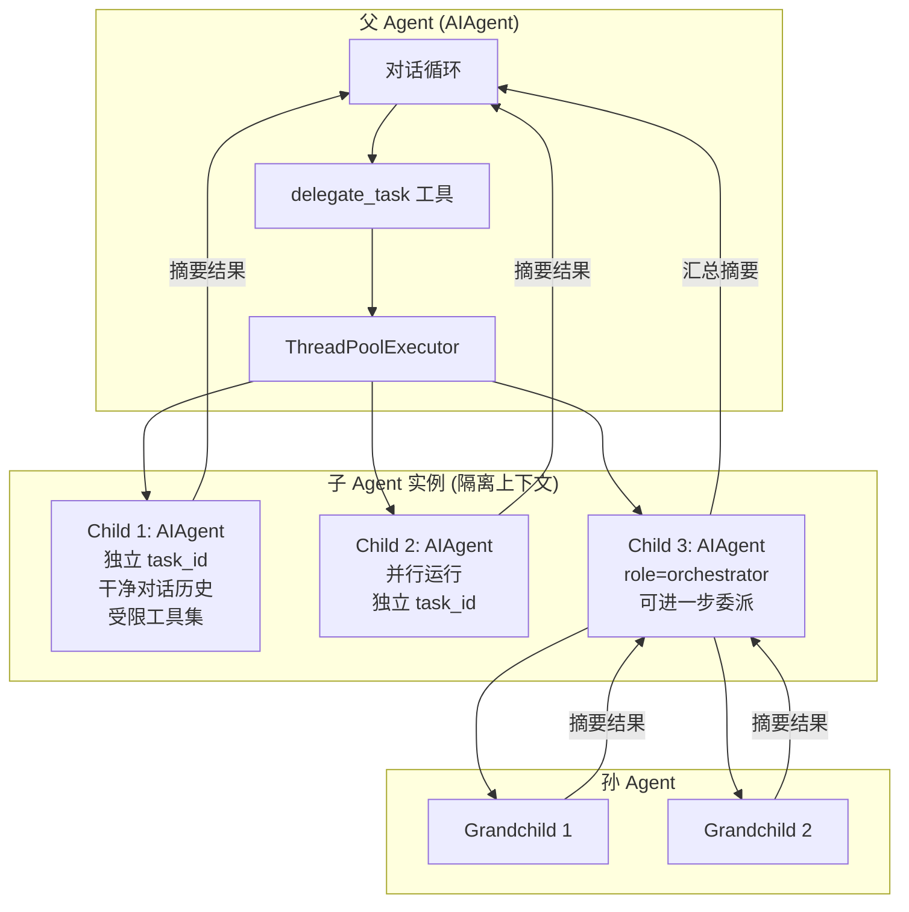
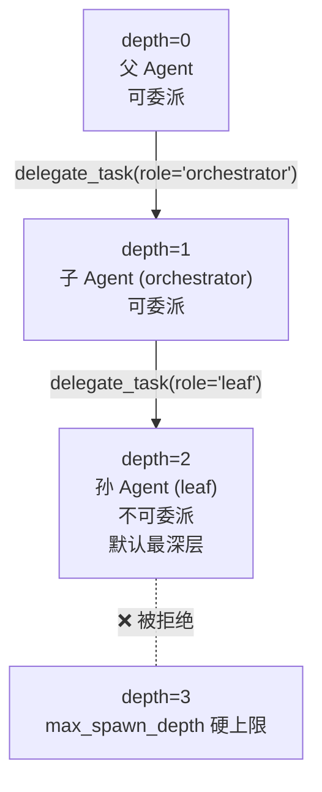
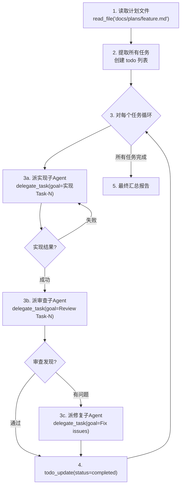

# 10 - 多 Agent 协作模式

## 这一章讲什么？

单个 Agent 能处理的任务复杂度有上限。Hermes 通过 `delegate_task` 工具实现了**可嵌套的多 Agent 协作架构**——父 Agent 像项目经理一样分配任务给子 Agent，子 Agent 在隔离环境中独立执行，完成后只返回摘要。这一章详解子 Agent 的创建、隔离、并行执行和嵌套委派的全流程。

核心文件:
- [tools/delegate_tool.py](../code/hermes-agent/tools/delegate_tool.py) (2767行) — 子 Agent 创建、调度、生命周期管理
- [run_agent.py](../code/hermes-agent/run_agent.py) (15075行) — `AIAgent` 类，每个子 Agent 都是独立实例
- [tools/terminal_tool.py](../code/hermes-agent/tools/terminal_tool.py) — 子 Agent 审批回调注入
- 技能参考: [subagent-driven-development/](../code/hermes-agent/skills/software-development/subagent-driven-development/SKILL.md), [kanban-orchestrator/](../code/hermes-agent/skills/devops/kanban-orchestrator/SKILL.md), [kanban-worker/](../code/hermes-agent/skills/devops/kanban-worker/SKILL.md), [spike/](../code/hermes-agent/skills/software-development/spike/SKILL.md), [test-driven-development/](../code/hermes-agent/skills/software-development/test-driven-development/SKILL.md)

## 架构总览



核心设计原则：**父 Agent 只看到委托调用和最终摘要，永远看不到子 Agent 的中间推理和工具调用**。这压缩了父 Agent 的上下文窗口，让单个 Agent 能处理理论上无限大的任务。

## 三种运行模式

### 1. Single 模式（单任务委托）

最简单的方式：把一个具体任务交给一个子 Agent。

```python
# Agent 调用 delegate_task 工具（单任务模式）
delegate_task(
    goal="实现 User 模型，包含 email 和 password_hash 字段",
    context="""
    技术约束:
    - 使用 bcrypt 做密码哈希
    - 文件路径: src/models/user.py
    - 测试路径: tests/models/test_user.py
    - 数据库: SQLAlchemy ORM + PostgreSQL
    """,
    toolsets=["terminal", "file_ops"],
    max_iterations=30,
    role="leaf"
)
```

子 Agent 收到的 System Prompt（[delegate_tool.py:581-604](../code/hermes-agent/tools/delegate_tool.py#L581-L604)）：

```
You are a focused subagent working on a specific delegated task.

YOUR TASK:
实现 User 模型，包含 email 和 password_hash 字段

CONTEXT:
技术约束:
- 使用 bcrypt 做密码哈希
...

Complete this task using the tools available to you.
When finished, provide a clear, concise summary of:
- What you did
- What you found or accomplished
- Any files you created or modified
- Any issues encountered

Be thorough but concise -- your response is returned to the
parent agent as a summary.
```

返回的结构化结果：

```json
{
  "task_index": 0,
  "status": "completed",
  "summary": "创建了 User 模型: src/models/user.py (email + password_hash 字段, bcrypt 哈希)。\n测试: tests/models/test_user.py (7 个测试全部通过)。\n迁移: alembic/versions/xxx_add_user.py",
  "api_calls": 12,
  "duration_seconds": 45.3,
  "changed_files": ["src/models/user.py", "tests/models/test_user.py"],
  "tests_run": 7,
  "tests_passed": 7
}
```

### 2. Batch 模式（并行多任务）

当多个子任务**彼此独立**时，一次调用并行跑：

```python
delegate_task(
    tasks=[
        {
            "goal": "Research: 对比 FastAPI vs Litestar 性能差异",
            "context": "关注吞吐量、p99 延迟、3年维护成本预估",
            "toolsets": ["web"],
            "role": "leaf"
        },
        {
            "goal": "Research: MySQL 8.0 迁移到 Postgres 16 的成本",
            "context": "50GB 数据、200表、存储过程/触发器迁移方案",
            "toolsets": ["web"],
            "role": "leaf"
        },
        {
            "goal": "Implementation: 创建 FastAPI 项目骨架",
            "context": "FastAPI + SQLAlchemy async + Alembic + structlog",
            "toolsets": ["terminal", "file_ops"],
            "role": "leaf"
        }
    ],
    max_iterations=40
)
```

底层使用 `ThreadPoolExecutor` 并发执行（[delegate_tool.py:2081-2090](../code/hermes-agent/tools/delegate_tool.py#L2081-L2090)）：

```python
# 实际执行逻辑（简化版）
with ThreadPoolExecutor(max_workers=max_children) as executor:
    futures = {}
    for i, t, child in children:
        future = executor.submit(
            _run_single_child,
            task_index=i,
            goal=t["goal"],
            child=child,
            parent_agent=parent_agent,
        )
        futures[future] = i

    # 轮询等待，支持中断传播
    while pending:
        if parent_agent._interrupt_requested:
            break  # 父Agent被中断，终止等待
        done, pending = wait(pending, timeout=0.5,
                            return_when=FIRST_COMPLETED)
        for future in done:
            results.append(future.result())
```

关键细节：
- 默认最多 **3 个并发**子 Agent（`delegation.max_concurrent_children` 可配置）
- 用 `wait(timeout=0.5)` 而非 `as_completed()` 轮询，确保中断信号能及时响应
- 父 Agent 被 Ctrl+C 时，已完成的结果保留，未完成的标记为 `"interrupted"`

### 3. Orchestrator 模式（嵌套委派）

子 Agent 角色设为 `"orchestrator"` 时，它**也可以调用 `delegate_task`** 创建自己的子 Agent 树：

```python
# 父 Agent 创建 orchestrator
delegate_task(
    goal="对这个 PR 做完整的 Code Review（安全性 + 性能 + 代码风格）",
    role="orchestrator",
    toolsets=["terminal", "file_ops", "web", "delegation"],
    max_iterations=60
)
```

Orchestrator 收到的 System Prompt 扩展（[delegate_tool.py:617-636](../code/hermes-agent/tools/delegate_tool.py#L617-L636)）：

```
## Subagent Spawning (Orchestrator Role)
You have access to the `delegate_task` tool and CAN spawn
your own subagents to parallelize independent work.

WHEN to delegate:
- The goal decomposes into 2+ independent subtasks
- A subtask is reasoning-heavy and would flood your context

WHEN NOT to delegate:
- Single-step mechanical work — do it directly
- Trivial tasks you can execute in one or two tool calls
- Re-delegating your entire assigned goal to one worker

Coordinate your workers' results and synthesize them before
reporting back to your parent.

NOTE: You are at depth 1. The delegation tree is capped at
max_spawn_depth=2. Your own children MUST be leaves.
```

Orchestrator 内部的委派逻辑：

```python
# orchestrator 子 Agent 内部 —— 把 review 拆成 3 个并行任务
delegate_task(
    tasks=[
        {
            "goal": "Review 安全性: SQL注入/XSS/CSRF/权限绕过",
            "context": "目标 PR diff...",
            "role": "leaf",
            "toolsets": ["terminal", "file_ops"]
        },
        {
            "goal": "Review 性能: N+1查询/内存泄漏/慢查询",
            "context": "目标 PR diff...",
            "role": "leaf",
            "toolsets": ["terminal", "file_ops"]
        },
        {
            "goal": "Review 代码风格: PEP8/类型注解/命名规范",
            "context": "目标 PR diff...",
            "role": "leaf",
            "toolsets": ["terminal", "file_ops"]
        }
    ]
)
# 汇总三个子结果 → 写最终 Review 报告 → 返回给父 Agent
```

嵌套深度限制：



深度上限由 `delegation.max_spawn_depth` 控制（默认 1，硬上限 3）。

## 隔离机制

每个子 Agent 是**真正的独立 AIAgent 实例**（[delegate_tool.py:896](../code/hermes-agent/tools/delegate_tool.py#L896)），享有以下隔离：

| 隔离维度 | 机制 |
|---------|------|
| **对话上下文** | 子 Agent 从零开始，不继承父 Agent 的对话历史 |
| **工具集** | 父 Agent 工具集的**子集**（子 Agent 不可能获得父 Agent 没有的工具），再加上黑名单过滤 |
| **工作目录** | 独立的 `task_id`，独立的文件操作缓存 |
| **记忆** | `memory` 工具被禁止，不会污染共享 MEMORY.md |
| **凭证** | 可配置独立 provider:model，与父 Agent 使用不同的 API key |
| **迭代预算** | 独立的 `max_iterations`（通过 `delegation.max_iterations` 配置） |

### 黑名单工具（所有子 Agent 永远不可用）

```python
# delegate_tool.py:40-48
DELEGATE_BLOCKED_TOOLS = frozenset([
    "delegate_task",   # leaf 不可递归委派
    "clarify",         # 不可直接与用户交互
    "memory",          # 不可写入共享 MEMORY.md
    "send_message",    # 不可跨平台发消息
    "execute_code",    # 应逐步推理而非写脚本
])
```

### 审批安全

子 Agent 运行在独立线程中，如果执行危险命令（如 `rm -rf`），默认**自动拒绝**，防止阻塞父 Agent 的 UI（[delegate_tool.py:68-76](../code/hermes-agent/tools/delegate_tool.py#L68-L76)）：

```python
def _subagent_auto_deny(command, description, **kwargs):
    """子Agent危险命令自动拒绝（安全默认值）"""
    return "deny"

# 如果需要在 cron/批处理场景自动批准:
# 配置 delegation.subagent_auto_approve: true
```

## 完整实战案例

### 案例 1: Subagent-Driven Development（基于技能）

这是 [software-development/subagent-driven-development](../code/hermes-agent/skills/software-development/subagent-driven-development/SKILL.md) 技能的完整流程：



实际代码（Agent 执行的工具调用序列）：

```python
# Step 1: 一次性读取计划
read_file("docs/plans/user-auth-feature.md")

# Step 2: 创建 todo 追踪
todo_write(todos=[
    {"id": "t1", "content": "Create User model", "status": "pending"},
    {"id": "t2", "content": "Add password hashing utility", "status": "pending"},
    {"id": "t3", "content": "Create login endpoint", "status": "pending"},
    {"id": "t4", "content": "Add JWT token generation", "status": "pending"},
])

# Step 3: 对每个任务 —— 实现 → 审查 → 修复 三段式
for task in ["t1", "t2", "t3", "t4"]:
    todo_write(todos=[{"id": task, "status": "in_progress", ...}])

    # 3a. 实现子Agent（带完整上下文，不让子Agent去读文件）
    impl = delegate_task(
        goal=f"Implement {task}: Create User model with email + password_hash",
        context="""
        TASK FROM PLAN (Task 1/4):
        - Create src/models/user.py
        - Fields: id (UUID), email (str, unique), password_hash (str)
        - Use bcrypt via passlib[bcrypt]
        - Add __repr__ for debugging

        FOLLOW TDD:
        1. Write failing test in tests/models/test_user.py
        2. Run: pytest tests/models/test_user.py -v (verify FAIL)
        3. Write minimal implementation
        4. Run: pytest tests/models/test_user.py -v (verify PASS)
        5. Run: pytest tests/ -q (verify no regressions)
        6. Commit: git add -A && git commit -m "feat: add User model"
        """,
        toolsets=["terminal", "file_ops"],
        role="leaf"
    )

    # 3b. 审查子Agent（审实现结果）
    review = delegate_task(
        goal=f"Review implementation of {task} for spec compliance and quality",
        context=f"""
        ORIGINAL SPEC:
        - User model with email + password_hash, bcrypt hashing

        IMPLEMENTATION RESULT:
        {impl['summary']}

        CHECKLIST:
        - Does the code match the spec?
        - Error handling for duplicate email, invalid email format?
        - Tests cover edge cases (empty string, None, SQL injection)?
        - Any security issues?
        """,
        toolsets=["terminal", "file_ops"],
        role="leaf"
    )

    # 3c. 如有问题，派修复子Agent
    if review.get("findings"):
        fix = delegate_task(
            goal=f"Fix review findings for {task}",
            context=f"""
            ORIGINAL TASK: Create User model with email + password_hash
            REVIEW FINDINGS: {review['findings']}
            Fix ALL issues. Run full test suite after fixes.
            """,
            toolsets=["terminal", "file_ops"],
            role="leaf"
        )

    todo_write(todos=[{"id": task, "status": "completed", ...}])

# Step 4: 最终汇总
# "所有 4 个任务完成。实现 + 审查 + 修复 共 12 个子 Agent 调用。
#  最终测试: 23 passed, 0 failed."
```

### 案例 2: Kanban 多 Agent 流水线

这是 [devops/kanban-orchestrator](../code/hermes-agent/skills/devops/kanban-orchestrator/SKILL.md) 技能的完整流程。与 `delegate_task` 的临时子 Agent 不同，Kanban 使用**持久化角色**（profiles），每个角色是独立的长生命周期 Agent。

角色 roster：

| Profile | 职责 | 工作空间 |
|---------|------|---------|
| `researcher` | 信息收集、阅读源码、写调研笔记 | `scratch` |
| `analyst` | 综合多个 researcher 输出、排名 | `scratch` |
| `writer` | 按用户语气起草文档 | `scratch` 或 Obsidian vault |
| `reviewer` | 审查输出、提出修改意见、把关 | `scratch` |
| `backend-eng` | 编写后端代码 | `worktree` |
| `frontend-eng` | 编写前端代码 | `worktree` |
| `ops` | 执行脚本、管理服务、部署 | `dir:` 到运维仓库 |

Orchestrator 的工作流：

```python
# Orchestrator 收到用户请求: "分析是否应该迁移到 Postgres"

# Step 1: 理解目标，画出任务依赖图
# 不写代码，先输出 graph 给用户确认

# Step 2: 创建 Kanban cards
t1 = kanban_create(
    title="research: Postgres 成本 vs 当前",
    assignee="researcher",
    body="对比基础设施成本、迁移成本、3年运维成本。参考: AWS/GCP 定价、团队时间估算",
    tenant=os.environ["HERMES_TENANT"],
)
t2 = kanban_create(
    title="research: Postgres 性能 vs 当前",
    assignee="researcher",
    body="对比吞吐量、延迟、并发连接数。关注我们的典型查询模式",
    tenant=os.environ["HERMES_TENANT"],
)
t3 = kanban_create(
    title="synthesize: 迁移建议",
    assignee="analyst",
    body="综合 T1 和 T2 的研究结果，给出加权推荐和风险矩阵",
    parents=[t1["task_id"], t2["task_id"]],  # ← 依赖关系
    tenant=os.environ["HERMES_TENANT"],
)
t4 = kanban_create(
    title="draft: 决策备忘录",
    assignee="writer",
    body="基于 T3 的分析结果起草给 CTO 的决策备忘录（1页）",
    parents=[t3["task_id"]],
    tenant=os.environ["HERMES_TENANT"],
)

# Kanban Dispatcher 自动拉起对应 profile 的 Agent:
# T1, T2 → 2个 researcher Agent 并行
#   ↓ (等 T1, T2 都完成)
# T3 → 1个 analyst Agent
#   ↓ (等 T3 完成)
# T4 → 1个 writer Agent

# Step 3: Orchestrator 轮询状态，等全部完成后汇总给用户
```

Worker（以 researcher 为例）的标准输出格式：

```python
# researcher agent 完成时调用
kanban_complete(
    summary="Postgres 成本预估: 3年 TCO 约 $45K vs MySQL 当前 $38K。差距主要在托管服务费用 ($7K)，自管理方案差距仅 $2K",
    metadata={
        "sources_read": 12,
        "recommendation": "Postgres",
        "confidence": "medium",
        "cost_comparison": {
            "postgres_managed": 45000,
            "postgres_selfhosted": 39000,
            "mysql_current": 38000,
        },
    },
)
```

### 案例 3: Spike 快速验证（探索型多 Agent）

[software-development/spike](../code/hermes-agent/skills/software-development/spike/SKILL.md) 技能演示了多 Agent 在**事实发现/原型验证**场景的用法：

```python
# 用户: "我想知道 WebSocket 推送 LLM token 流是否可行"

# 分解为 3 个独立可行性问题
delegate_task(
    tasks=[
        {
            "goal": "Spike: FastAPI WebSocket 推送 token 流",
            "context": "Given WS连接, When LLM流式生成, Then 客户端 <100ms 收到每个token",
            "role": "leaf",
            "toolsets": ["terminal", "file_ops", "web"]
        },
        {
            "goal": "Spike: 对比 ws vs SSE vs polling 的客户端复杂度",
            "context": "对比三种方案在前端 React 的集成代码量和错误处理复杂度",
            "role": "leaf",
            "toolsets": ["terminal", "file_ops", "web"]
        },
    ]
)
# 两个 spike 并行跑，完事后父 Agent 汇总：
# "WebSocket: 可行，延迟 <50ms。SSE: 更简单但单向。建议用 WS。"
```

## 配置参考

在 `~/.hermes/config.yaml` 中：

```yaml
delegation:
  # 子Agent迭代预算
  max_iterations: 50

  # 嵌套深度 (默认1, 硬上限3)
  max_spawn_depth: 1

  # 并行子Agent数量上限
  max_concurrent_children: 3

  # 子Agent可路由到不同模型（省钱/加速）
  provider: "openrouter"
  model: "anthropic/claude-haiku-4-20250501"

  # 子Agent超时 (秒)
  child_timeout_seconds: 600

  # 危险命令: false=安全拒绝, true=自动批准 (cron场景用)
  subagent_auto_approve: false

  # 子Agent推理力度
  reasoning_effort: "low"

  # orchestrator模式: true=允许子Agent再委派
  orchestrator_enabled: true
```

## delegate_task vs Kanban 对比

| 特性 | delegate_task | Kanban |
|------|-------------|--------|
| **子 Agent 生命周期** | 临时的，用完即弃 | 持久的，profile 复用 |
| **并行** | Batch 模式（同一次调用） | 通过 parent 链接定义的 DAG |
| **人机协同** | 不支持（`clarify` 被禁） | 支持（每个 card 可人工介入） |
| **故障恢复** | 中断后结果丢失 | Board 持久化，重启可继续 |
| **适用场景** | 单次任务分解（代码实现/调研） | 长流程、多角色协作、需审计 |

## 子 Agent 也可以多模型

一个重要特性是**子 Agent 可以用和父 Agent 不同的模型**：

```yaml
# config.yaml
delegation:
  provider: "openrouter"                           # 子Agent走 OpenRouter
  model: "anthropic/claude-haiku-4-20250501"      # 用 Haiku（便宜/快）
```

父 Agent 用 Claude Opus 做统筹，子 Agent 用 Haiku 或 Gemini Flash 做具体执行，兼顾质量与成本。

---

## 下一步

了解了多 Agent 协作后，回到 [09-SDK与API开发接口](09-SDK与API开发接口.md) 看如何通过 Python SDK、ACP、MCP 等接口让外部系统与 Hermes 的多 Agent 树交互。
