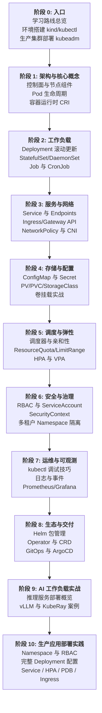

# 学习路线总览

## 目标

本学习路径帮助你系统掌握 Kubernetes 容器编排平台，从本地 kind 集群实验到生产级 Helm/GitOps 交付，覆盖 CKA/CKAD 导向的核心实操技能。完成学习后，你将能独立部署、调试和运维 K8s 上的应用，并为 AI 推理服务（vLLM、KubeRay）的云端部署打下基础。

## 前置要求

- Linux 基础命令（文件、进程、网络）
- Docker 基本概念（镜像、容器、端口映射）
- YAML 语法基础
- 了解 HTTP/TCP 网络基础

## 9 阶段学习路线



## 建议学习周期（8-10 周）

| 周次 | 阶段 | 内容 | 预计时间 |
|------|------|------|----------|
| 1 | 入口 | 学习路线总览、kind 环境搭建、生产集群部署 | 4h |
| 2 | 架构与核心概念 | K8s 架构、Pod 生命周期 | 5h |
| 3 | 工作负载 | Deployment、StatefulSet、Job | 6h |
| 4 | 服务与网络 | Service、Ingress、NetworkPolicy | 6h |
| 5 | 存储与配置 | ConfigMap/Secret、PV/PVC | 5h |
| 6 | 调度与弹性 | 亲和性、配额、HPA | 6h |
| 7 | 安全与治理 | RBAC、SecurityContext、多租户 | 5h |
| 8 | 运维与可观测 | 调试、日志、Prometheus | 5h |
| 9 | 生态与交付 | Helm、Operator、ArgoCD | 6h |
| 10 | AI 工作负载 | 推理服务、vLLM/KubeRay 衔接 | 4h |
| 11 | 生产应用部署实践 | Namespace/RBAC、完整 Deployment、Service/Ingress、HPA/PDB | 6h |

## 学习建议

1. **动手优先**：每章 YAML 都在本地 kind 集群 `kubectl apply`，namespace 统一使用 `k8s-learn`
2. **先通后深**：01-04 打通部署链路（Pod → Deployment → Service → ConfigMap），再深入调度与安全
3. **对照官方文档**：K8s 概念以 [kubernetes.io 官方文档](https://kubernetes.io/zh-cn/docs/home/) 为准，本路径侧重实操路径
4. **衔接 AI 路径**：阶段 9 完成后，可继续 [Ray KubeRay 云原生部署](../../ray-learning-path/08-集群与生产/02-KubeRay与云原生部署.md)

## 核心工具

```bash
# kubectl（K8s 命令行）
kubectl version --client

# kind（本地集群，推荐）
kind version

# helm（包管理，阶段 8 需要）
helm version
```
