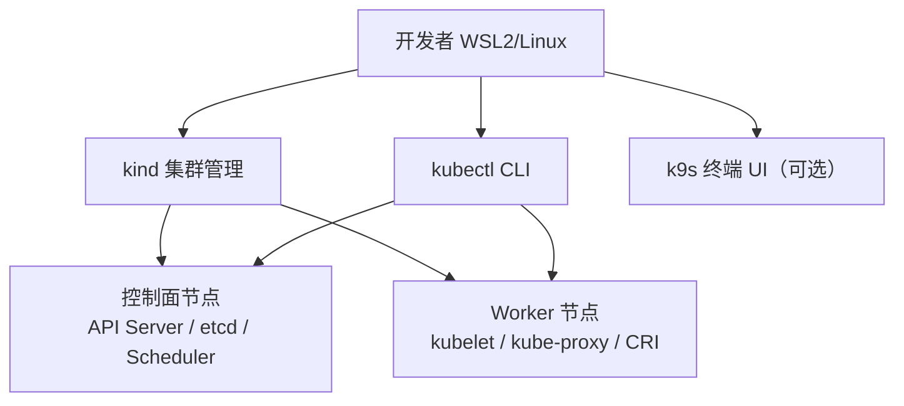

# 环境搭建

## 本地开发环境拓扑



> **类比**：kind 像是在你的电脑上快速搭一个「迷你数据中心」——控制面是总部调度中心，Worker 是干活的机房，kubectl 是你给总部下命令的电话。

## 安装 kubectl

```bash
# Linux amd64（WSL2 适用）
curl -LO "https://dl.k8s.io/release/$(curl -L -s https://dl.k8s.io/release/stable.txt)/bin/linux/amd64/kubectl"
chmod +x kubectl
sudo mv kubectl /usr/local/bin/

kubectl version --client
```

启用 shell 补全（bash）：

```bash
echo 'source <(kubectl completion bash)' >> ~/.bashrc
echo 'alias k=kubectl' >> ~/.bashrc
echo 'complete -o default -F __start_kubectl k' >> ~/.bashrc
source ~/.bashrc
```

## 安装 kind

kind（Kubernetes IN Docker）在 Docker 容器内运行 K8s 节点，轻量且适合 CI。

**前置**：需要 Docker 已安装并运行。

```bash
# 安装 kind
curl -Lo ./kind https://kind.sigs.k8s.io/dl/v0.26.0/kind-linux-amd64
chmod +x ./kind
sudo mv ./kind /usr/local/bin/kind

kind version
```

## 创建第一个集群

```bash
# 创建单节点集群
kind create cluster --name k8s-learn

# 验证
kubectl cluster-info --context kind-k8s-learn
kubectl get nodes
```

预期输出：一个 `Ready` 状态的 control-plane 节点。

## 创建学习用 Namespace

后续章节统一使用 `k8s-learn` namespace：

```bash
kubectl create namespace k8s-learn
kubectl config set-context --current --namespace=k8s-learn
```

## 备选：minikube

如果无法使用 Docker，可用 minikube：

```bash
curl -LO https://storage.googleapis.com/minikube/releases/latest/minikube-linux-amd64
sudo install minikube-linux-amd64 /usr/local/bin/minikube
minikube start --driver=docker
```

## 可选工具

### k9s — 终端集群 UI

```bash
curl -sS https://webinstall.dev/k9s | bash
k9s -n k8s-learn
```

### helm — 包管理（阶段 8 需要）

```bash
curl https://raw.githubusercontent.com/helm/helm/main/scripts/get-helm-3 | bash
helm version
```

## 验证清单

| 检查项 | 命令 | 预期 |
|--------|------|------|
| kubectl 可用 | `kubectl version --client` | 显示 Client Version |
| 集群连通 | `kubectl get nodes` | STATUS = Ready |
| namespace | `kubectl get ns k8s-learn` | Active |

## 清理

```bash
kind delete cluster --name k8s-learn
```

## 常见坑

- **Docker 未启动**：kind 依赖 Docker，`Cannot connect to the Docker daemon` 需先启动 Docker Desktop 或 `sudo service docker start`
- **端口冲突**：多集群并存时用 `--name` 区分 context
- **WSL2 内存不足**：kind 默认单节点约需 2GB+ 可用内存

## 小结

- 推荐 **kind + kubectl** 作为本地实验环境
- 创建 `k8s-learn` namespace 作为后续章节的统一实验空间
- 阶段 8 前安装 helm 即可，k9s 可提升日常操作效率
