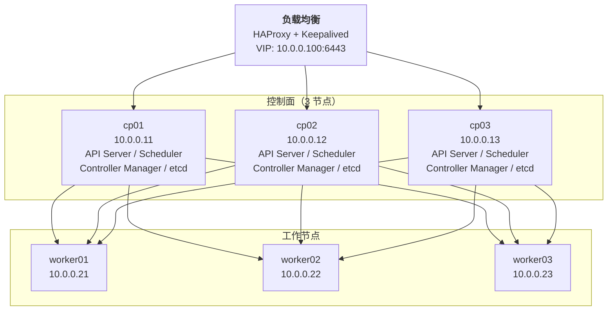

# 生产集群部署

## 目标

使用 kubeadm 部署一套生产可用的高可用 Kubernetes 集群，覆盖节点规划、系统初始化、容器运行时、控制面高可用、CNI 网络、证书管理、etcd 备份恢复全流程。

> **类比**：如果说 kind 是在你电脑上搭积木做实验，kubeadm 就是按照建筑图纸在工地上浇筑钢筋混凝土——每一步都需要精确规划，但成果是能扛住真实流量的。

## 生产拓扑总览



| 角色 | 数量 | 最低配置 | 推荐配置 |
|---|---|---|---|
| 控制面节点 | 3 | 2C/4G/40G | 4C/8G/100G SSD |
| 工作节点 | ≥3 | 4C/8G/100G | 8C/16G/200G SSD |
| 负载均衡 | 2 | 1C/2G/20G | 2C/4G/40G |

## 所有节点初始化

> 以下所有命令需要在**每台节点上**以 root 执行。

### 1. 系统内核参数

```bash
cat <<EOF | tee /etc/modules-load.d/k8s.conf
overlay
br_netfilter
EOF

modprobe overlay
modprobe br_netfilter

cat <<EOF | tee /etc/sysctl.d/k8s.conf
# 允许 iptables 处理 bridge 流量（Pod 跨节点通信必需）
net.bridge.bridge-nf-call-iptables  = 1
net.bridge.bridge-nf-call-ip6tables = 1
# 允许 IP 转发（Pod 访问外部网络必需）
net.ipv4.ip_forward                 = 1
EOF

sysctl --system
```

### 2. 关闭 swap

K8s 要求关闭 swap，否则 kubelet 拒绝启动。如果物理内存不足应加内存而不是开 swap。

```bash
# 临时关闭
swapoff -a

# 永久关闭 —— 注释掉 swap 行
sed -i '/\sswap\s/s/^/#/' /etc/fstab
```

### 3. 关闭防火墙与 SELinux

```bash
# Ubuntu (ufw)
ufw disable

# CentOS/RHEL (firewalld + SELinux)
systemctl stop firewalld && systemctl disable firewalld
setenforce 0
sed -i 's/SELINUX=enforcing/SELINUX=disabled/' /etc/selinux/config
```

### 4. 配置主机名与 hosts

```bash
# 每台节点设置唯一主机名
hostnamectl set-hostname cp01    # 以此类推

# 所有节点追加 /etc/hosts
cat <<EOF >> /etc/hosts
10.0.0.11 cp01
10.0.0.12 cp02
10.0.0.13 cp03
10.0.0.21 worker01
10.0.0.22 worker02
10.0.0.23 worker03
10.0.0.100 k8s-api.lan
EOF
```

## 安装 containerd（CRI 运行时）

K8s 从 v1.24 起移除 dockershim，生产环境统一使用 containerd。

```bash
# 安装 containerd（通过 apt）
apt update && apt install -y containerd

# 生成默认配置
mkdir -p /etc/containerd
containerd config default > /etc/containerd/config.toml

# 关键修改：启用 SystemdCgroup（否则 kubelet 报 cgroup 驱动不匹配）
sed -i 's/SystemdCgroup = false/SystemdCgroup = true/' /etc/containerd/config.toml

# 可选但建议：将 sandbox_image 改为国内镜像源
sed -i 's|sandbox_image = ".*"|sandbox_image = "registry.k8s.io/pause:3.10"|' /etc/containerd/config.toml

systemctl restart containerd
systemctl enable containerd
```

**为什么必须用 SystemdCgroup**：kubelet 和 Linux 发行版默认用 systemd cgroup 驱动，而 containerd 默认用 cgroupfs。两者不一致会导致资源统计异常和 kubelet 启动失败。

## 安装 kubeadm / kubelet / kubectl

```bash
# 添加 K8s apt 仓库
apt update && apt install -y apt-transport-https ca-certificates curl gpg

# 使用国内镜像源（阿里云）
curl -fsSL https://mirrors.aliyun.com/kubernetes/apt/doc/apt-key.gpg | gpg --dearmor -o /etc/apt/keyrings/kubernetes-archive-keyring.gpg

echo "deb [signed-by=/etc/apt/keyrings/kubernetes-archive-keyring.gpg] https://mirrors.aliyun.com/kubernetes/apt/ kubernetes-xenial main" | tee /etc/apt/sources.list.d/kubernetes.list

# 安装指定版本（锁定版本避免升级事故）
K8S_VERSION=1.32.3-1.1
apt update
apt install -y kubelet=$K8S_VERSION kubeadm=$K8S_VERSION kubectl=$K8S_VERSION

# 锁定版本防止 apt upgrade 误升级
apt-mark hold kubelet kubeadm kubectl

# kubelet 开机自启（此时还不会成功运行，等 kubeadm init 后即可）
systemctl enable --now kubelet
```

## 控制面高可用 —— HAProxy + Keepalived

生产环境需要负载均衡器将 API Server 请求分发到 3 个控制节点。在两台 LB 节点上配置：

### HAProxy 配置

```bash
# 两台 LB 节点上都执行
apt install -y haproxy keepalived

cat <<EOF > /etc/haproxy/haproxy.cfg
global
    maxconn 4096

defaults
    mode tcp
    timeout connect 5s
    timeout client 30s
    timeout server 30s

frontend k8s-api
    bind *:6443
    default_backend k8s-cp

backend k8s-cp
    balance roundrobin
    option tcp-check
    server cp01 10.0.0.11:6443 check
    server cp02 10.0.0.12:6443 check
    server cp03 10.0.0.13:6443 check
EOF

systemctl restart haproxy && systemctl enable haproxy
```

### Keepalived 配置（VIP 漂移）

```bash
# lb01（MASTER）
cat <<EOF > /etc/keepalived/keepalived.conf
vrrp_instance VI_1 {
    state MASTER
    interface eth0
    virtual_router_id 51
    priority 100               # lb02 写 90
    advert_int 1
    authentication {
        auth_type PASS
        auth_pass k8s-lb-secret
    }
    virtual_ipaddress {
        10.0.0.100/24           # VIP —— 对外暴露的唯一入口
    }
}
EOF

# lb02 改两处：state BACKUP、priority 90
```

```bash
systemctl restart keepalived && systemctl enable keepalived
```

验证：`ip addr show eth0 | grep 10.0.0.100` 应在 MASTER 上看到 VIP。

## 初始化第一个控制节点

创建 `kubeadm-config.yaml`：

```yaml
apiVersion: kubeadm.k8s.io/v1beta4
kind: ClusterConfiguration
kubernetesVersion: v1.32.3
clusterName: prod-cluster
controlPlaneEndpoint: "k8s-api.lan:6443"  # 指向 VIP / 域名，不是单节点 IP
networking:
  podSubnet: "10.244.0.0/16"   # 与 CNI 插件配置一致
  serviceSubnet: "10.96.0.0/16"
  dnsDomain: "cluster.local"
apiServer:
  certSANs:
    - "k8s-api.lan"
    - "10.0.0.100"
    - "10.0.0.11"
    - "10.0.0.12"
    - "10.0.0.13"
    - "127.0.0.1"
    - "localhost"
  extraArgs:
    - name: "audit-log-path"
      value: "/var/log/kubernetes/audit.log"
    - name: "audit-log-maxage"
      value: "30"
    - name: "audit-log-maxbackup"
      value: "10"
    - name: "audit-log-maxsize"
      value: "100"
controllerManager:
  extraArgs:
    - name: "bind-address"
      value: "0.0.0.0"
etcd:
  local:
    dataDir: /var/lib/etcd
    extraArgs:
      - name: "auto-compaction-retention"
        value: "24h"
---
apiVersion: kubeadm.k8s.io/v1beta4
kind: InitConfiguration
localAPIEndpoint:
  advertiseAddress: "10.0.0.11"  # 当前执行节点的 IP
nodeRegistration:
  criSocket: "unix:///var/run/containerd/containerd.sock"
```

> **certSANs** 是生产部署中最容易被忽视但最关键的配置——证书中没有的 IP/域名即使 DNS 解析正确，kubectl 也会报 `x509: certificate is not valid`。

在 **cp01** 上执行初始化：

```bash
kubeadm init --config kubeadm-config.yaml --upload-certs
```

成功后会输出两条关键 join 命令：

```text
# 其他控制节点加入
kubeadm join k8s-api.lan:6443 --token <token> \
  --discovery-token-ca-cert-hash sha256:<hash> \
  --control-plane --certificate-key <cert-key>

# 工作节点加入
kubeadm join k8s-api.lan:6443 --token <token> \
  --discovery-token-ca-cert-hash sha256:<hash>
```

> **certificate-key 的作用**：使用 `--upload-certs` 时，kubeadm 将控制面证书加密后上传到集群，其他控制节点加入时用此 key 解密下载，无需手动复制证书。

配置当前用户的 kubectl：

```bash
mkdir -p $HOME/.kube
cp /etc/kubernetes/admin.conf $HOME/.kube/config
chown $(id -u):$(id -g) $HOME/.kube/config
kubectl get nodes
```

## 安装 CNI 网络插件

以 Calico 为例（生产中推荐，支持 NetworkPolicy）：

```bash
# Calico v3.29（匹配 K8s 1.32）
curl -O https://raw.githubusercontent.com/projectcalico/calico/v3.29.4/manifests/calico.yaml

# 修改 POD_CIDR 环境变量为实际的 podSubnet
# 默认就是 10.244.0.0/16，如果自定义了 podSubnet 需要改

kubectl apply -f calico.yaml
```

验证（等待约 1-2 分钟）：

```bash
kubectl get pods -n kube-system -l k8s-app=calico-node
kubectl get nodes
# 此时 cp01 应为 Ready
```

**CNI 选型对比**：

| 特性 | Calico | Cilium | Flannel |
|---|---|---|---|
| 性能 | 高（iptables/eBPF） | 极高（eBPF） | 中（VXLAN） |
| NetworkPolicy | 支持 | 支持 | 不支持 |
| 加密 | WireGuard | WireGuard/IPSec | 不支持 |
| 复杂度 | 中 | 高 | 低 |
| 适用场景 | 通用生产 | 云原生/可观测强需求 | 简单的 Pod 互通 |

> 一般生产环境选 Calico 或 Cilium。Flannel 只适合实验/学习，不推荐用于生产。

## 加入其他控制节点

在 cp01 上获取 join 命令（如果之前的 token 过期了）：

```bash
# 重新生成控制面 join 命令
kubeadm init phase upload-certs --upload-certs
kubeadm token create --print-join-command
# 将输出末尾加上 --control-plane --certificate-key <上一步输出的 key>
```

在 **cp02、cp03** 上执行 join：

```bash
kubeadm join k8s-api.lan:6443 --token <token> \
  --discovery-token-ca-cert-hash sha256:<hash> \
  --control-plane --certificate-key <cert-key>
```

每台控制节点 join 后，为其配置 kubectl（同 cp01 的步骤）。

## 加入工作节点

在 **worker01-03** 上执行（无需 `--control-plane`）：

```bash
kubeadm join k8s-api.lan:6443 --token <token> \
  --discovery-token-ca-cert-hash sha256:<hash>
```

最终验证：

```bash
kubectl get nodes -o wide
```

预期输出：

```text
NAME       STATUS   ROLES           AGE   VERSION   INTERNAL-IP
cp01       Ready    control-plane   30m   v1.32.3   10.0.0.11
cp02       Ready    control-plane   20m   v1.32.3   10.0.0.12
cp03       Ready    control-plane   10m   v1.32.3   10.0.0.13
worker01   Ready    <none>          5m    v1.32.3   10.0.0.21
worker02   Ready    <none>          5m    v1.32.3   10.0.0.22
worker03   Ready    <none>          5m    v1.32.3   10.0.0.23
```

## 证书管理

### 查看证书有效期

```bash
kubeadm certs check-expiration
```

默认证书有效期：

| 证书类型 | 有效期 | 说明 |
|---|---|---|
| CA 证书 | 10 年 | 集群根证书，过期后需重建集群 |
| API Server 证书 | 1 年 | 服务端证书 |
| 其他组件证书 | 1 年 | scheduler、controller-manager 等 |
| kubelet 证书 | 1 年 | 自动续期 |

### 手动续期

```bash
# 续期所有证书（需在每台控制节点执行）
kubeadm certs renew all

# 重启使用证书的组件
systemctl restart kubelet
```

### 自动续期（推荐）

kubelet 证书有自动续期机制，但控制面证书不自动续期。生产环境建议：

```bash
# 方式一：crontab 每年续期
# 0 3 1 1 * kubeadm certs renew all && systemctl restart kubelet

# 方式二：kubeadm 启动时会自动检查 —— 每个版本升级时自然续期，建议每季度升级
```

## etcd 备份与恢复

### 定时备份

```bash
cat <<'EOF' > /usr/local/bin/etcd-backup.sh
#!/bin/bash
BACKUP_DIR="/backup/etcd"
RETENTION_DAYS=30
TIMESTAMP=$(date +%Y%m%d_%H%M%S)

mkdir -p $BACKUP_DIR

# 使用 etcd API + 健康节点 + 带超时
kubeadm etcd snapshot save \
  --etcd-endpoints https://127.0.0.1:2379 \
  --cacert /etc/kubernetes/pki/etcd/ca.crt \
  --cert /etc/kubernetes/pki/etcd/server.crt \
  --key /etc/kubernetes/pki/etcd/server.key \
  --request-timeout 30s \
  $BACKUP_DIR/etcd-snapshot-${TIMESTAMP}.db

# 保留最近 30 天
find $BACKUP_DIR -name "*.db" -mtime +$RETENTION_DAYS -delete
EOF

chmod +x /usr/local/bin/etcd-backup.sh

# crontab：每天凌晨 2 点备份
# 0 2 * * * /usr/local/bin/etcd-backup.sh
```

> **注意**：etcd 各节点通过 Raft 复制、数据一致，备份任意一台控制节点即可，无需每台都执行。

### 从备份恢复

```bash
# 1. 停止 kubelet 和 etcd
systemctl stop kubelet
systemctl stop etcd  # 或 mv /var/lib/etcd /var/lib/etcd.bak

# 2. 恢复快照
kubeadm etcd snapshot restore /backup/etcd/etcd-snapshot-20260101_020001.db \
  --data-dir /var/lib/etcd \
  --name cp01  # 用当前节点名

# 3. 重启
systemctl start etcd
systemctl start kubelet
```

## 部署后验证清单

### 基础组件

```bash
kubectl get pods -n kube-system
kubectl get cs   # 组件状态（K8s 1.32+ 可能已废弃，改用 kubectl get --raw /livez）
```

### 节点状态

```bash
kubectl describe nodes | grep -A5 "Conditions"
kubectl get nodes -o custom-columns='NAME:.metadata.name,STATUS:.status.conditions[-1].type,VERSION:.status.nodeInfo.kubeletVersion,IP:.status.addresses[0].address'
```

### DNS 验证

```bash
# 创建临时 Pod 测试 DNS
kubectl run dns-test --image=busybox:1.28 --rm -it --restart=Never -- nslookup kubernetes.default
```

### 跨节点通信

```bash
# 创建测试 Deployment 并检查 Pod 跨节点互通
kubectl create deployment nginx-test --image=nginx:alpine --replicas=3
kubectl expose deployment nginx-test --port=80 --type=ClusterIP
kubectl run curl-test --image=curlimages/curl --rm -it --restart=Never -- curl -s http://nginx-test
```

### 高可用测试

```bash
# 1. 查看 etcd 集群成员
kubectl -n kube-system exec -it etcd-cp01 -- etcdctl \
  --endpoints https://127.0.0.1:2379 \
  --cacert /etc/kubernetes/pki/etcd/ca.crt \
  --cert /etc/kubernetes/pki/etcd/server.crt \
  --key /etc/kubernetes/pki/etcd/server.key \
  member list

# 2. 模拟控制节点故障 —— 关闭 cp01，kubectl 应仍可通过 LB 访问集群
# poweroff cp01
# kubectl get nodes (在 cp02 或 cp03 上执行，应正常工作)
```

## 常见坑

| 问题 | 现象 | 解决 |
|---|---|---|
| cgroup 驱动不匹配 | kubelet 报 `cgroup driver mismatch` | containerd 中 `SystemdCgroup = true` |
| swap 未关闭 | kubelet 启动失败 | `swapoff -a` + 修改 /etc/fstab |
| 证书 SAN 缺失 | `x509: certificate is not valid for` | kubeadm-config 中补充 certSANs |
| Pod 网络不通 | CoreDNS Pending / coredns CrashLoopBackOff | CNI 未安装或 podSubnet 不匹配 |
| etcd 不可达 | kubeadm init 超时 | 检查防火墙规则，确保 2379/2380 端口开放 |
| join 命令过期 | `token not found` | `kubeadm token create --print-join-command` 重新生成 |
| 不同版本混用 | 控制面 1.32，工作节点 1.31 | **kubelet 版本不得高于 API Server**，统一锁定版本 |

## 小结

- 生产部署的核心是 **高可用**：3 控制面 + 外部 etcd 或堆叠 etcd + LB
- certSANs 配置是新人最容易踩的坑——部署前就想清楚所有访问入口
- etcd 备份是灾难恢复的最后防线，**必须在部署时就设置好定时备份**
- 锁定组件版本、审计日志、资源配额这些"运维基本功"在第一天就配好，不然后面很难补
