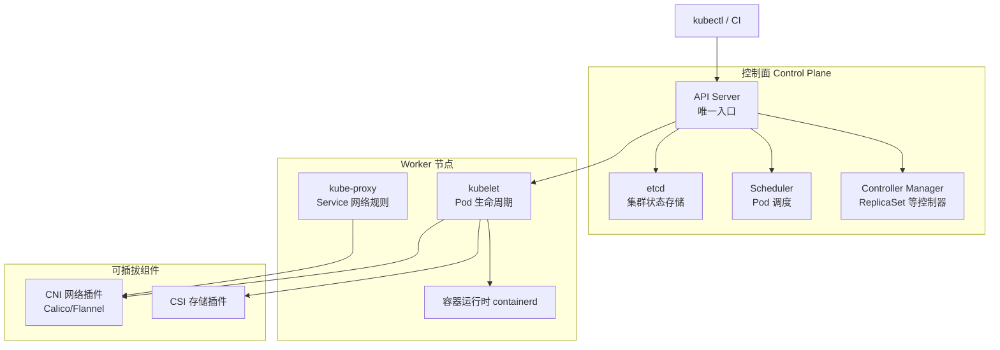
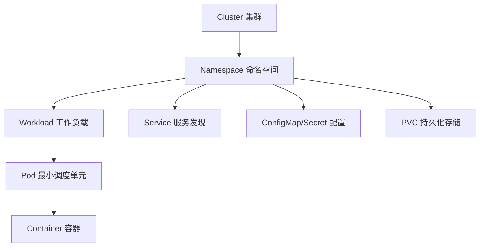

# Kubernetes 架构总览

## 提出问题

你写了一个 Web 服务，单机 Docker 跑得好好的。现在要部署 10 个副本、自动重启故障实例、滚动升级不停机、把流量均衡到健康实例——谁来协调这一切？

Kubernetes 就是这套「数据中心操作系统」：你声明期望状态（要 10 个副本），它持续 reconcile 实际状态与之对齐。

## 集群架构



> **类比**：API Server 是前台总机；etcd 是档案室；Scheduler 是排班经理；Controller Manager 是各部门主管；kubelet 是每台机器上的现场主管。

## 核心组件职责

| 组件 | 职责 | 故障影响 |
|------|------|----------|
| API Server | 认证、鉴权、REST API、watch 机制 | 集群不可操作 |
| etcd | 持久化所有 K8s 对象 | 数据丢失则集群状态丢失 |
| Scheduler | 为 Pending Pod 选择 Node | Pod 无法调度 |
| Controller Manager | 运行各类控制器 | 期望状态无法 reconcile |
| kubelet | 在本节点创建/销毁容器、上报状态 | 该节点 Pod 异常 |
| kube-proxy | 维护 Service 的 iptables/IPVS 规则 | Service 流量异常 |

## 可插拔标准接口

| 接口 | 全称 | 作用 |
|------|------|------|
| CRI | Container Runtime Interface | 容器运行时（containerd、CRI-O） |
| CNI | Container Network Interface | Pod 网络（Calico、Flannel、Cilium） |
| CSI | Container Storage Interface | 持久化存储（云盘、NFS） |

## 声明式 API

K8s 采用**声明式**管理：你提交 YAML 描述「要什么」，控制器负责「怎么达到」。

```yaml
apiVersion: apps/v1
kind: Deployment
metadata:
  name: nginx-demo
  namespace: k8s-learn
spec:
  replicas: 3
  selector:
    matchLabels:
      app: nginx-demo
  template:
    metadata:
      labels:
        app: nginx-demo
    spec:
      containers:
      - name: nginx
        image: nginx:1.25
        ports:
        - containerPort: 80
```

```bash
kubectl apply -f deployment.yaml
kubectl get deployment,pods -n k8s-learn
```

## 核心对象层次



## 动手练习

1. 查看控制面组件 Pod：
   ```bash
   kubectl get pods -n kube-system
   ```

2. 查看节点详情：
   ```bash
   kubectl describe node
   ```

3. 查看 API 资源类型：
   ```bash
   kubectl api-resources | head -20
   ```

## 常见坑

- **控制面 vs 数据面**：应用 Pod 跑在 Worker 上，托管 K8s 控制面由云厂商运维
- **etcd 是核心**：生产环境 etcd 必须高可用（通常 3/5 节点）
- **不要直接管理 Pod**：Pod 是临时的，用 Deployment 等控制器管理

## 小结

- K8s 集群 = 控制面 + Worker 节点，通过 CRI/CNI/CSI 可插拔扩展
- 声明式 API：提交 YAML，控制器持续 reconcile
- Pod 是最小调度单元，上层由 Deployment 等工作负载封装
