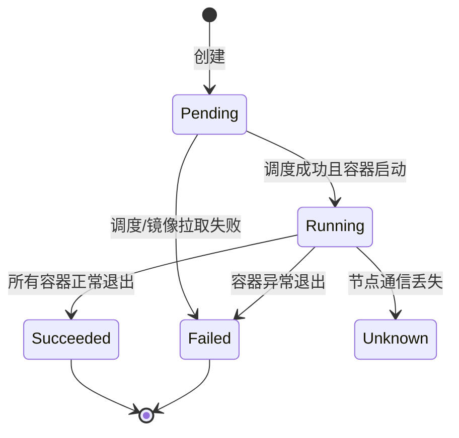
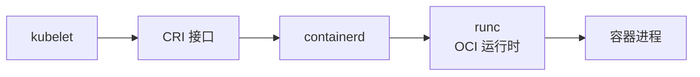

# Pod 与容器运行时

## 核心原理

Pod 是 K8s **最小调度单元**，不是容器。一个 Pod 可包含一个或多个共享网络的容器（Sidecar 模式）。Scheduler 调度的是 Pod，不是单个 Container。

> **类比**：Pod 像「合租公寓」——同一 Pod 内的容器共享 IP、localhost、Volume，但各自是独立「房间」（进程隔离）。

## Pod 生命周期



## 最小 Pod 示例

```yaml
apiVersion: v1
kind: Pod
metadata:
  name: nginx-pod
  namespace: k8s-learn
  labels:
    app: nginx-pod
spec:
  containers:
  - name: nginx
    image: nginx:1.25
    ports:
    - containerPort: 80
    resources:
      requests:
        cpu: 100m
        memory: 128Mi
      limits:
        cpu: 200m
        memory: 256Mi
    livenessProbe:
      httpGet:
        path: /
        port: 80
      initialDelaySeconds: 5
      periodSeconds: 10
    readinessProbe:
      httpGet:
        path: /
        port: 80
      initialDelaySeconds: 3
      periodSeconds: 5
```

```bash
kubectl apply -f pod.yaml
kubectl get pod nginx-pod -n k8s-learn -w
kubectl logs nginx-pod -n k8s-learn
kubectl exec -it nginx-pod -n k8s-learn -- /bin/bash
kubectl delete pod nginx-pod -n k8s-learn
```

## Init Container 与 Sidecar

```yaml
spec:
  initContainers:
  - name: init-db
    image: busybox:1.36
    command: ['sh', '-c', 'until nslookup db; do sleep 2; done']
  containers:
  - name: app
    image: nginx:1.25
  - name: log-collector
    image: busybox:1.36
    command: ['sh', '-c', 'tail -f /var/log/nginx/access.log']
    volumeMounts:
    - name: logs
      mountPath: /var/log/nginx
```

Init Container 按顺序执行完毕后，主容器才启动。Sidecar 与主容器并行运行，常用于日志采集、代理注入。

## 容器运行时 CRI

kubelet 通过 CRI 与容器运行时通信，主流实现是 **containerd**（Docker 底层也使用 containerd）。



查看节点运行时：

```bash
kubectl get nodes -o wide
# 或 SSH 到节点
crictl ps
```

## Probe 对比

| 探针 | 作用 | 失败后果 |
|------|------|----------|
| livenessProbe | 容器是否存活 | kubelet 重启容器 |
| readinessProbe | 是否可接收流量 | 从 Service Endpoints 移除 |
| startupProbe | 慢启动应用保护 | 在通过前禁用 liveness |

## 动手练习

1. 创建上述 Pod，观察从 Pending 到 Running 的状态变化
2. 故意写错镜像名 `nginx:wrongtag`，用 `kubectl describe pod` 查看 Events
3. 修改 livenessProbe 的 path 为 `/bad`，观察容器被重启

## 常见坑

- **Pod 不会自愈**：直接创建的 Pod 删除后不会重建，需 Deployment
- **requests vs limits**：未设 requests 影响调度；未设 limits 可能 OOM 影响节点
- **镜像拉取策略**：`imagePullPolicy: IfNotPresent` 本地有缓存时不拉取，可能用到 stale 镜像

## 小结

- Pod 是最小调度单元，可含多容器共享网络与存储
- 生命周期：Pending → Running → Succeeded/Failed
- liveness/readiness/startup 探针是生产必备
- kubelet 通过 CRI 调用 containerd 管理容器
