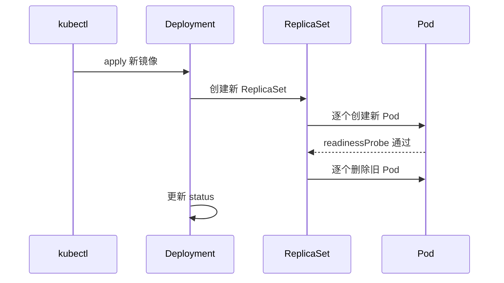

# Deployment 与 ReplicaSet

## 核心原理

Deployment 管理 Pod 的**声明式更新**和**副本数**。底层由 ReplicaSet 保证指定数量的 Pod 运行。你改 Deployment spec，控制器执行滚动更新（RollingUpdate）。

> **类比**：Deployment 是「编制表」——规定要 3 个人值班；ReplicaSet 是 HR 确保始终有 3 人在岗；滚动更新像换班，一次换一两个，不影响服务。

## 滚动更新流程



## Deployment 示例

```yaml
apiVersion: apps/v1
kind: Deployment
metadata:
  name: web
  namespace: k8s-learn
spec:
  replicas: 3
  strategy:
    type: RollingUpdate
    rollingUpdate:
      maxSurge: 1
      maxUnavailable: 0
  selector:
    matchLabels:
      app: web
  template:
    metadata:
      labels:
        app: web
    spec:
      containers:
      - name: nginx
        image: nginx:1.25
        ports:
        - containerPort: 80
        readinessProbe:
          httpGet:
            path: /
            port: 80
```

```bash
kubectl apply -f deployment.yaml
kubectl rollout status deployment/web -n k8s-learn
kubectl get rs -n k8s-learn
```

## 更新与回滚

```bash
# 更新镜像
kubectl set image deployment/web nginx=nginx:1.26 -n k8s-learn

# 查看历史
kubectl rollout history deployment/web -n k8s-learn

# 回滚
kubectl rollout undo deployment/web -n k8s-learn

# 回滚到指定版本
kubectl rollout undo deployment/web --to-revision=2 -n k8s-learn
```

## 策略对比

| 策略 | 行为 | 适用场景 |
|------|------|----------|
| RollingUpdate | 逐步替换 | 默认，无状态 Web 服务 |
| Recreate | 先删后建，有 downtime | 不支持多版本并存的应用 |

## 动手练习

1. 部署 3 副本 Deployment，执行 `kubectl get pods -n k8s-learn -w` 同时更新镜像，观察滚动过程
2. 设置 `maxUnavailable: 1`，对比更新速度
3. 故意部署失败版本，练习 `kubectl rollout undo`

## 常见坑

- **selector 不可变**：Deployment 创建后 `spec.selector` 不能改
- **标签必须匹配**：template.labels 必须包含 selector.matchLabels
- **旧 ReplicaSet 保留**：默认保留 10 个历史 RS 供回滚

## 小结

- Deployment → ReplicaSet → Pod 三层管理
- RollingUpdate 通过 maxSurge/maxUnavailable 控制更新节奏
- `kubectl rollout undo` 是生产回滚第一手段
