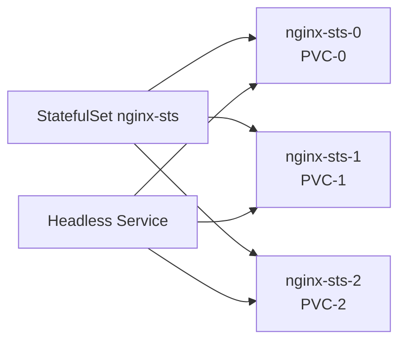

# StatefulSet 与 DaemonSet

## StatefulSet：有状态应用

StatefulSet 为 Pod 提供**稳定标识**（有序名称、固定网络 ID、独立 PVC），适合数据库、消息队列等有状态服务。



### Headless Service + StatefulSet

```yaml
apiVersion: v1
kind: Service
metadata:
  name: nginx-headless
  namespace: k8s-learn
spec:
  clusterIP: None
  selector:
    app: nginx-sts
  ports:
  - port: 80
---
apiVersion: apps/v1
kind: StatefulSet
metadata:
  name: nginx-sts
  namespace: k8s-learn
spec:
  serviceName: nginx-headless
  replicas: 3
  selector:
    matchLabels:
      app: nginx-sts
  template:
    metadata:
      labels:
        app: nginx-sts
    spec:
      containers:
      - name: nginx
        image: nginx:1.25
        ports:
        - containerPort: 80
  volumeClaimTemplates:
  - metadata:
      name: data
    spec:
      accessModes: ["ReadWriteOnce"]
      resources:
        requests:
          storage: 1Gi
```

Pod  DNS：`nginx-sts-0.nginx-headless.k8s-learn.svc.cluster.local`

```bash
kubectl apply -f statefulset.yaml
kubectl get pods -n k8s-learn -l app=nginx-sts
# 缩容按逆序：nginx-sts-2 → nginx-sts-1 → nginx-sts-0
kubectl scale sts nginx-sts --replicas=1 -n k8s-learn
```

## DaemonSet：每节点一个 Pod

DaemonSet 确保**每个（或选定）节点**运行一个 Pod 副本，常用于日志采集、监控 Agent、CNI 插件。

```yaml
apiVersion: apps/v1
kind: DaemonSet
metadata:
  name: fluentd
  namespace: k8s-learn
spec:
  selector:
    matchLabels:
      app: fluentd
  template:
    metadata:
      labels:
        app: fluentd
    spec:
      containers:
      - name: fluentd
        image: fluent/fluentd:v1.16
        resources:
          limits:
            memory: 200Mi
```

## 工作负载选型

| 类型 | 特点 | 典型场景 |
|------|------|----------|
| Deployment | 无状态、随机 Pod 名 | Web API、微服务 |
| StatefulSet | 稳定 ID、有序启停、独立存储 | MySQL、Kafka、ZooKeeper |
| DaemonSet | 每节点一 Pod | node-exporter、fluentd、kube-proxy |
| Job/CronJob | 运行完退出 | 批处理、定时任务 |

## 动手练习

1. 创建 StatefulSet，验证 Pod 名称为 `nginx-sts-0/1/2`
2. 删除 `nginx-sts-1`，观察是否以相同名称重建
3. 创建 DaemonSet，确认每个节点有一个 Pod

## 常见坑

- **StatefulSet 缩容不删 PVC**：缩容后 PVC 仍保留，需手动清理
- **有序启停**：扩容 0→3 按序，缩容 3→0 逆序，更新也是逐个
- **DaemonSet 与污点**：默认不调度到有 NoSchedule 污点的节点，除非配置 tolerations

## 小结

- StatefulSet = 稳定网络标识 + 有序部署 + volumeClaimTemplates
- DaemonSet = 每节点一个 Pod，适合节点级 Agent
- 无状态用 Deployment，有状态用 StatefulSet，节点级用 DaemonSet
