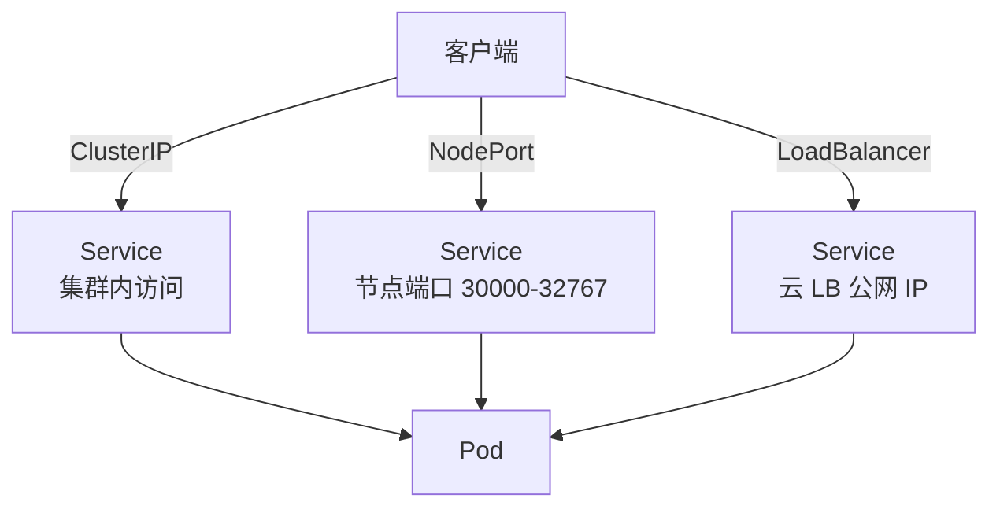

# Service 与 Endpoints

## 核心原理

Pod IP 是临时的，Deployment 滚动更新后 IP 会变。Service 提供**稳定虚拟 IP（ClusterIP）**和 DNS 名称，将流量负载均衡到后端 Pod。

> **类比**：Service 是「总机号码」——客户永远打同一个号码，后面接线员（Pod）换了也不影响。

## Service 类型



| 类型 | 访问方式 | 场景 |
|------|----------|------|
| ClusterIP | 集群内 DNS | 默认，微服务互调 |
| NodePort | `<NodeIP>:<Port>` | 开发测试 |
| LoadBalancer | 云厂商 LB | 生产公网入口 |
| ExternalName | CNAME 到外部 DNS | 代理外部服务 |

## ClusterIP Service

```yaml
apiVersion: v1
kind: Service
metadata:
  name: web-svc
  namespace: k8s-learn
spec:
  type: ClusterIP
  selector:
    app: web
  ports:
  - port: 80
    targetPort: 80
    protocol: TCP
```

```bash
kubectl apply -f service.yaml
kubectl get svc,endpoints -n k8s-learn
kubectl run curl --rm -it --image=curlimages/curl -n k8s-learn -- curl http://web-svc
```

## Endpoints

Service 通过 **selector** 匹配 Pod，Endpoints 控制器自动生成 Endpoints 对象（或 EndpointSlice）：

```bash
kubectl get endpoints web-svc -n k8s-learn -o yaml
```

只有 **readinessProbe 通过** 的 Pod 才会加入 Endpoints。

## 无 selector 的 Service

手动指定后端：

```yaml
apiVersion: v1
kind: Service
metadata:
  name: external-db
  namespace: k8s-learn
spec:
  ports:
  - port: 5432
---
apiVersion: v1
kind: Endpoints
metadata:
  name: external-db
  namespace: k8s-learn
subsets:
- addresses:
  - ip: 10.0.0.50
  ports:
  - port: 5432
```

## 动手练习

1. 部署 Deployment + ClusterIP Service，集群内 curl 验证
2. 修改 Deployment 使 Pod NotReady，观察 Endpoints 变化
3. 创建 NodePort Service，从宿主机访问

## 常见坑

- **selector 不匹配**：Service 无 Endpoints，流量不通
- **targetPort 写错**：Service port ≠ containerPort 时需正确设置 targetPort
- **headless Service**：`clusterIP: None`，返回 Pod IP 列表，供 StatefulSet 使用

## 小结

- Service 提供稳定访问入口，kube-proxy 实现负载均衡
- Endpoints 动态反映 Ready Pod 列表
- ClusterIP 集群内、NodePort/LB 对外暴露
