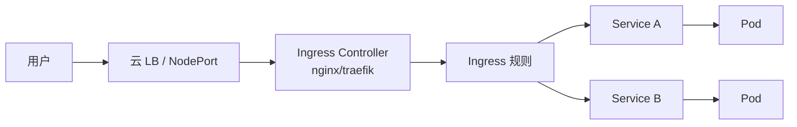

# Ingress 与 Gateway API

## 核心原理

Service 的 NodePort/LoadBalancer 每个服务一个入口，成本高。Ingress（配合 Ingress Controller）提供**七层 HTTP 路由**，按域名/路径将流量分发到不同 Service。

> **类比**：Ingress 是「大楼前台」——访客报公司名（Host/Path），前台引导到对应楼层（Service）。

## Ingress 流量路径



## 安装 Ingress Controller（kind）

kind 需额外映射端口：

```yaml
# kind-config.yaml
kind: Cluster
apiVersion: kind.x-k8s.io/v1alpha4
nodes:
- role: control-plane
  kubeadmConfigPatches:
  - |
    kind: InitConfiguration
    nodeRegistration:
      kubeletExtraArgs:
        node-labels: "ingress-ready=true"
  extraPortMappings:
  - containerPort: 80
    hostPort: 80
    protocol: TCP
```

```bash
kind create cluster --config kind-config.yaml --name k8s-learn
kubectl apply -f https://raw.githubusercontent.com/kubernetes/ingress-nginx/main/deploy/static/provider/kind/deploy.yaml
kubectl wait --namespace ingress-nginx --for=condition=ready pod -l app.kubernetes.io/component=controller --timeout=120s
```

## Ingress 示例

```yaml
apiVersion: networking.k8s.io/v1
kind: Ingress
metadata:
  name: web-ingress
  namespace: k8s-learn
  annotations:
    nginx.ingress.kubernetes.io/rewrite-target: /
spec:
  ingressClassName: nginx
  rules:
  - host: web.local
    http:
      paths:
      - path: /
        pathType: Prefix
        backend:
          service:
            name: web-svc
            port:
              number: 80
      - path: /api
        pathType: Prefix
        backend:
          service:
            name: api-svc
            port:
              number: 8080
```

```bash
# /etc/hosts 添加: 127.0.0.1 web.local
curl -H "Host: web.local" http://localhost/
```

## TLS 终止

```yaml
spec:
  tls:
  - hosts:
    - web.local
    secretName: web-tls
  rules:
  - host: web.local
    ...
```

## Gateway API（下一代）

Gateway API 是 Ingress 的演进，角色分离更清晰（GatewayClass / Gateway / HTTPRoute）：

```yaml
apiVersion: gateway.networking.k8s.io/v1
kind: HTTPRoute
metadata:
  name: web-route
  namespace: k8s-learn
spec:
  parentRefs:
  - name: main-gateway
  hostnames:
  - "web.local"
  rules:
  - matches:
    - path:
        type: PathPrefix
        value: /
    backendRefs:
    - name: web-svc
      port: 80
```

## 动手练习

1. 在 kind 安装 ingress-nginx，创建 Ingress 规则，通过 web.local 访问
2. 配置 `/api` 路径路由到不同 Service
3. 了解 `kubectl get ingressclass`

## 常见坑

- **Ingress 只是规则**：必须安装 Ingress Controller 才生效
- **pathType**：`Prefix`/`Exact`/`ImplementationSpecific` 匹配行为不同
- **annotations 绑定实现**：nginx 注解在其他 Controller 上无效

## 小结

- Ingress = 七层路由规则 + Ingress Controller 实现
- 支持 Host/Path 路由、TLS 终止
- Gateway API 是面向未来的标准，新项目可关注
