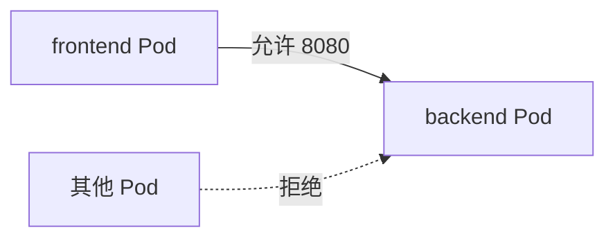
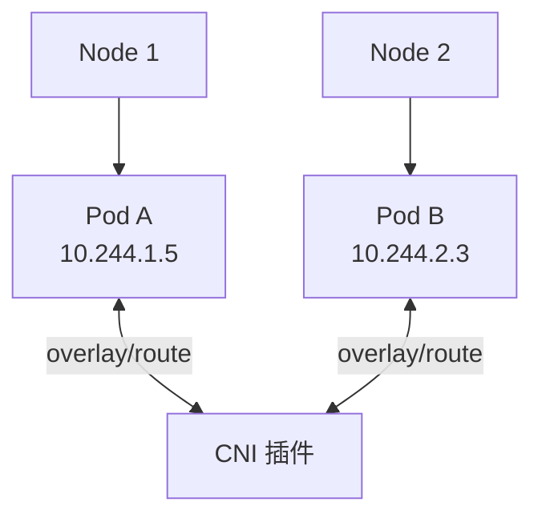

# NetworkPolicy 与 CNI

## 核心原理

默认 K8s 集群内**所有 Pod 可互相通信**。NetworkPolicy 定义**入站/出站**流量规则，实现微隔离。实际 enforcement 由 CNI 插件（Calico、Cilium 等）实现。

> **类比**：NetworkPolicy 是「防火墙 ACL」——默认全通，你按需加白名单规则。

## NetworkPolicy 示例

只允许 `app=frontend` 访问 `app=backend` 的 8080 端口：

```yaml
apiVersion: networking.k8s.io/v1
kind: NetworkPolicy
metadata:
  name: backend-policy
  namespace: k8s-learn
spec:
  podSelector:
    matchLabels:
      app: backend
  policyTypes:
  - Ingress
  ingress:
  - from:
    - podSelector:
        matchLabels:
          app: frontend
    ports:
    - protocol: TCP
      port: 8080
```



## 默认拒绝 + 白名单

```yaml
apiVersion: networking.k8s.io/v1
kind: NetworkPolicy
metadata:
  name: default-deny
  namespace: k8s-learn
spec:
  podSelector: {}
  policyTypes:
  - Ingress
  - Egress
```

`podSelector: {}` 匹配 namespace 内所有 Pod，无 ingress/egress 规则 = 全部拒绝。

## CNI 插件对比

| CNI | 特点 | NetworkPolicy |
|-----|------|---------------|
| Flannel | 简单 overlay，VXLAN | 不支持（需 Calico 等） |
| Calico | BGP/overlay，策略丰富 | 支持 |
| Cilium | eBPF 高性能 | 支持 L3-L7 |
| kind 默认 | kindnet | 不支持 NetworkPolicy |

kind 集群测试 NetworkPolicy 需改用 Calico：

```bash
kubectl apply -f https://docs.projectcalico.org/manifests/collapse/calico.yaml
```

## Pod 网络模型



每个 Pod 有独立 IP，跨节点通过 CNI overlay 或 BGP 路由互通。

## 动手练习

1. 部署 frontend + backend 两个 Deployment，默认互通
2. 应用 NetworkPolicy 限制仅 frontend 可访问 backend
3. 从第三个 Pod curl backend，验证被拒绝

## 常见坑

- **CNI 不支持则策略无效**：kind 默认 kindnet 不 enforce NetworkPolicy
- **DNS  egress**：default-deny egress 时需放行 kube-dns（UDP 53）
- **namespace 隔离**：NetworkPolicy 仅作用于本 namespace 匹配的 Pod

## 小结

- NetworkPolicy 实现 Pod 级网络隔离，依赖 CNI 支持
- podSelector + policyTypes + ingress/egress 规则组合使用
- 生产推荐 Calico 或 Cilium
