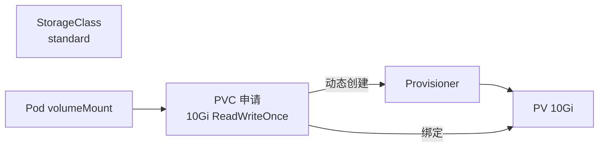

# PV、PVC 与 StorageClass

## 核心原理

Pod 重启后容器内数据丢失。持久化存储通过 **PV（存储资源）** + **PVC（存储申请）** 解耦。StorageClass 实现**动态 provisioning**——PVC 创建时自动分配 PV。

> **类比**：StorageClass 是「存储套餐」；PVC 是「采购申请单」；PV 是「实际仓库空间」。

## 绑定关系



## 动态 provisioning（StorageClass）

kind 默认提供 `standard` StorageClass：

```bash
kubectl get storageclass
```

```yaml
apiVersion: v1
kind: PersistentVolumeClaim
metadata:
  name: data-pvc
  namespace: k8s-learn
spec:
  accessModes:
  - ReadWriteOnce
  resources:
    requests:
      storage: 1Gi
  storageClassName: standard
```

## 静态 PV + PVC

```yaml
apiVersion: v1
kind: PersistentVolume
metadata:
  name: manual-pv
spec:
  capacity:
    storage: 2Gi
  accessModes:
  - ReadWriteOnce
  persistentVolumeReclaimPolicy: Retain
  hostPath:
    path: /tmp/k8s-data
---
apiVersion: v1
kind: PersistentVolumeClaim
metadata:
  name: manual-pvc
  namespace: k8s-learn
spec:
  accessModes:
  - ReadWriteOnce
  resources:
    requests:
      storage: 1Gi
  # 不指定 storageClassName 且 PV 无 class 时静态绑定
```

## accessModes 与 reclaimPolicy

| accessMode | 含义 |
|------------|------|
| ReadWriteOnce (RWO) | 单节点读写 |
| ReadOnlyMany (ROX) | 多节点只读 |
| ReadWriteMany (RWX) | 多节点读写（需 NFS 等支持） |

| reclaimPolicy | 含义 |
|---------------|------|
| Retain | 删除 PVC 后 PV 保留，需手动清理  
| Delete | 删除 PVC 后自动删 PV（动态 provisioning 默认）  
| Recycle | 已废弃  

## 动手练习

1. 创建 PVC，观察 `kubectl get pv,pvc -n k8s-learn` 绑定状态  
2. 创建 Pod 挂载 PVC，写入数据后删 Pod 再重建，验证数据仍在  
3. 对比 `kubectl describe pvc` 的 Events  

## 常见坑

- **PVC Pending**：无匹配 StorageClass、容量不足、accessMode 不匹配  
- **hostPath 仅适合测试**：节点绑定，Pod 漂移后数据不在  
- **RWO 不能跨节点共享**：多 Pod 挂载同一 RWO PVC 会失败（除非在同一节点）  

## 小结  

- PVC 申请存储，PV 提供存储，StorageClass 动态创建 PV  
- StatefulSet 用 volumeClaimTemplates 为每个 Pod 独立 PVC  
- 生产用云 CSI（EBS、Azure Disk 等），避免 hostPath  
