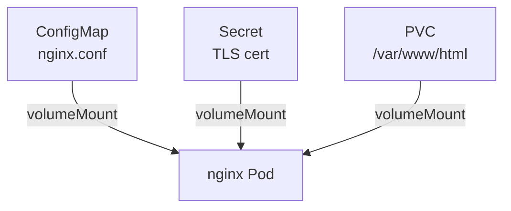

# 卷挂载实战

## 综合场景

部署一个带**配置**、**密钥**和**持久化数据**的 Nginx 应用，串联 ConfigMap、Secret、PVC。



## 完整 YAML

```yaml
apiVersion: v1
kind: ConfigMap
metadata:
  name: nginx-config
  namespace: k8s-learn
data:
  default.conf: |
    server {
      listen 80;
      root /var/www/html;
      location /health { return 200 'ok'; add_header Content-Type text/plain; }
    }
---
apiVersion: v1
kind: PersistentVolumeClaim
metadata:
  name: web-data
  namespace: k8s-learn
spec:
  accessModes: [ReadWriteOnce]
  resources:
    requests:
      storage: 1Gi
---
apiVersion: apps/v1
kind: Deployment
metadata:
  name: nginx-storage-demo
  namespace: k8s-learn
spec:
  replicas: 1
  selector:
    matchLabels:
      app: nginx-storage-demo
  template:
    metadata:
      labels:
        app: nginx-storage-demo
    spec:
      containers:
      - name: nginx
        image: nginx:1.25
        ports:
        - containerPort: 80
        volumeMounts:
        - name: config
          mountPath: /etc/nginx/conf.d
        - name: data
          mountPath: /var/www/html
      volumes:
      - name: config
        configMap:
          name: nginx-config
      - name: data
        persistentVolumeClaim:
          claimName: web-data
```

```bash
kubectl apply -f nginx-storage-demo.yaml
kubectl exec deploy/nginx-storage-demo -n k8s-learn -- sh -c 'echo hello > /var/www/html/index.html'
kubectl run curl --rm -it --image=curlimages/curl -n k8s-learn -- curl http://nginx-storage-demo
```

## emptyDir 与临时存储

```yaml
volumes:
- name: cache
  emptyDir: {}
```

Pod 删除后 emptyDir 数据丢失，适合缓存、Sidecar 共享。

## projected Volume（多源合并）

```yaml
volumes:
- name: all-in-one
  projected:
    sources:
    - configMap:
        name: nginx-config
    - secret:
        name: tls-secret
    - downwardAPI:
        items:
        - path: labels
          fieldRef:
            fieldPath: metadata.labels
```

## 动手练习

1. 部署上述综合示例，验证 ConfigMap 配置和 PVC 持久化  
2. 删除 Pod（不删 Deployment），确认 `/var/www/html` 数据仍在  
3. 添加 emptyDir，Sidecar 容器写日志到共享目录  

## 常见坑

- **ReadWriteOnce 与 replicas**：多副本 Deployment 不能共享同一 RWO PVC（除非 ReadWriteMany）  
- **ConfigMap subPath**：使用 subPath 时 ConfigMap 更新不会自动反映  
- **权限**：挂载 Secret 默认权限 0644，敏感目录可设 `defaultMode: 0400`  

## 小结  

- 生产 Pod 通常组合 ConfigMap（配置）+ Secret（密钥）+ PVC（数据）  
- emptyDir 适合临时/共享缓存  
- projected volume 可合并多种卷源  
