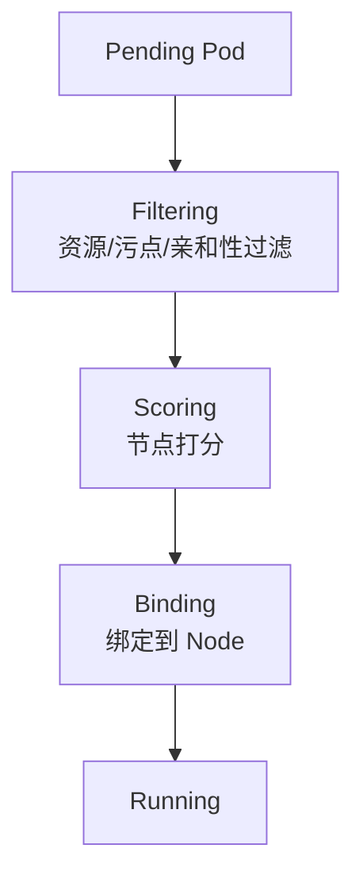

# 调度器与亲和性

## 核心原理

Scheduler 为 Pending Pod 选择合适 Node。默认策略过滤不可调度节点后，按资源可用性、亲和性等打分选最优节点。

> **类比**：Scheduler 是排班系统——先看谁有空（资源），再看谁更合适（亲和性/污点）。

## 调度流程



## nodeSelector

最简单节点选择：

```yaml
spec:
  nodeSelector:
    disktype: ssd
    zone: us-west-1a
```

节点需有对应 label：`kubectl label nodes <node> disktype=ssd`

## nodeAffinity

比 nodeSelector 更灵活：

```yaml
spec:
  affinity:
    nodeAffinity:
      requiredDuringSchedulingIgnoredDuringExecution:
        nodeSelectorTerms:
        - matchExpressions:
          - key: kubernetes.io/arch
            operator: In
            values: [amd64]
      preferredDuringSchedulingIgnoredDuringExecution:
      - weight: 100
        preference:
          matchExpressions:
          - key: disktype
            operator: In
            values: [ssd]
```

## podAffinity / podAntiAffinity

```yaml
spec:
  affinity:
    podAntiAffinity:
      requiredDuringSchedulingIgnoredDuringExecution:
      - labelSelector:
          matchLabels:
            app: web
        topologyKey: kubernetes.io/hostname
```

同一节点不调度两个 `app=web` 的 Pod（高可用分散）。

## Taints 与 Tolerations

节点设污点「拒绝」Pod，Pod 设 toleration「容忍」才能调度：

```bash
kubectl taint nodes node1 dedicated=gpu:NoSchedule
```

```yaml
spec:
  tolerations:
  - key: dedicated
    operator: Equal
    value: gpu
    effect: NoSchedule
```

| effect | 含义 |
|--------|------|
| NoSchedule | 不调度新 Pod |
| PreferNoSchedule | 尽量不调度 |
| NoExecute | 不调度且驱逐已有 Pod |

## 动手练习

1. 给节点打 label，用 nodeSelector 调度 Pod
2. 配置 podAntiAffinity 使 3 副本分散到不同节点（多节点 kind 集群）
3. 设置 taint + toleration，验证只有容忍的 Pod 能调度

## 常见坑

- **required 无法满足则 Pending**：检查 Events `FailedScheduling`
- **topologyKey**：podAntiAffinity 常用 `kubernetes.io/hostname`
- **IgnoredDuringExecution**：调度后节点 label 变化不会驱逐 Pod

## 小结

- nodeSelector < nodeAffinity < podAffinity，表达能力递增
- Taint 排斥，Toleration 容忍，常用于专用节点（GPU、系统组件）
- `kubectl describe pod` 的 Events 是调度问题第一排查点
