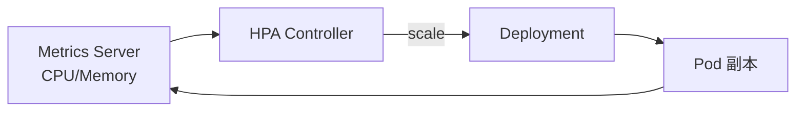

# HPA 与 VPA

## 核心原理

**HPA（Horizontal Pod Autoscaler）** 根据 CPU/内存/自定义指标**水平扩缩 Pod 副本数**。**VPA** 自动调整 Pod 的 requests/limits（较少与 HPA 同用）。

> **类比**：HPA 是「忙了加人、闲了减人」；VPA 是「给每个人调整工位大小」。

## HPA 工作流程



## 安装 metrics-server（kind）

```bash
kubectl apply -f https://github.com/kubernetes-sigs/metrics-server/releases/latest/download/components.yaml
# kind 需加 --kubelet-insecure-tls，见官方 kind 文档
```

## HPA 示例

```yaml
apiVersion: autoscaling/v2
kind: HorizontalPodAutoscaler
metadata:
  name: web-hpa
  namespace: k8s-learn
spec:
  scaleTargetRef:
    apiVersion: apps/v1
    kind: Deployment
    name: web
  minReplicas: 2
  maxReplicas: 10
  metrics:
  - type: Resource
    resource:
      name: cpu
      target:
        type: Utilization
        averageUtilization: 50
  behavior:
    scaleUp:
      stabilizationWindowSeconds: 0
    scaleDown:
      stabilizationWindowSeconds: 300
```

```bash
kubectl apply -f hpa.yaml
kubectl get hpa -n k8s-learn -w
kubectl run load --rm -it --image=busybox -n k8s-learn -- sh -c 'while true; do wget -q -O- http://web-svc; done'
```

## HPA vs VPA

| | HPA | VPA |
|---|-----|-----|
| 调整对象 | 副本数 | 单 Pod resources |
| 典型场景 | Web 流量波动 | 批处理/right-sizing |
| 与 Deployment | 原生支持 | 需 VPA CRD |

## 自定义指标

HPA v2 支持 Prometheus Adapter 等提供自定义指标（QPS、队列长度）：

```yaml
metrics:
- type: Pods
  pods:
    metric:
      name: http_requests_per_second
    target:
      type: AverageValue
      averageValue: "1000"
```

## 动手练习

1. 部署带 resources 的 Deployment + HPA
2. 压测观察副本数变化
3. `kubectl describe hpa` 查看 Current/Target 指标

## 常见坑

- **未设 resources**：HPA 无法计算 CPU 利用率
- **metrics-server 未装**：HPA 显示 unknown 状态
- **缩容过快**：设置 scaleDown stabilizationWindowSeconds
- **Ray Worker 用 Ray Autoscaler 而非 HPA**：见 [KubeRay 章节](../../ray-learning-path/08-集群与生产/02-KubeRay与云原生部署.md)

## 小结

- HPA 根据指标自动调整 Deployment/StatefulSet 副本数
- 依赖 metrics-server 或自定义 metrics adapter
- 生产需设 min/max 副本和缩容冷却时间
