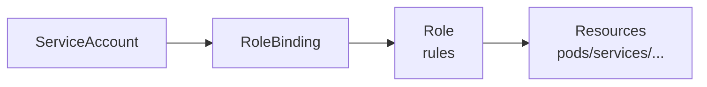

# RBAC 与 ServiceAccount

## 核心原理

RBAC（Role-Based Access Control）通过 **Role/ClusterRole** 定义权限，**RoleBinding/ClusterRoleBinding** 将权限绑定到用户/组/ServiceAccount。

> **类比**：Role 是「岗位权限清单」；RoleBinding 是「谁在这个岗位上」。

## RBAC 模型



## Role 与 ClusterRole

```yaml
apiVersion: rbac.authorization.k8s.io/v1
kind: Role
metadata:
  name: pod-reader
  namespace: k8s-learn
rules:
- apiGroups: [""]
  resources: ["pods"]
  verbs: ["get", "list", "watch"]
---
apiVersion: rbac.authorization.k8s.io/v1
kind: RoleBinding
metadata:
  name: read-pods
  namespace: k8s-learn
subjects:
- kind: ServiceAccount
  name: app-sa
  namespace: k8s-learn
roleRef:
  kind: Role
  name: pod-reader
  apiGroup: rbac.authorization.k8s.io
```

ClusterRole 集群级，ClusterRoleBinding 可绑定到所有 namespace。

## ServiceAccount

每个 namespace 有 default ServiceAccount，Pod 默认使用它：

```yaml
spec:
  serviceAccountName: app-sa
```

```bash
kubectl create serviceaccount app-sa -n k8s-learn
kubectl apply -f role.yaml -f rolebinding.yaml
```

## 常用 verbs

| verb | 含义 |
|------|------|
| get, list, watch | 读 |
| create, update, patch | 写 |
| delete | 删除 |
| * | 全部 |

## 权限检查

```bash
kubectl auth can-i list pods --as=system:serviceaccount:k8s-learn:app-sa -n k8s-learn
kubectl auth can-i create deployments --as=system:serviceaccount:k8s-learn:default -n k8s-learn
```

## 动手练习

1. 创建只读 Pod 的 Role + RoleBinding
2. 用该 SA 运行 Pod，测试能否 list pods、能否 delete pods
3. 对比 ClusterRole `view`/`edit`/`admin` 内置角色

## 常见坑

- **最小权限原则**：应用 SA 不要绑定 cluster-admin
- **Secret 挂载 SA Token**：K8s 1.24+ 不再自动创建长期 Token，需手动创建 Secret 或使用 TokenRequest API
- **RoleBinding namespace**：RoleBinding 只能引用同 namespace 的 Role

## 小结

- Role + RoleBinding = namespace 级权限
- ClusterRole + ClusterRoleBinding = 集群级权限
- Pod 通过 ServiceAccount 获得 API 访问身份
