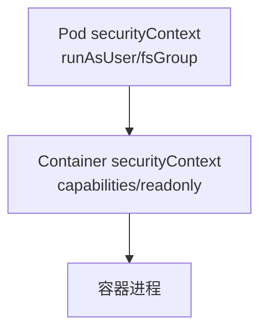

# SecurityContext 与 Pod 安全

## 核心原理

SecurityContext 定义 Pod/Container 级安全策略：运行用户、特权模式、capabilities、只读根文件系统等。Pod Security Standards（restricted/baseline/privileged）在 namespace 级别强制执行。

> **类比**：SecurityContext 是「容器里的安全守则」——以非 root 运行、禁止提权、最小 capabilities。

## Pod 级 SecurityContext

```yaml
spec:
  securityContext:
    runAsNonRoot: true
    runAsUser: 1000
    runAsGroup: 3000
    fsGroup: 2000
    seccompProfile:
      type: RuntimeDefault
```

## Container 级 SecurityContext

```yaml
containers:
- name: app
  image: nginx:1.25
  securityContext:
    allowPrivilegeEscalation: false
    readOnlyRootFilesystem: true
    capabilities:
      drop: ["ALL"]
      add: ["NET_BIND_SERVICE"]
```



## Pod Security Standards

```yaml
apiVersion: v1
kind: Namespace
metadata:
  name: k8s-learn
  labels:
    pod-security.kubernetes.io/enforce: baseline
    pod-security.kubernetes.io/warn: restricted
    pod-security.kubernetes.io/audit: restricted
```

| 级别 | 要求 |
|------|------|
| privileged | 无限制 |
| baseline | 禁止特权容器、hostNetwork 等 |
| restricted | 非 root、drop ALL capabilities、seccomp |

## 动手练习

1. 部署 runAsNonRoot 的 Pod，镜像需支持非 root 用户
2. 在 enforce=restricted 的 namespace 尝试部署 privileged Pod，观察被拒绝
3. 配置 readOnlyRootFilesystem + emptyDir 作 /tmp

## 常见坑

- **镜像以 root 运行**：runAsNonRoot 会导致启动失败，需换用户或改镜像
- **只读根文件系统**：应用写 /tmp 需挂载 emptyDir
- **capabilities**：绑定 80 端口需 NET_BIND_SERVICE 或非 root 高端口

## 小结

- SecurityContext 分层：Pod 级 + Container 级
- 生产推荐：非 root、drop ALL、readOnlyRootFilesystem、seccomp
- Pod Security Standards 在 namespace 标签强制执行
