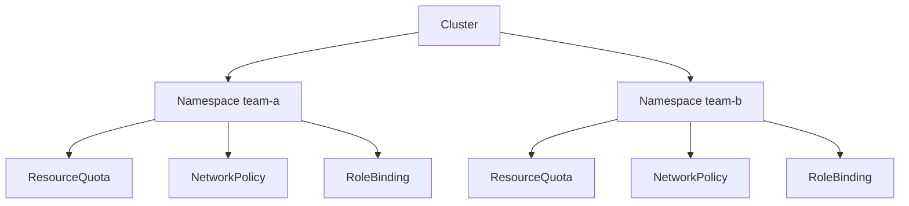

# 多租户与 Namespace 隔离

## 核心原理

Namespace 是 K8s **逻辑隔离单元**，配合 ResourceQuota、NetworkPolicy、RBAC 实现软多租户。硬隔离需独立集群或 Virtual Cluster（vCluster）。

> **类比**：Namespace 像「公司里的部门」——共用大楼（集群），但有各自的钥匙（RBAC）和预算（Quota）。

## 多租户隔离层次



## 创建租户 Namespace

```yaml
apiVersion: v1
kind: Namespace
metadata:
  name: team-a
  labels:
    team: a
    pod-security.kubernetes.io/enforce: baseline
---
apiVersion: v1
kind: ResourceQuota
metadata:
  name: team-a-quota
  namespace: team-a
spec:
  hard:
    requests.cpu: "10"
    requests.memory: 20Gi
    pods: "50"
---
apiVersion: rbac.authorization.k8s.io/v1
kind: RoleBinding
metadata:
  name: team-a-admin
  namespace: team-a
subjects:
- kind: Group
  name: team-a-admins
  apiGroup: rbac.authorization.k8s.io
roleRef:
  kind: ClusterRole
  name: admin
  apiGroup: rbac.authorization.k8s.io
```

## 跨 namespace 访问

默认 Pod 只能访问**同 namespace** 的 Service DNS：`service-name` 或 `service-name.namespace.svc.cluster.local`

跨 namespace：`other-svc.other-ns.svc.cluster.local`

NetworkPolicy 可进一步限制跨 namespace 流量。

## 隔离策略对比

| 方案 | 隔离强度 | 成本 | 适用 |
|------|----------|------|------|
| Namespace + Quota/RBAC | 软隔离 | 低 | 团队/环境(dev/staging) |
| 独立集群 | 硬隔离 | 高 | 强合规、生产/测试分离 |
| vCluster | 虚拟控制面 | 中 | 多租户 SaaS |

## 命名约定

```
<team>-<env>   例：ml-prod, ml-staging
<app>-<env>    例：web-prod
```

## 动手练习

1. 创建两个 namespace，各自部署同名 Service，验证 DNS 隔离
2. 为 team-a 设 ResourceQuota，team-b 用户无法在其 namespace 超额
3. 用 NetworkPolicy 禁止 team-a 访问 team-b

## 常见坑

- **Namespace 不是安全边界**：同集群内 root 突破、etcd 访问仍可跨 namespace
- **ClusterRoleBinding 过宽**：绑定 cluster-admin 给普通团队
- **系统 namespace**：kube-system、ingress-nginx 等勿随意修改

## 小结

- Namespace + Quota + NetworkPolicy + RBAC = 软多租户四件套
- Service DNS 含 namespace，跨 namespace 需 FQDN
- 强隔离场景考虑独立集群
