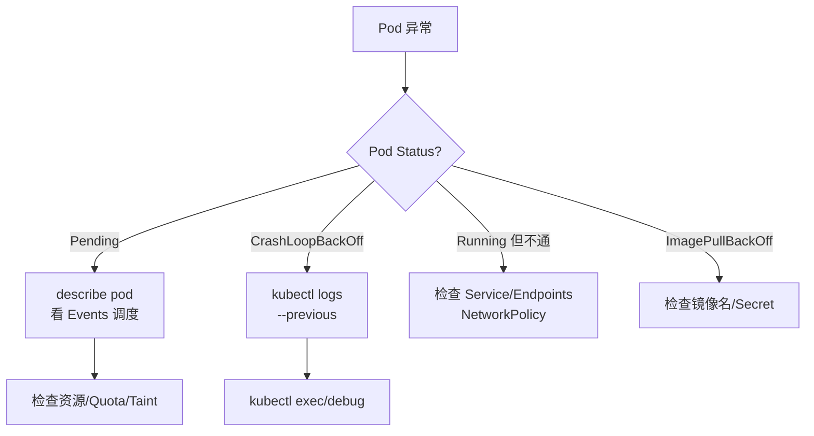

# kubectl 调试技巧

## 排障决策树



## 核心命令

```bash
# 概览
kubectl get pods -n k8s-learn -o wide
kubectl describe pod <name> -n k8s-learn

# 日志
kubectl logs <pod> -n k8s-learn
kubectl logs <pod> -c <container> -n k8s-learn --previous
kubectl logs -f deploy/web -n k8s-learn

# 进入容器
kubectl exec -it <pod> -n k8s-learn -- /bin/sh

# 端口转发
kubectl port-forward svc/web-svc 8080:80 -n k8s-learn

# 复制文件
kubectl cp k8s-learn/<pod>:/path/file ./local-file
```

## kubectl debug 临时容器

K8s 1.23+ 支持 ephemeral debug container（无需改 Pod spec）：

```bash
kubectl debug -it <pod> -n k8s-learn --image=busybox:1.36 --target=<container> -- sh
```

## 复制 Pod 调试

```bash
kubectl debug <pod> -n k8s-learn --copy-to=debug-pod --container=app -- sh
```

## 常用 describe 关注点

| 字段 | 含义 |
|------|------|
| Events | 最近事件（调度失败、拉镜像、Probe 失败） |
| Conditions | PodScheduled、Initialized、Ready |
| State | Waiting/Running/Terminated 及 Reason |
| QoS Class | Guaranteed/Burstable/BestEffort |

## 动手练习

1. 部署故意失败的 Pod（错误命令），用 logs --previous 查看
2. port-forward 访问 ClusterIP Service
3. 用 debug 容器 attach 到运行中的 Pod

## 常见坑

- **CrashLoopBackOff 太快**：加 sleep 或改 command 便于 exec
- **最小镜像无 shell**：用 busybox/debug 镜像作 debug container
- **只看 get 不够**：90% 问题在 describe Events

## 小结

- describe + logs + exec 是三板斧
- kubectl debug 适合 distroless 镜像排障
- port-forward 快速验证 Service 后端
