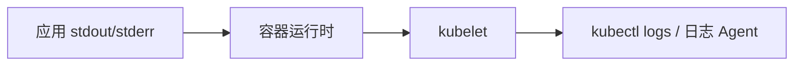

# 日志与事件

## 核心原理

容器日志写入 **stdout/stderr**，kubelet 收集后可通过 kubectl logs 查看。K8s **Events** 是对象生命周期的事件流，排障时极其重要。

> **类比**：日志是「应用日记」；Events 是「K8s 系统通知」——Pod 为什么 Pending，这里写得清清楚楚。

## 日志架构



## 日志命令

```bash
# 单 Pod
kubectl logs nginx-pod -n k8s-learn

# Deployment 所有 Pod（选一个）
kubectl logs -l app=web -n k8s-learn --tail=100

# 多容器
kubectl logs nginx-pod -c sidecar -n k8s-learn

# 已崩溃容器
kubectl logs nginx-pod --previous -n k8s-learn

# 实时跟踪
kubectl logs -f deploy/web -n k8s-learn --timestamps
```

## Events

```bash
# Pod 相关事件
kubectl describe pod nginx-pod -n k8s-learn | tail -20

# namespace 所有事件
kubectl get events -n k8s-learn --sort-by='.lastTimestamp'

# 过滤 Warning
kubectl get events -n k8s-learn --field-selector type=Warning
```

常见 Event Reason：

| Reason | 含义 |
|--------|------|
| FailedScheduling | 调度失败 |
| Pulling / Pulled | 拉取镜像 |
| Created / Started | 容器创建/启动 |
| Unhealthy | Probe 失败 |
| FailedMount | 卷挂载失败 |

## 集中式日志（生产）

单节点 kubectl logs 不够，生产用日志栈：

| 方案 | 组件 |
|------|------|
| EFK | Elasticsearch + Fluentd/Fluent Bit + Kibana |
| Loki | Grafana Loki + Promtail |
| 云原生 | CloudWatch、Stackdriver |

DaemonSet 部署 Fluent Bit 采集 `/var/log/containers/*.log`。

## 动手练习

1. 触发 ImagePullBackOff，用 get events 找到原因
2. 对比 Running Pod 与 CrashLoop Pod 的 Events 差异
3. 用 `--since=1h` 过滤 logs

## 常见坑

- **日志不持久化**：Pod 删除后 logs 不可查，生产必须集中采集
- **日志过大**：应用需轮转或限制输出，避免磁盘打满
- **Events 1小时过期**：重要 Events 需外部监控捕获

## 小结

- kubectl logs 查应用输出，Events 查 K8s 系统行为
- describe 底部 Events 是排障首选
- 生产用 DaemonSet + 日志栈集中存储
