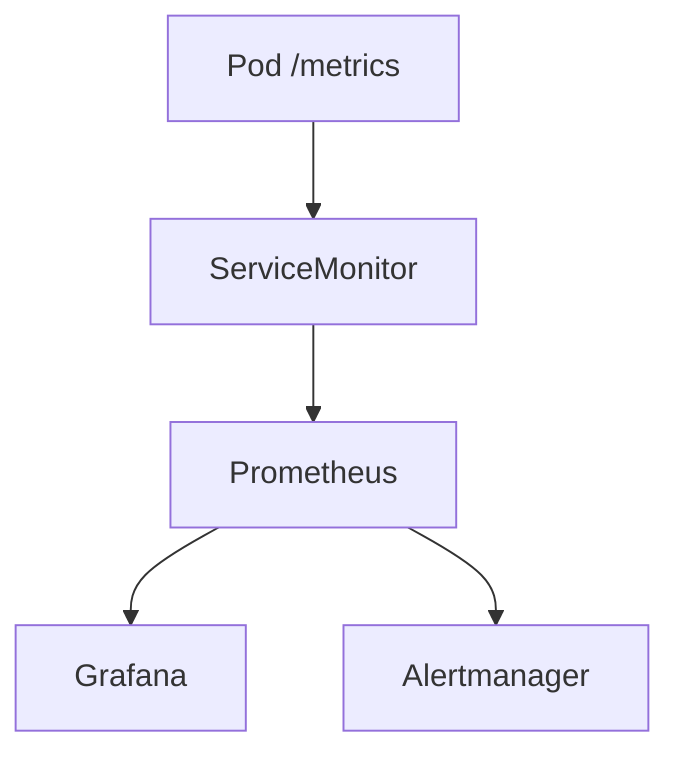

# Prometheus 与 Grafana 入门

## 核心原理

**Prometheus** 拉取（pull）指标并存储时序数据；**Grafana** 可视化 Dashboard。**kube-prometheus-stack** 是 K8s 监控的事实标准 Helm Chart。

> **类比**：Prometheus 是「数据采集员」；Grafana 是「仪表盘」；Alertmanager 是「报警器」。

## 监控架构



## 安装 kube-prometheus-stack

```bash
helm repo add prometheus-community https://prometheus-community.github.io/helm-charts
helm repo update
helm install monitoring prometheus-community/kube-prometheus-stack \
  -n monitoring --create-namespace
```

```bash
kubectl port-forward svc/monitoring-kube-prometheus-prometheus -n monitoring 9090:9090
kubectl port-forward svc/monitoring-grafana -n monitoring 3000:80
# Grafana 默认 admin / prom-operator
```

## 关键指标

| 指标 | 含义 |
|------|------|
| container_cpu_usage_seconds_total | CPU 使用 |
| container_memory_working_set_bytes | 内存使用 |
| kube_pod_status_phase | Pod 状态 |
| kube_deployment_status_replicas_available | 可用副本 |

PromQL 示例：

```promql
# Pod CPU 使用率
rate(container_cpu_usage_seconds_total{namespace="k8s-learn"}[5m])

# 不可用 Deployment
kube_deployment_status_replicas_unavailable > 0
```

## ServiceMonitor 示例

```yaml
apiVersion: monitoring.coreos.com/v1
kind: ServiceMonitor
metadata:
  name: web-monitor
  namespace: k8s-learn
spec:
  selector:
    matchLabels:
      app: web
  endpoints:
  - port: metrics
    interval: 30s
```

## 告警规则

```yaml
apiVersion: monitoring.coreos.com/v1
kind: PrometheusRule
metadata:
  name: pod-alerts
  namespace: monitoring
spec:
  groups:
  - name: pod.rules
    rules:
    - alert: PodCrashLooping
      expr: rate(kube_pod_container_status_restarts_total[15m]) > 0
      for: 5m
      labels:
        severity: warning
      annotations:
        summary: "Pod {{ $labels.pod }} is crash looping"
```

## 动手练习

1. Helm 安装 kube-prometheus-stack，访问 Grafana
2. 导入 Dashboard ID 315（K8s cluster monitoring）
3. 在 Prometheus UI 查询 container_memory 指标

## 常见坑

- **metrics-server ≠ Prometheus**：前者供 HPA/kubectl top，后者做监控存储
- **ServiceMonitor 需 Prometheus Operator**：kube-prometheus-stack 自带
- **资源消耗**：完整栈需 2GB+ 内存，kind 集群注意资源

## 小结

- Prometheus pull 模型 + PromQL 查询
- kube-prometheus-stack 一键部署 K8s 监控
- ServiceMonitor 声明式发现应用 metrics 端点
