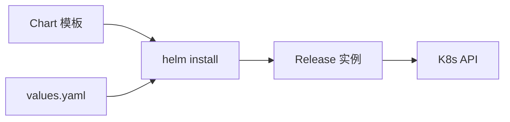

# Helm 包管理

## 核心原理

Helm 是 K8s 的**包管理器**。Chart 是应用模板包，Release 是 Chart 的一次部署实例。通过 values.yaml 参数化，避免复制粘贴 YAML。

> **类比**：Helm Chart 像「宜家家具说明书+零件包」；Release 是你组装好的那套家具。

## Helm 架构



## 基本操作

```bash
helm repo add bitnami https://charts.bitnami.com/bitnami
helm repo update
helm search repo nginx

helm install my-nginx bitnami/nginx \
  -n k8s-learn \
  --set replicaCount=2 \
  --set service.type=ClusterIP

helm list -n k8s-learn
helm status my-nginx -n k8s-learn
helm upgrade my-nginx bitnami/nginx --set replicaCount=3 -n k8s-learn
helm rollback my-nginx 1 -n k8s-learn
helm uninstall my-nginx -n k8s-learn
```

## Chart 目录结构

```
mychart/
├── Chart.yaml          # 元数据
├── values.yaml         # 默认参数
├── templates/          # Go template YAML
│   ├── deployment.yaml
│   ├── service.yaml
│   └── _helpers.tpl
└── charts/             # 依赖子 Chart
```

## 模板示例

```yaml
# templates/deployment.yaml
apiVersion: apps/v1
kind: Deployment
metadata:
  name: {{ include "mychart.fullname" . }}
spec:
  replicas: {{ .Values.replicaCount }}
  template:
    spec:
      containers:
      - name: {{ .Chart.Name }}
        image: "{{ .Values.image.repository }}:{{ .Values.image.tag }}"
```

```yaml
# values.yaml
replicaCount: 2
image:
  repository: nginx
  tag: "1.25"
```

```bash
helm create mychart
helm template mychart ./mychart   # 本地渲染预览
helm install demo ./mychart -n k8s-learn
```

## 动手练习

1. 用 bitnami/nginx Chart 部署，修改 replicaCount
2. `helm create` 创建自定义 Chart 并安装
3. 练习 upgrade 和 rollback

## 常见坑

- **helm install 重复名**：同 namespace Release 名唯一
- **模板语法错误**：用 `helm template` 先渲染验证
- **Chart 版本**：生产 pin Chart version，不用 latest

## 小结

- Chart = 模板包，Release = 部署实例，Values = 参数
- helm install/upgrade/rollback 管理生命周期
- 团队共享 Chart 是 K8s 应用交付标准实践
