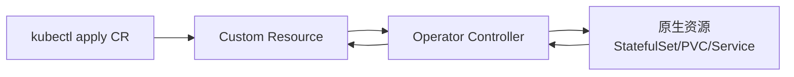

# Operator 与 CRD

## 核心原理

Operator 是**领域知识编码进控制器**的模式：通过 CRD（Custom Resource Definition）扩展 K8s API，Controller 监听 CR 变化并 reconcile 到期望状态。

> **类比**：Deployment 控制器懂 Pod 副本；MySQL Operator 懂主从复制——把 DBA 经验写进代码。

## Operator 模式



## CRD 示例

```yaml
apiVersion: apiextensions.k8s.io/v1
kind: CustomResourceDefinition
metadata:
  name: widgets.example.com
spec:
  group: example.com
  versions:
  - name: v1
    served: true
    storage: true
    schema:
      openAPIV3Schema:
        type: object
        properties:
          spec:
            type: object
            properties:
              size:
                type: integer
  scope: Namespaced
  names:
    plural: widgets
    singular: widget
    kind: Widget
```

```yaml
apiVersion: example.com/v1
kind: Widget
metadata:
  name: my-widget
  namespace: k8s-learn
spec:
  size: 3
```

```bash
kubectl apply -f crd.yaml
kubectl get widgets -n k8s-learn
kubectl describe widget my-widget -n k8s-learn
```

## 常见 Operator

| Operator | CRD | 用途 |
|----------|-----|------|
| KubeRay | RayCluster, RayJob | Ray 集群 |
| Prometheus Operator | ServiceMonitor, Prometheus | 监控 |
| cert-manager | Certificate | TLS 证书 |
| Strimzi | Kafka | 消息队列 |

## 开发工具

- **Kubebuilder**：Go 框架，生成 CRD + Controller 脚手架
- **Operator SDK**：Red Hat 出品，类似 Kubebuilder
- **kopf**：Python 编写 Operator

## 动手练习

1. 安装 KubeRay Operator，创建 RayCluster CR（预习阶段 9）
2. 查看 CRD：`kubectl get crd | grep ray`
3. 理解 `kubectl get raycluster -o yaml` 的 spec/status

## 常见坑

- **CRD 不可随意改 schema**：版本迁移需 careful planning
- **Operator 权限**：通常需 ClusterRole 管理多种资源
- **Finalizer**：删除 CR 时 Operator 可能做清理，卡住需手动移除 finalizer

## 小结

- CRD 扩展 K8s API，Operator Controller 实现领域 reconcile 逻辑
- KubeRay、Prometheus Operator 是 AI/监控场景常见 Operator
- 复杂有状态服务优先找成熟 Operator 而非手写 YAML
