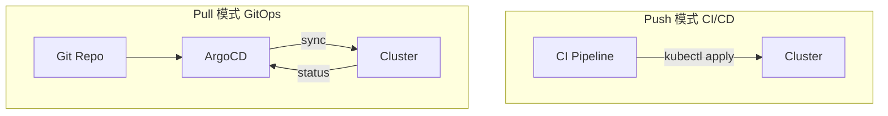

# GitOps 与 ArgoCD

## 核心原理

GitOps 以 **Git 为唯一事实来源**：集群状态由 Git 仓库声明，Controller（如 ArgoCD）持续 pull 并 reconcile 到集群。变更 = PR + merge，可追溯、可回滚。

> **类比**：传统部署是「手工改现场」；GitOps 是「改图纸，机器人自动施工」。

## Push vs Pull



| | Push | Pull (GitOps) |
|---|------|---------------|
| 触发 | CI 主动 deploy | Controller 轮询 Git |
| 凭证 | CI 需集群凭证 | 集群内 Agent pull |
| 漂移检测 | 弱 | 强（自动 detect drift） |
| 回滚 | 重新 deploy | git revert |

## 安装 ArgoCD

```bash
kubectl create namespace argocd
kubectl apply -n argocd -f https://raw.githubusercontent.com/argoproj/argo-cd/stable/manifests/install.yaml
kubectl port-forward svc/argocd-server -n argocd 8080:443
# 初始密码
kubectl -n argocd get secret argocd-initial-admin-secret -o jsonpath="{.data.password}" | base64 -d
```

## Application 示例

Git 仓库结构：

```
manifests/
├── deployment.yaml
├── service.yaml
└── kustomization.yaml
```

```yaml
apiVersion: argoproj.io/v1alpha1
kind: Application
metadata:
  name: web-app
  namespace: argocd
spec:
  project: default
  source:
    repoURL: https://github.com/example/k8s-manifests.git
    targetRevision: main
    path: manifests
  destination:
    server: https://kubernetes.default.svc
    namespace: k8s-learn
  syncPolicy:
    automated:
      prune: true
      selfHeal: true
    syncOptions:
    - CreateNamespace=true
```

```bash
kubectl apply -f application.yaml
argocd app get web-app
argocd app sync web-app
```

## 与 Helm 集成

ArgoCD 可直接部署 Helm Chart：

```yaml
source:
  repoURL: https://charts.bitnami.com/bitnami
  chart: nginx
  targetRevision: 15.x.x
  helm:
    values: |
      replicaCount: 3
```

## 动手练习

1. 安装 ArgoCD，UI 登录
2. 创建 Application 指向含 Deployment 的 Git repo
3. 修改 Git 中 replicas，观察 ArgoCD 自动 sync

## 常见坑

- **私有 Git 需配 Secret**：SSH key 或 HTTPS token
- **selfHeal 慎用**：手动 kubectl 修改会被 revert
- **sync 顺序**：CRD 需先于 CR 部署，用 sync waves 控制

## 小结

- GitOps = Git 声明 + Controller reconcile
- ArgoCD 是 K8s 最流行的 GitOps 工具
- 与 Helm/Kustomize 配合，实现完整交付流水线
